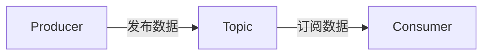
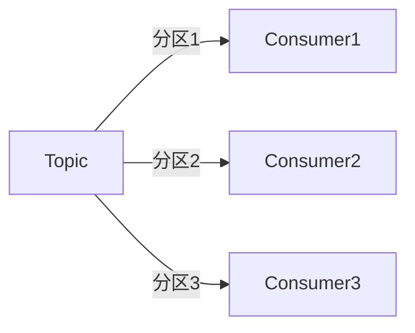

# Kafka 实时分析架构

在现代数据驱动的世界中，实时分析变得越来越重要。无论是监控系统、推荐引擎还是欺诈检测，实时分析都能帮助企业快速响应变化并做出数据驱动的决策。Apache Kafka 作为一个分布式流处理平台，因其高吞吐量、低延迟和可扩展性，成为构建实时分析架构的首选工具之一。

本文将带你了解 Kafka 实时分析架构的核心概念、设计模式以及如何在实际场景中应用。

## 什么是Kafka实时分析架构？

Kafka 实时分析架构是一种基于 Kafka 的流处理系统，能够实时处理和分析大量数据流。它通常由以下几个核心组件组成：

1. **数据生产者（Producer）**：将数据发送到 Kafka 主题（Topic）。
2. **Kafka 集群**：负责存储和分发数据流。
3. **数据消费者（Consumer）**：从 Kafka 主题中读取数据并进行处理。
4. **流处理引擎**：如 Kafka Streams 或 Apache Flink，用于实时处理和分析数据。
5. **存储系统**：如数据库或数据仓库，用于存储处理后的结果。

通过将这些组件组合在一起，Kafka 实时分析架构能够实现从数据采集到实时分析的全流程自动化。

## Kafka 实时分析架构的核心概念

### 1. Kafka主题（Topic）

Kafka 主题是数据流的逻辑容器。生产者将数据发布到主题，消费者从主题中订阅数据。主题可以分区（Partition），以便并行处理数据。



### 2. 分区（Partition）

Kafka 主题可以分为多个分区，每个分区是一个有序的、不可变的记录序列。分区允许 Kafka 并行处理数据，从而提高吞吐量。

### 3. 消费者组（Consumer Group）

消费者组是一组共同消费一个主题的消费者。Kafka 会将主题的分区分配给消费者组中的消费者，确保每个分区只被一个消费者处理。



### 4. 流处理引擎

流处理引擎如 Kafka Streams 或 Apache Flink 可以实时处理 Kafka 中的数据流。它们支持窗口操作、聚合、连接等高级功能，非常适合实时分析场景。

## 实际案例：实时用户行为分析

假设我们正在构建一个实时用户行为分析系统，用于监控用户在网站上的点击行为并实时生成分析报告。

### 1. 数据生产者

用户点击事件通过生产者发送到 Kafka 主题 `user-clicks`。

```java
Properties props = new Properties();
props.put("bootstrap.servers", "localhost:9092");
props.put("key.serializer", "org.apache.kafka.common.serialization.StringSerializer");
props.put("value.serializer", "org.apache.kafka.common.serialization.StringSerializer");

Producer<String, String> producer = new KafkaProducer<>(props);
producer.send(new ProducerRecord<>("user-clicks", "user1", "clicked_button_A"));
producer.close();
```

### 2. 数据消费者

消费者从 `user-clicks` 主题中读取数据并进行处理。

```java
Properties props = new Properties();
props.put("bootstrap.servers", "localhost:9092");
props.put("group.id", "user-click-analytics");
props.put("key.deserializer", "org.apache.kafka.common.serialization.StringDeserializer");
props.put("value.deserializer", "org.apache.kafka.common.serialization.StringDeserializer");

KafkaConsumer<String, String> consumer = new KafkaConsumer<>(props);
consumer.subscribe(Arrays.asList("user-clicks"));

while (true) {
    ConsumerRecords<String, String> records = consumer.poll(Duration.ofMillis(100));
    for (ConsumerRecord<String, String> record : records) {
        System.out.printf("User %s clicked %s%n", record.key(), record.value());
    }
}
```

### 3. 流处理引擎

使用 Kafka Streams 对点击事件进行实时分析，例如计算每个用户的点击次数。

```java
StreamsBuilder builder = new StreamsBuilder();
KStream<String, String> clicks = builder.stream("user-clicks");

KTable<String, Long> userClickCounts = clicks
    .groupByKey()
    .count();

userClickCounts.toStream().to("user-click-counts", Produced.with(Serdes.String(), Serdes.Long()));

KafkaStreams streams = new KafkaStreams(builder.build(), props);
streams.start();
```

### 4. 存储系统

将处理后的结果存储到数据库或数据仓库中，供后续查询和分析。

```java
// 假设我们使用 JDBC 将结果存储到 MySQL
try (Connection connection = DriverManager.getConnection("jdbc:mysql://localhost:3306/analytics", "user", "password")) {
    PreparedStatement statement = connection.prepareStatement("INSERT INTO user_click_counts (user_id, click_count) VALUES (?, ?)");
    statement.setString(1, userId);
    statement.setLong(2, clickCount);
    statement.executeUpdate();
}
```

## 总结

Kafka 实时分析架构通过将数据生产者、Kafka 集群、数据消费者和流处理引擎结合在一起，能够实现高效、实时的数据处理和分析。无论是用户行为分析、监控系统还是推荐引擎，Kafka 都能提供强大的支持。

:::tip
如果你对 Kafka 实时分析架构感兴趣，可以尝试以下练习：
1. 使用 Kafka Streams 实现一个简单的实时点击计数器。
2. 将处理后的结果存储到 Elasticsearch 中，并构建一个实时仪表盘。
:::

## 附加资源

- [Kafka 官方文档](https://kafka.apache.org/documentation/)
- [Kafka Streams 入门指南](https://kafka.apache.org/documentation/streams/)
- [Apache Flink 官方文档](https://flink.apache.org/)

希望本文能帮助你理解 Kafka 实时分析架构的核心概念，并为你的实时分析项目提供灵感！