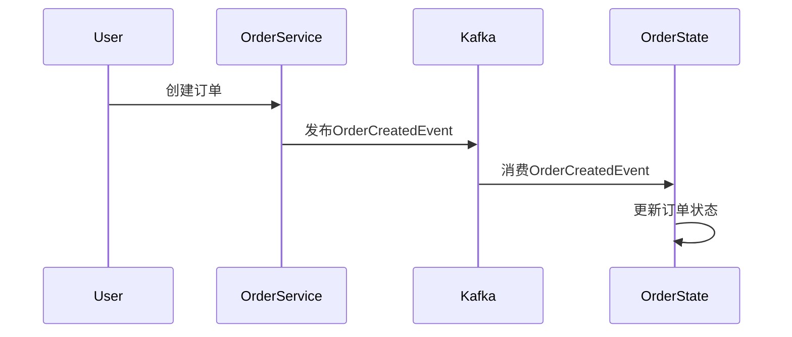
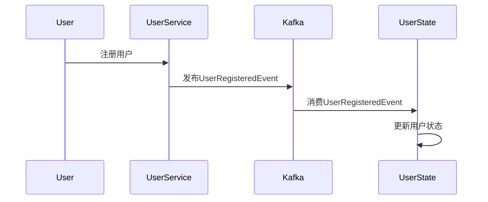

# Kafka 事件溯源模式

事件溯源（Event Sourcing）是一种设计模式，它将应用程序的状态变化记录为一系列不可变的事件。这些事件存储在事件日志中，并可以通过重放事件来重建应用程序的状态。Kafka作为一个分布式流处理平台，非常适合用于实现事件溯源模式。

## 什么是事件溯源？

事件溯源的核心思想是将应用程序的状态变化记录为一系列事件。每个事件代表一个状态变化，并且是不可变的。通过重放这些事件，可以重建应用程序的当前状态。

### 事件溯源的基本概念

- **事件（Event）**：表示系统中发生的某个动作或状态变化。例如，用户注册、订单创建等。
- **事件存储（Event Store）**：存储所有事件的日志。Kafka可以作为事件存储。
- **状态（State）**：通过重放事件日志重建的应用程序的当前状态。

## 为什么使用Kafka实现事件溯源？

Kafka是一个分布式、高吞吐量的消息系统，非常适合用于存储和传输事件。以下是使用Kafka实现事件溯源的一些优势：

- **高吞吐量**：Kafka能够处理大量的消息，适合高并发场景。
- **持久性**：Kafka将消息持久化到磁盘，确保数据不会丢失。
- **分布式**：Kafka是分布式的，能够水平扩展，适合大规模系统。

## 事件溯源的实现

### 1. 定义事件

首先，我们需要定义系统中的事件。每个事件应该包含足够的信息来描述状态变化。

```java
public class UserRegisteredEvent {
    private String userId;
    private String username;
    private LocalDateTime timestamp;

    // Getters and setters
}
```

### 2. 发布事件到Kafka

当系统中发生状态变化时，我们将事件发布到Kafka主题中。

```java
KafkaProducer<String, UserRegisteredEvent> producer = new KafkaProducer<>(props);
UserRegisteredEvent event = new UserRegisteredEvent("user123", "john_doe", LocalDateTime.now());
ProducerRecord<String, UserRegisteredEvent> record = new ProducerRecord<>("user-events", event.getUserId(), event);
producer.send(record);
```

### 3. 消费事件并重建状态

消费者从Kafka主题中读取事件，并根据事件重建应用程序的状态。

```java
KafkaConsumer<String, UserRegisteredEvent> consumer = new KafkaConsumer<>(props);
consumer.subscribe(Collections.singletonList("user-events"));

while (true) {
    ConsumerRecords<String, UserRegisteredEvent> records = consumer.poll(Duration.ofMillis(100));
    for (ConsumerRecord<String, UserRegisteredEvent> record : records) {
        UserRegisteredEvent event = record.value();
        // 根据事件更新状态
        updateState(event);
    }
}
```

### 4. 重建状态

通过重放事件日志，我们可以重建应用程序的当前状态。

```java
public void updateState(UserRegisteredEvent event) {
    // 根据事件更新状态
    userState.put(event.getUserId(), event.getUsername());
}
```

## 实际应用场景

### 电商系统中的订单管理

在电商系统中，订单的状态变化（如创建、支付、发货、完成）可以作为事件存储在Kafka中。通过重放这些事件，可以重建订单的当前状态。



### 用户管理系统

在用户管理系统中，用户的注册、更新、删除等操作可以作为事件存储在Kafka中。通过重放这些事件，可以重建用户的当前状态。



## 总结

事件溯源模式通过将状态变化记录为一系列不可变的事件，提供了一种可靠的方式来重建应用程序的状态。Kafka作为一个高吞吐量、分布式的消息系统，非常适合用于实现事件溯源模式。

通过定义事件、发布事件到Kafka、消费事件并重建状态，我们可以轻松地实现事件溯源模式。在实际应用中，事件溯源模式可以用于电商系统中的订单管理、用户管理系统等场景。

## 附加资源

- [Kafka官方文档](https://kafka.apache.org/documentation/)
- [事件溯源模式详解](https://martinfowler.com/eaaDev/EventSourcing.html)
- [Kafka事件溯源示例代码](https://github.com/example/kafka-event-sourcing)

## 练习

1. 尝试在本地环境中搭建一个Kafka集群，并实现一个简单的事件溯源示例。
2. 修改上述示例代码，使其能够处理多个不同类型的事件（如用户注册、用户更新等）。
3. 思考如何在事件溯源模式中处理事件版本控制问题。
