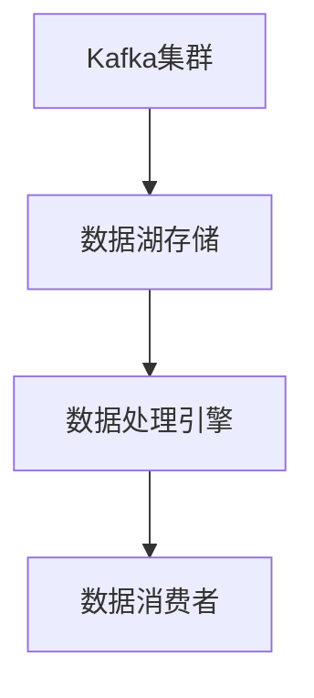

# Kafka 数据湖架构

## 介绍

Kafka数据湖架构是一种将Apache Kafka与数据湖（Data Lake）结合使用的设计模式。数据湖是一个集中存储各种结构化和非结构化数据的存储库，而Kafka则是一个分布式流处理平台，能够高效地处理实时数据流。通过将Kafka与数据湖结合，企业可以构建一个既能处理实时数据流，又能长期存储和分析数据的系统。

### 什么是数据湖？

数据湖是一个存储大量原始数据的系统，通常以低成本的方式存储，并且支持多种数据格式。数据湖的优势在于它能够存储各种类型的数据，包括结构化数据（如数据库表）、半结构化数据（如JSON、XML）和非结构化数据（如图片、视频）。

### 为什么使用Kafka与数据湖结合？

Kafka作为一个分布式流处理平台，能够高效地处理实时数据流。通过将Kafka与数据湖结合，企业可以实现以下目标：

- **实时数据处理**：Kafka能够实时处理数据流，并将处理后的数据存储到数据湖中。
- **长期存储**：数据湖能够长期存储大量数据，供后续分析和处理。
- **数据集成**：Kafka可以作为数据湖与其他系统之间的桥梁，实现数据的无缝集成。

## Kafka 数据湖架构的基本组成

Kafka数据湖架构通常由以下几个部分组成：

1. **Kafka集群**：负责实时数据的生产和消费。
2. **数据湖存储**：如Amazon S3、Azure Data Lake Storage或HDFS，用于长期存储数据。
3. **数据处理引擎**：如Apache Spark、Flink或Hive，用于对数据湖中的数据进行处理和分析。
4. **数据消费者**：如BI工具、机器学习模型等，用于从数据湖中提取数据进行分析。



## 实际应用场景

### 场景1：实时日志分析

假设你有一个大型的Web应用程序，每天产生大量的日志数据。你可以使用Kafka来实时收集这些日志数据，并将其存储到数据湖中。然后，使用Spark或Flink对日志数据进行实时分析，以监控应用程序的健康状况。

### 场景2：物联网数据存储与分析

在物联网（IoT）场景中，设备会不断产生大量的传感器数据。通过Kafka将这些数据实时传输到数据湖中，可以长期存储这些数据，并使用机器学习模型对数据进行分析，以预测设备故障或优化设备性能。

## 代码示例

以下是一个简单的Kafka生产者示例，将数据发送到Kafka主题中，然后使用Spark将数据写入数据湖。

### Kafka 生产者

```python
from kafka import KafkaProducer

producer = KafkaProducer(bootstrap_servers='localhost:9092')
producer.send('sensor-data', b'{"sensor_id": 1, "value": 23.5}')
producer.flush()
```

### Spark写入数据湖

```python
from pyspark.sql import SparkSession

spark = SparkSession.builder.appName("KafkaDataLake").getOrCreate()
df = spark.readStream.format("kafka").option("kafka.bootstrap.servers", "localhost:9092").option("subscribe", "sensor-data").load()
df.writeStream.format("parquet").option("path", "s3://my-data-lake/sensor-data").start().awaitTermination()
```

## 总结

Kafka数据湖架构是一种强大的设计模式，能够将实时数据处理与长期数据存储相结合。通过Kafka处理实时数据流，并将数据存储到数据湖中，企业可以构建一个既能处理实时数据，又能进行长期数据分析的系统。

## 附加资源

- [Apache Kafka官方文档](https://kafka.apache.org/documentation/)
- [Apache Spark官方文档](https://spark.apache.org/docs/latest/)
- [数据湖架构设计指南](https://aws.amazon.com/big-data/datalakes-and-analytics/what-is-a-data-lake/)

## 练习

1. 尝试在本地搭建一个Kafka集群，并创建一个Kafka生产者，将数据发送到Kafka主题中。
2. 使用Spark Streaming从Kafka主题中读取数据，并将数据写入本地文件系统或云存储（如S3）。
3. 思考如何在你的项目中应用Kafka数据湖架构，并设计一个简单的架构图。