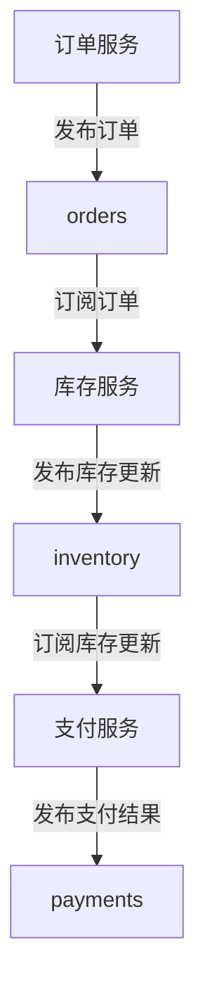

# Kafka 微服务通信

在现代分布式系统中，微服务架构已经成为一种流行的设计模式。微服务之间的通信是这种架构的核心挑战之一。Apache Kafka 作为一个分布式流处理平台，为微服务之间的异步通信提供了强大的支持。本文将详细介绍如何使用 Kafka 实现微服务之间的高效通信。

## 什么是Kafka微服务通信？

Kafka 是一个分布式发布-订阅消息系统，它允许微服务通过消息队列进行异步通信。与传统的同步通信（如 HTTP 请求）不同，Kafka 提供了一种解耦的方式，使得微服务可以在不直接依赖对方的情况下进行通信。

### 为什么选择Kafka？

- **高吞吐量**：Kafka 能够处理大量的消息，适合高并发的场景。
- **持久性**：消息被持久化到磁盘，确保数据不会丢失。
- **可扩展性**：Kafka 集群可以轻松扩展，以应对不断增长的数据量。
- **解耦**：生产者和消费者之间不需要直接通信，降低了系统的耦合度。

## Kafka 微服务通信的基本概念

在 Kafka 中，消息通过 **主题（Topic）** 进行传递。生产者将消息发布到主题，消费者从主题中订阅消息。每个主题可以被分为多个 **分区（Partition）**，以实现并行处理。

### 生产者与消费者

- **生产者（Producer）**：负责将消息发布到 Kafka 主题。
- **消费者（Consumer）**：负责从 Kafka 主题中读取消息。

### 消息的发布与订阅

生产者将消息发布到 Kafka 主题，消费者订阅该主题并处理消息。Kafka 保证消息的顺序性和可靠性。

## 代码示例

以下是一个简单的 Kafka 生产者和消费者的代码示例，使用 Java 编写。

### 生产者代码

```java
import org.apache.kafka.clients.producer.*;

import java.util.Properties;

public class KafkaProducerExample {
    public static void main(String[] args) {
        Properties props = new Properties();
        props.put("bootstrap.servers", "localhost:9092");
        props.put("key.serializer", "org.apache.kafka.common.serialization.StringSerializer");
        props.put("value.serializer", "org.apache.kafka.common.serialization.StringSerializer");

        Producer<String, String> producer = new KafkaProducer<>(props);

        for (int i = 0; i < 10; i++) {
            producer.send(new ProducerRecord<>("my-topic", Integer.toString(i), "Message " + i));
        }

        producer.close();
    }
}
```

### 消费者代码

```java
import org.apache.kafka.clients.consumer.*;
import org.apache.kafka.common.serialization.StringDeserializer;

import java.time.Duration;
import java.util.Collections;
import java.util.Properties;

public class KafkaConsumerExample {
    public static void main(String[] args) {
        Properties props = new Properties();
        props.put("bootstrap.servers", "localhost:9092");
        props.put("group.id", "test-group");
        props.put("key.deserializer", StringDeserializer.class.getName());
        props.put("value.deserializer", StringDeserializer.class.getName());

        Consumer<String, String> consumer = new KafkaConsumer<>(props);
        consumer.subscribe(Collections.singletonList("my-topic"));

        while (true) {
            ConsumerRecords<String, String> records = consumer.poll(Duration.ofMillis(100));
            for (ConsumerRecord<String, String> record : records) {
                System.out.printf("offset = %d, key = %s, value = %s%n", record.offset(), record.key(), record.value());
            }
        }
    }
}
```

## 实际案例：订单处理系统

假设我们有一个订单处理系统，包含以下微服务：

1. **订单服务**：负责接收订单请求。
2. **库存服务**：负责检查库存并更新库存信息。
3. **支付服务**：负责处理支付。

### 使用Kafka进行通信

1. **订单服务** 接收到订单请求后，将订单信息发布到 Kafka 主题 `orders`。
2. **库存服务** 订阅 `orders` 主题，检查库存并发布库存更新到 `inventory` 主题。
3. **支付服务** 订阅 `inventory` 主题，处理支付并发布支付结果到 `payments` 主题。



## 总结

Kafka 为微服务之间的异步通信提供了强大的支持，能够有效解耦系统组件，提高系统的可扩展性和可靠性。通过本文的介绍和示例代码，你应该已经掌握了 Kafka 在微服务通信中的基本应用。

## 附加资源

- [Kafka官方文档](https://kafka.apache.org/documentation/)
- [Kafka入门教程](https://www.tutorialspoint.com/apache_kafka/index.htm)
- [Kafka与微服务架构](https://www.confluent.io/blog/apache-kafka-for-microservices-integration/)

## 练习

1. 尝试修改生产者代码，使其能够发送 JSON 格式的消息。
2. 创建一个新的 Kafka 主题，并编写一个消费者来订阅该主题。
3. 设计一个简单的微服务系统，使用 Kafka 进行通信，并实现一个完整的业务流程。

:::tip
在开发过程中，建议使用 Docker 快速部署 Kafka 集群，以便进行本地测试和开发。
:::