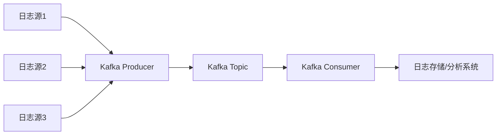

# Kafka 日志聚合

## 介绍

Kafka日志聚合是一种将多个日志源的数据集中存储和处理的技术。它通过将分散在不同系统或服务中的日志数据发送到Kafka集群中，从而实现日志的统一管理和分析。日志聚合在分布式系统中尤为重要，因为它可以帮助开发者和运维人员更好地监控系统状态、排查问题以及进行数据分析。

Kafka作为一个高吞吐量的分布式消息系统，非常适合用于日志聚合场景。它能够高效地处理大量日志数据，并支持数据的持久化和实时处理。

## 日志聚合的基本原理

在Kafka中，日志聚合的基本原理是将来自不同源的日志数据发送到Kafka的Topic中。每个Topic可以看作是一个日志流的集合，生产者（Producer）将日志数据发送到Topic，而消费者（Consumer）则从Topic中读取数据进行处理。

### 日志数据流

以下是一个典型的日志聚合数据流：



在这个流程中，多个日志源将数据发送到Kafka Producer，Producer将数据写入Kafka Topic。然后，Kafka Consumer从Topic中读取数据，并将其发送到日志存储或分析系统（如Elasticsearch、Hadoop等）进行进一步处理。

## 实现步骤

### 1. 创建Kafka Topic

首先，我们需要在Kafka中创建一个Topic来存储日志数据。可以使用Kafka自带的命令行工具来创建Topic：

```bash
kafka-topics.sh --create --topic logs --bootstrap-server localhost:9092 --partitions 3 --replication-factor 1
```

这个命令创建了一个名为`logs`的Topic，它有3个分区，并且复制因子为1。

### 2. 配置日志源

接下来，我们需要配置日志源，使其将日志数据发送到Kafka。假设我们有一个应用程序，它使用Log4j作为日志框架。我们可以通过配置Log4j的Kafka Appender来实现日志的发送：

```xml
<appender name="KafkaAppender" class="org.apache.kafka.log4jappender.KafkaLog4jAppender">
    <param name="Topic" value="logs" />
    <param name="BrokerList" value="localhost:9092" />
    <layout class="org.apache.log4j.PatternLayout">
        <param name="ConversionPattern" value="%d{ISO8601} %-5p %c{1}:%L - %m%n" />
    </layout>
</appender>
```

这个配置将日志数据发送到Kafka的`logs` Topic中。

### 3. 消费日志数据

最后，我们需要编写一个Kafka Consumer来消费日志数据。以下是一个简单的Java示例：

```java
Properties props = new Properties();
props.put("bootstrap.servers", "localhost:9092");
props.put("group.id", "log-consumer-group");
props.put("enable.auto.commit", "true");
props.put("auto.commit.interval.ms", "1000");
props.put("key.deserializer", "org.apache.kafka.common.serialization.StringDeserializer");
props.put("value.deserializer", "org.apache.kafka.common.serialization.StringDeserializer");

KafkaConsumer<String, String> consumer = new KafkaConsumer<>(props);
consumer.subscribe(Arrays.asList("logs"));

while (true) {
    ConsumerRecords<String, String> records = consumer.poll(Duration.ofMillis(100));
    for (ConsumerRecord<String, String> record : records) {
        System.out.printf("offset = %d, key = %s, value = %s%n", record.offset(), record.key(), record.value());
    }
}
```

这个Consumer会从`logs` Topic中读取日志数据，并将其打印到控制台。

## 实际应用场景

### 1. 系统监控

在分布式系统中，日志聚合可以帮助运维人员集中监控各个服务的运行状态。通过将日志数据发送到Kafka，运维人员可以使用统一的工具（如Elasticsearch、Kibana）来查看和分析日志，从而快速发现和解决问题。

### 2. 用户行为分析

在电商或社交平台中，用户的行为日志（如点击、购买、评论等）可以通过Kafka进行聚合。这些日志数据可以用于分析用户行为，优化产品设计，甚至用于个性化推荐。

### 3. 安全审计

在金融或安全敏感的应用中，日志聚合可以用于安全审计。通过将所有的操作日志发送到Kafka，安全团队可以集中分析这些日志，检测异常行为或潜在的安全威胁。

## 总结

Kafka日志聚合是一种强大的技术，它能够帮助我们将分散的日志数据集中存储和处理。通过Kafka的高吞吐量和分布式特性，我们可以轻松地实现日志的实时收集、存储和分析。无论是系统监控、用户行为分析还是安全审计，Kafka日志聚合都能为我们提供强大的支持。

## 附加资源

- [Kafka官方文档](https://kafka.apache.org/documentation/)
- [Log4j Kafka Appender](https://github.com/apache/log4j-kafka-appender)
- [Elasticsearch与Kafka集成](https://www.elastic.co/guide/en/elasticsearch/reference/current/kafka-integration.html)

## 练习

1. 尝试在你的本地环境中搭建一个Kafka集群，并创建一个Topic用于日志聚合。
2. 配置一个应用程序，使其将日志发送到Kafka。
3. 编写一个Kafka Consumer，将日志数据存储到Elasticsearch中，并使用Kibana进行可视化分析。
