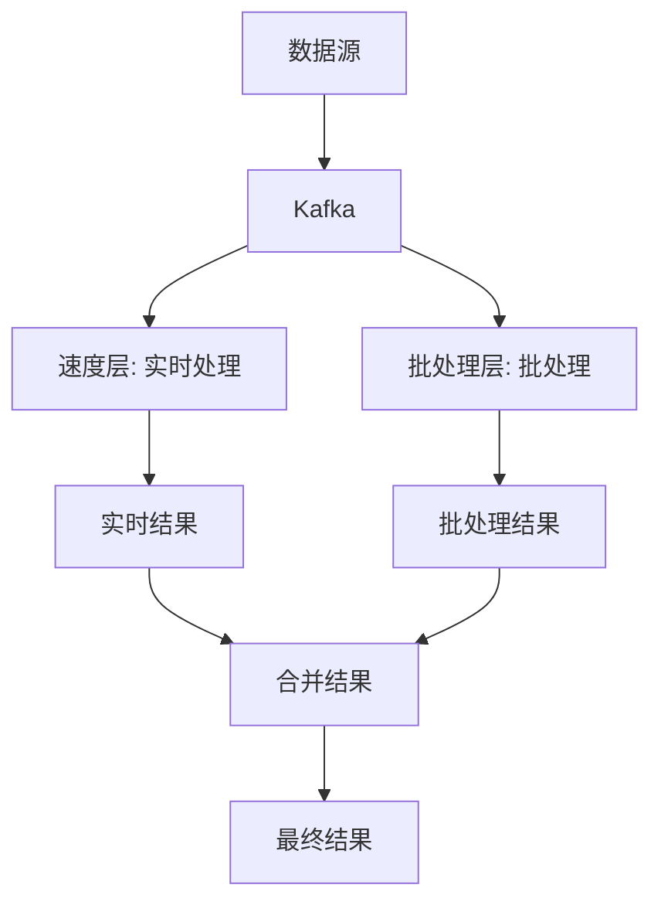

# Kafka Lambda 架构

Kafka Lambda 架构是一种结合了批处理和流处理的混合架构模式，旨在提供低延迟和高吞吐量的数据处理能力。它通过将实时流处理（Lambda 架构中的“速度层”）与批处理（Lambda 架构中的“批处理层”）相结合，确保数据的一致性和准确性。

## 什么是 Kafka Lambda 架构？

Kafka Lambda 架构的核心思想是将数据处理分为两个部分：

1. **速度层（Speed Layer）**：负责实时处理数据流，提供低延迟的结果。
2. **批处理层（Batch Layer）**：负责处理历史数据，提供高准确性的结果。

Kafka 作为分布式消息队列，在这两个层之间起到了桥梁作用。它能够高效地处理大量数据流，并将数据分发到速度层和批处理层进行处理。

### 架构图



## Kafka Lambda 架构的工作原理

### 1. 数据摄入
数据首先通过 Kafka 进行摄入。Kafka 作为一个高吞吐量的分布式消息队列，能够处理来自多个数据源的大量数据。

### 2. 速度层处理
速度层通常使用流处理框架（如 Apache Flink、Apache Storm 或 Kafka Streams）来处理实时数据流。速度层的目标是尽快提供近似的实时结果。

```java
// 示例：使用 Kafka Streams 进行实时处理
KStream<String, String> sourceStream = builder.stream("input-topic");
KStream<String, String> processedStream = sourceStream.mapValues(value -> value.toUpperCase());
processedStream.to("output-topic");
```

### 3. 批处理层处理
批处理层通常使用批处理框架（如 Apache Spark 或 Hadoop MapReduce）来处理历史数据。批处理层的目标是提供高准确性的结果。

```python
# 示例：使用 Spark 进行批处理
from pyspark import SparkContext

sc = SparkContext("local", "Batch Processing")
data = sc.textFile("hdfs://path/to/historical-data")
result = data.map(lambda line: line.upper())
result.saveAsTextFile("hdfs://path/to/processed-data")
```

### 4. 结果合并
最终的结果是通过将速度层的实时结果与批处理层的批处理结果进行合并得到的。这样可以确保结果的准确性和实时性。

## 实际应用场景

### 实时推荐系统
在电商平台中，Kafka Lambda 架构可以用于实时推荐系统。速度层可以实时处理用户的行为数据，提供即时的推荐结果；而批处理层则可以处理历史数据，优化推荐算法。

### 金融风控
在金融领域，Kafka Lambda 架构可以用于实时风控系统。速度层可以实时监控交易数据，检测异常行为；而批处理层则可以分析历史数据，优化风控模型。

## 总结

Kafka Lambda 架构通过结合实时流处理和批处理，提供了一种高效、可靠的数据处理方案。它能够在保证数据准确性的同时，提供低延迟的实时结果。对于需要处理大量数据并需要实时响应的应用场景，Kafka Lambda 架构是一个理想的选择。

## 附加资源

- [Kafka 官方文档](https://kafka.apache.org/documentation/)
- [Apache Flink 官方文档](https://flink.apache.org/)
- [Apache Spark 官方文档](https://spark.apache.org/docs/latest/)

## 练习

1. 使用 Kafka Streams 实现一个简单的实时数据处理应用。
2. 使用 Spark 实现一个批处理任务，处理历史数据并生成结果。
3. 尝试将 Kafka Streams 和 Spark 的结果进行合并，生成最终结果。

:::tip
在实现 Kafka Lambda 架构时，确保数据的一致性和准确性是关键。建议在实际应用中仔细设计数据流和批处理流程。
:::