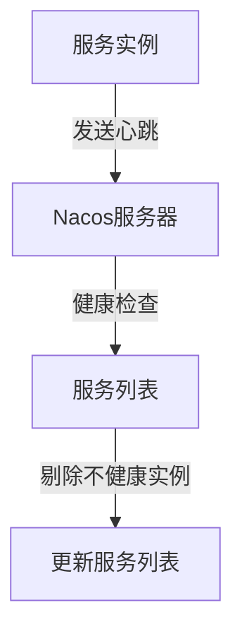

# Nacos 简介

Nacos（Naming and Configuration Service）是一个动态服务发现、配置管理和服务管理平台。它由阿里巴巴开源，旨在帮助开发者更轻松地构建、部署和管理微服务架构。Nacos的核心功能包括服务发现、配置管理和服务健康监测，是微服务生态中的重要组件。

## 什么是Nacos？

Nacos是一个集成了服务发现、配置管理和服务管理的平台，支持多种编程语言和框架。它的主要目标是简化微服务架构中的服务治理和配置管理，帮助开发者更高效地构建和运维分布式系统。

### 核心功能

1. **服务发现**：Nacos允许服务注册和发现，使得服务之间可以动态地找到彼此。
2. **配置管理**：Nacos提供了一个集中化的配置管理平台，支持动态配置更新。
3. **服务健康监测**：Nacos可以监测服务的健康状态，并在服务不可用时自动剔除。

## Nacos 的核心概念

### 1. 服务注册与发现

在微服务架构中，服务实例需要注册到Nacos服务器，以便其他服务可以发现并调用它们。Nacos通过心跳机制来维护服务实例的健康状态。

```java
// 示例：Java服务注册
NamingService naming = NacosFactory.createNamingService("127.0.0.1:8848");
naming.registerInstance("my-service", "127.0.0.1", 8080);
```

### 2. 配置管理

Nacos提供了一个集中化的配置管理平台，支持动态配置更新。开发者可以通过Nacos控制台或API来管理配置。

```yaml
# 示例：Nacos配置
spring:
  application:
    name: my-service
  cloud:
    nacos:
      config:
        server-addr: 127.0.0.1:8848
        file-extension: yaml
```

### 3. 服务健康监测

Nacos通过心跳机制监测服务的健康状态。如果服务实例停止发送心跳，Nacos会将其标记为不健康，并从服务列表中剔除。



## 实际应用场景

### 场景1：动态配置更新

在微服务架构中，配置的更新是一个常见的需求。Nacos允许开发者在运行时动态更新配置，而无需重启服务。

```java
// 示例：动态配置更新
ConfigService configService = NacosFactory.createConfigService("127.0.0.1:8848");
String content = configService.getConfig("my-service", "DEFAULT_GROUP", 5000);
System.out.println(content);
```

### 场景2：服务发现与负载均衡

Nacos可以与Spring Cloud等框架集成，实现服务发现和负载均衡。通过Nacos，服务可以动态地发现其他服务，并根据负载均衡策略进行调用。

```yaml
# 示例：Spring Cloud集成Nacos
spring:
  cloud:
    nacos:
      discovery:
        server-addr: 127.0.0.1:8848
```

## 总结

Nacos是一个功能强大的服务发现和配置管理平台，适用于微服务架构中的服务治理。通过Nacos，开发者可以轻松实现服务注册与发现、动态配置更新和服务健康监测等功能。本文介绍了Nacos的核心概念和实际应用场景，帮助初学者快速上手Nacos。

## 附加资源与练习

- **官方文档**：[Nacos官方文档](https://nacos.io/zh-cn/docs/what-is-nacos.html)
- **练习**：尝试在本地搭建一个Nacos服务器，并注册一个简单的服务实例。然后通过Nacos控制台查看服务的健康状态。

:::tip
如果你在练习中遇到问题，可以参考Nacos的官方文档或社区论坛，获取更多帮助。
:::