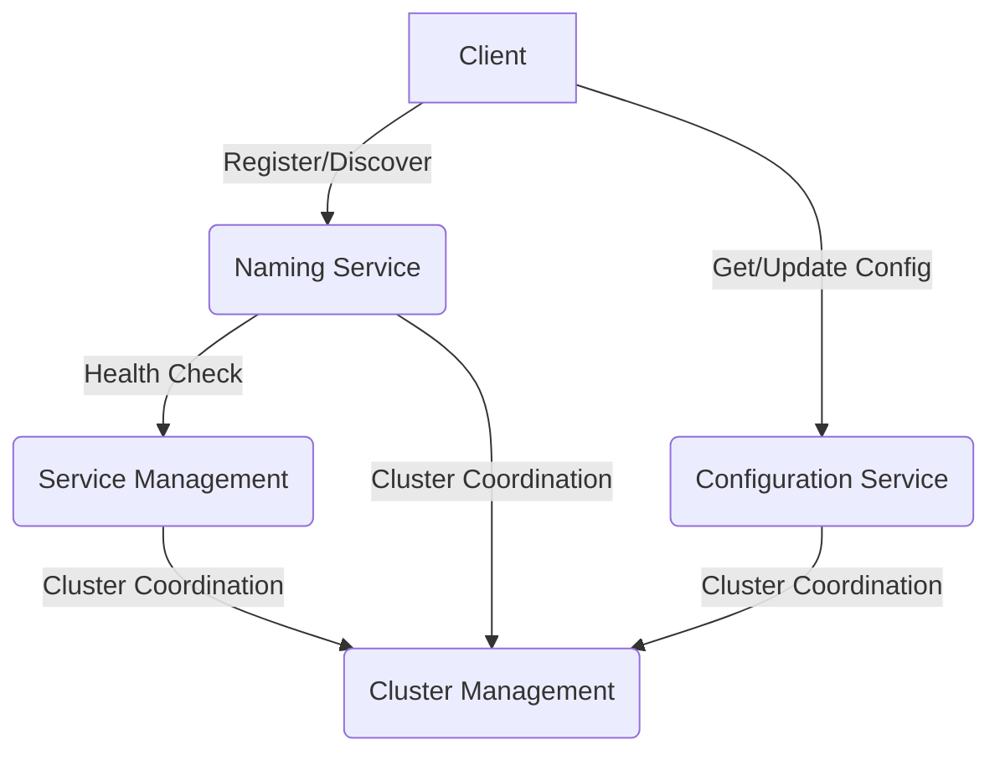

## 介绍

Nacos（Naming and Configuration Service）是一个动态服务发现、配置管理和服务管理平台。它由阿里巴巴开源，旨在帮助开发者构建云原生应用。Nacos的核心功能包括服务注册与发现、动态配置管理、服务元数据管理等。为了更好地理解Nacos，我们需要从它的架构设计入手。

## Nacos 架构概览

Nacos的架构主要由以下几个核心组件组成：

1. **Naming Service（命名服务）**：负责服务的注册与发现。
2. **Configuration Service（配置服务）**：负责动态配置的管理。
3. **Service Management（服务管理）**：负责服务的健康检查、元数据管理等。
4. **Cluster Management（集群管理）**：负责Nacos集群的管理与协调。

### Nacos 架构图

为了更好地理解Nacos的架构，我们可以通过以下Mermaid图表来展示其核心组件及其相互关系：



### 核心组件详解

#### 1. Naming Service（命名服务）

Naming Service是Nacos的核心功能之一，负责服务的注册与发现。当一个服务启动时，它会向Nacos注册自己的信息（如IP地址、端口号等）。其他服务可以通过Nacos查询到这些信息，从而实现服务间的通信。

**示例：服务注册与发现**

```java
// 服务注册
NamingService naming = NacosFactory.createNamingService("127.0.0.1:8848");
naming.registerInstance("my-service", "192.168.1.1", 8080);

// 服务发现
List<Instance> instances = naming.getAllInstances("my-service");
for (Instance instance : instances) {
    System.out.println(instance.getIp() + ":" + instance.getPort());
}
```

#### 2. Configuration Service（配置服务）

Configuration Service允许开发者动态管理应用的配置。通过Nacos，开发者可以在不重启应用的情况下更新配置，从而实现配置的动态化。

**示例：动态配置管理**

```java
// 获取配置
ConfigService configService = NacosFactory.createConfigService("127.0.0.1:8848");
String content = configService.getConfig("my-config", "DEFAULT_GROUP", 5000);
System.out.println(content);

// 监听配置变化
configService.addListener("my-config", "DEFAULT_GROUP", new Listener() {
    @Override
    public void receiveConfigInfo(String configInfo) {
        System.out.println("Config changed: " + configInfo);
    }
});
```

#### 3. Service Management（服务管理）

Service Management负责服务的健康检查、元数据管理等。Nacos会定期检查注册服务的健康状态，并将不健康的服务从服务列表中移除。

**示例：健康检查**

```java
// 设置健康检查
Instance instance = new Instance();
instance.setIp("192.168.1.1");
instance.setPort(8080);
instance.setHealthy(false); // 设置为不健康
naming.registerInstance("my-service", instance);
```

#### 4. Cluster Management（集群管理）

Cluster Management负责Nacos集群的管理与协调。Nacos支持集群部署，通过Raft协议实现集群的一致性。

**示例：集群配置**

```properties
# Nacos 集群配置
nacos.cluster.members=192.168.1.1:8848,192.168.1.2:8848,192.168.1.3:8848
```

## 实际应用场景

### 场景1：微服务架构中的服务发现

在微服务架构中，服务之间的通信依赖于服务发现。Nacos可以作为服务注册中心，帮助微服务自动发现彼此。

### 场景2：动态配置管理

在分布式系统中，配置的管理往往是一个挑战。Nacos提供了动态配置管理功能，使得配置的更新无需重启服务。

## 总结

Nacos作为一个功能强大的服务发现与配置管理平台，其架构设计简洁而高效。通过Naming Service、Configuration Service、Service Management和Cluster Management等核心组件，Nacos能够满足现代云原生应用的需求。

## 附加资源与练习

- **官方文档**：访问[Nacos官方文档](https://nacos.io/zh-cn/docs/what-is-nacos.html)以获取更多详细信息。
- **练习**：尝试在本地搭建一个Nacos集群，并实现服务的注册与发现。

:::tip
建议初学者在学习Nacos时，先从单机模式开始，逐步过渡到集群模式，以便更好地理解其工作原理。
:::