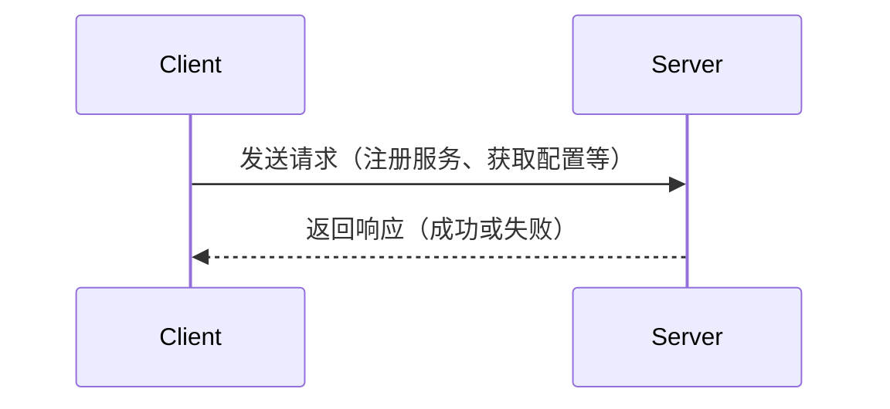

# Nacos 通信协议

Nacos（Naming and Configuration Service）是一个动态服务发现、配置管理和服务管理平台。它支持多种通信协议，以确保客户端与服务器之间的高效通信。本文将详细介绍Nacos的通信协议，帮助初学者理解其工作原理及实际应用。

## 1. 什么是Nacos通信协议？

Nacos通信协议是指Nacos客户端与服务器之间进行数据交换的规则和格式。Nacos支持多种通信协议，包括HTTP、gRPC等，以满足不同场景下的需求。通过通信协议，客户端可以注册服务、获取配置、订阅服务变更等。

## 2. Nacos支持的通信协议

Nacos主要支持以下两种通信协议：

### 2.1 HTTP协议

HTTP协议是Nacos最常用的通信协议之一。它基于RESTful API，通过HTTP请求与Nacos服务器进行交互。HTTP协议简单易用，适合大多数场景。

#### 2.1.1 HTTP请求示例

以下是一个使用HTTP协议注册服务的示例：

```bash
curl -X POST 'http://localhost:8848/nacos/v1/ns/instance' \
-H 'Content-Type: application/x-www-form-urlencoded' \
-d 'serviceName=exampleService' \
-d 'ip=127.0.0.1' \
-d 'port=8080'
```

**输入：**
- `serviceName`: 服务名称
- `ip`: 服务IP地址
- `port`: 服务端口

**输出：**
- 返回`ok`表示注册成功。

### 2.2 gRPC协议

gRPC是一种高性能、开源的通用RPC框架，Nacos也支持通过gRPC协议进行通信。gRPC基于HTTP/2协议，支持双向流、流控、头部压缩等特性，适合对性能要求较高的场景。

#### 2.2.1 gRPC请求示例

以下是一个使用gRPC协议获取配置的示例：

```java
ConfigService configService = NacosFactory.createConfigService("127.0.0.1:8848");
String content = configService.getConfig("exampleDataId", "exampleGroup", 5000);
System.out.println(content);
```

**输入：**
- `exampleDataId`: 配置的Data ID
- `exampleGroup`: 配置的分组
- `5000`: 超时时间（毫秒）

**输出：**
- 返回配置内容。

## 3. Nacos通信协议的工作原理

Nacos通信协议的核心是客户端与服务器之间的数据交换。以下是Nacos通信协议的基本工作流程：



1. **客户端发送请求**：客户端通过HTTP或gRPC协议向Nacos服务器发送请求，请求内容可以是注册服务、获取配置等。
2. **服务器处理请求**：Nacos服务器接收到请求后，根据请求类型进行处理，如更新服务列表、返回配置信息等。
3. **服务器返回响应**：服务器处理完请求后，将结果返回给客户端，客户端根据响应结果进行后续操作。

## 4. 实际应用场景

### 4.1 服务注册与发现

在微服务架构中，服务注册与发现是一个核心功能。Nacos通过HTTP或gRPC协议，允许服务实例在启动时向Nacos服务器注册自己，并在需要时发现其他服务实例。

**示例场景：**
- 服务A启动时，通过HTTP协议向Nacos注册自己。
- 服务B需要调用服务A时，通过Nacos获取服务A的地址列表，并选择一个实例进行调用。

### 4.2 配置管理

Nacos还支持动态配置管理，客户端可以通过HTTP或gRPC协议从Nacos服务器获取配置信息，并在配置变更时实时更新。

**示例场景：**
- 应用启动时，通过gRPC协议从Nacos获取数据库连接配置。
- 当数据库连接配置变更时，Nacos服务器会通知客户端，客户端自动更新配置。

## 5. 总结

Nacos通信协议是Nacos平台的核心组成部分，支持HTTP和gRPC两种协议，适用于不同的应用场景。通过本文的介绍，你应该对Nacos通信协议有了初步的了解，并能够在实际项目中应用这些知识。

## 6. 附加资源与练习

- **官方文档**：阅读[Nacos官方文档](https://nacos.io/zh-cn/docs/what-is-nacos.html)以获取更多详细信息。
- **练习**：尝试使用HTTP和gRPC协议分别注册一个服务，并获取其配置信息。

:::tip
建议初学者先从HTTP协议开始学习，熟悉后再尝试使用gRPC协议。
:::