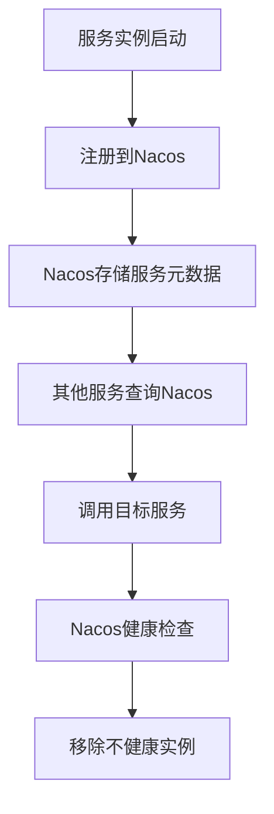

# Nacos 服务注册基础

## 介绍

在微服务架构中，服务注册与发现是一个核心组件。Nacos（Naming and Configuration Service）是一个动态服务发现、配置管理和服务管理平台，广泛应用于微服务架构中。它帮助开发者轻松实现服务的注册、发现和健康检查。

本文将介绍Nacos服务注册的基础知识，包括其工作原理、如何使用Nacos进行服务注册，以及实际应用场景。

## 什么是服务注册？

服务注册是指将服务的元数据（如服务名称、IP地址、端口号等）注册到一个中心化的服务注册中心。其他服务可以通过查询注册中心来发现并调用这些服务。

Nacos作为一个服务注册中心，提供了服务注册、发现和健康检查的功能。它支持多种协议（如HTTP、gRPC等），并且可以动态管理服务的上下线。

## Nacos 服务注册的工作原理

Nacos服务注册的核心流程如下：

1. **服务启动时**：服务实例启动后，会将自己的元数据（如服务名称、IP地址、端口号等）注册到Nacos服务器。
2. **服务发现**：其他服务可以通过Nacos查询已注册的服务实例，并根据需要调用这些服务。
3. **健康检查**：Nacos会定期检查注册的服务实例的健康状态，如果某个实例不可用，Nacos会将其从注册列表中移除。



## 如何使用Nacos进行服务注册

以下是一个简单的Java示例，展示如何使用Nacos进行服务注册。

### 1. 添加依赖

首先，在你的项目中添加Nacos客户端的依赖。如果你使用的是Maven，可以在`pom.xml`中添加以下依赖：

```xml
<dependency>
    <groupId>com.alibaba.cloud</groupId>
    <artifactId>spring-cloud-starter-alibaba-nacos-discovery</artifactId>
</dependency>
```

### 2. 配置Nacos服务器

在`application.yml`或`application.properties`中配置Nacos服务器的地址：

```yaml
spring:
  cloud:
    nacos:
      discovery:
        server-addr: 127.0.0.1:8848
```

### 3. 注册服务

在Spring Boot应用中，使用`@EnableDiscoveryClient`注解启用服务注册功能：

```java
import org.springframework.boot.SpringApplication;
import org.springframework.boot.autoconfigure.SpringBootApplication;
import org.springframework.cloud.client.discovery.EnableDiscoveryClient;

@SpringBootApplication
@EnableDiscoveryClient
public class NacosServiceApplication {
    public static void main(String[] args) {
        SpringApplication.run(NacosServiceApplication.class, args);
    }
}
```

### 4. 启动服务

启动服务后，服务实例会自动注册到Nacos服务器。你可以在Nacos控制台中查看已注册的服务实例。

## 实际应用场景

### 场景1：微服务架构中的服务发现

在一个微服务架构中，服务A需要调用服务B。服务A可以通过Nacos查询服务B的实例列表，并根据负载均衡策略选择一个实例进行调用。

### 场景2：动态扩展服务实例

当服务B的负载增加时，可以动态启动新的服务实例并注册到Nacos。服务A会自动发现新的实例，并将请求分发到这些实例上。

## 总结

Nacos服务注册是微服务架构中不可或缺的一部分。通过Nacos，开发者可以轻松实现服务的注册、发现和健康检查，从而提高系统的可扩展性和可靠性。

## 附加资源

- [Nacos官方文档](https://nacos.io/zh-cn/docs/what-is-nacos.html)
- [Spring Cloud Alibaba Nacos Discovery](https://github.com/alibaba/spring-cloud-alibaba/wiki/Nacos-discovery)

## 练习

1. 尝试在本地启动一个Nacos服务器，并注册一个简单的Spring Boot服务。
2. 使用Nacos控制台查看已注册的服务实例，并尝试调用这些服务。
3. 模拟服务实例的健康检查失败，观察Nacos如何自动移除不健康的实例。
