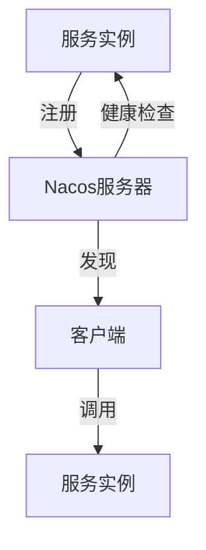

## 介绍

在现代微服务架构中，服务发现是一个至关重要的组件。它允许服务动态地找到并与其他服务通信，而无需硬编码服务地址。Nacos 是一个易于使用的动态服务发现、配置和服务管理平台，特别适合微服务架构。

本文将带你了解 Nacos 服务发现的基础知识，包括其核心概念、工作原理以及如何在实际项目中使用它。

## 什么是服务发现？

服务发现是微服务架构中的一个关键组件，它允许服务在运行时动态地发现和调用其他服务。传统的单体应用中，服务之间的调用通常是硬编码的，但在微服务架构中，服务的数量和位置可能会频繁变化，因此需要一个动态的机制来管理这些服务。

Nacos 提供了服务注册与发现的功能，使得服务可以自动注册自己，并且其他服务可以通过 Nacos 发现并调用它。

## Nacos 服务发现的核心概念

### 1. 服务注册

服务注册是指服务实例在启动时将自己的信息（如 IP 地址、端口号、服务名称等）注册到 Nacos 服务器。这样，其他服务就可以通过 Nacos 发现并调用该服务。

### 2. 服务发现

服务发现是指客户端通过 Nacos 查询已注册的服务实例列表，并根据需要选择合适的实例进行调用。

### 3. 健康检查

Nacos 会定期对已注册的服务实例进行健康检查，以确保它们仍然可用。如果某个实例不可用，Nacos 会将其从服务列表中移除。

## Nacos 服务发现的工作原理

Nacos 服务发现的工作原理可以概括为以下几个步骤：

1. **服务注册**：服务实例启动时，将自己的信息注册到 Nacos 服务器。
2. **服务发现**：客户端通过 Nacos 查询服务实例列表。
3. **负载均衡**：客户端根据负载均衡策略选择一个服务实例进行调用。
4. **健康检查**：Nacos 定期检查服务实例的健康状态，并更新服务列表。



## 实际案例：使用 Nacos 进行服务注册与发现

### 1. 服务注册

假设我们有一个名为 `user-service` 的服务，它需要在启动时注册到 Nacos。我们可以使用以下代码示例：

```java
import com.alibaba.nacos.api.naming.NamingFactory;
import com.alibaba.nacos.api.naming.NamingService;
import com.alibaba.nacos.api.naming.pojo.Instance;

public class UserService {
    public static void main(String[] args) throws Exception {
        // 创建 NamingService 实例
        NamingService namingService = NamingFactory.createNamingService("127.0.0.1:8848");

        // 创建服务实例
        Instance instance = new Instance();
        instance.setIp("192.168.1.100");
        instance.setPort(8080);
        instance.setServiceName("user-service");

        // 注册服务实例
        namingService.registerInstance("user-service", instance);

        System.out.println("user-service 注册成功！");
    }
}
```

### 2. 服务发现

现在，假设我们有一个客户端需要调用 `user-service`。我们可以使用以下代码示例来发现并调用该服务：

```java
import com.alibaba.nacos.api.naming.NamingFactory;
import com.alibaba.nacos.api.naming.NamingService;
import com.alibaba.nacos.api.naming.pojo.Instance;

public class Client {
    public static void main(String[] args) throws Exception {
        // 创建 NamingService 实例
        NamingService namingService = NamingFactory.createNamingService("127.0.0.1:8848");

        // 获取服务实例列表
        List<Instance> instances = namingService.getAllInstances("user-service");

        // 选择一个实例进行调用
        if (!instances.isEmpty()) {
            Instance instance = instances.get(0);
            System.out.println("调用 user-service，地址：" + instance.getIp() + ":" + instance.getPort());
        } else {
            System.out.println("未找到可用的 user-service 实例");
        }
    }
}
```

## 总结

Nacos 服务发现是微服务架构中不可或缺的一部分，它使得服务之间的调用更加灵活和动态。通过本文，你应该已经了解了 Nacos 服务发现的基本概念、工作原理以及如何在实际项目中使用它。

:::tip
如果你想进一步深入学习 Nacos，可以参考 [Nacos 官方文档](https://nacos.io/zh-cn/docs/what-is-nacos.html)。
:::

## 附加资源与练习

1. **练习**：尝试在本地搭建一个 Nacos 服务器，并注册多个服务实例。然后编写一个客户端程序，发现并调用这些服务。
2. **资源**：阅读 Nacos 官方文档，了解更多高级功能，如配置管理、集群部署等。
