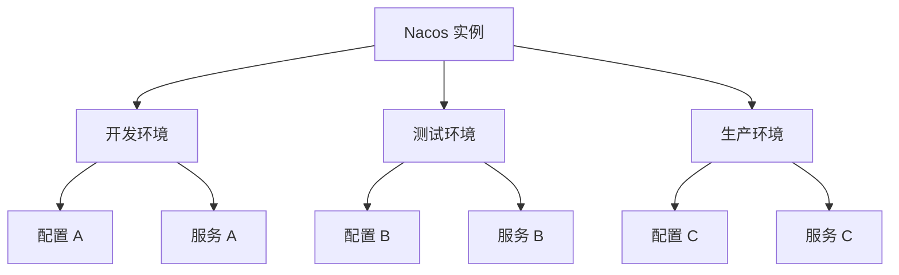
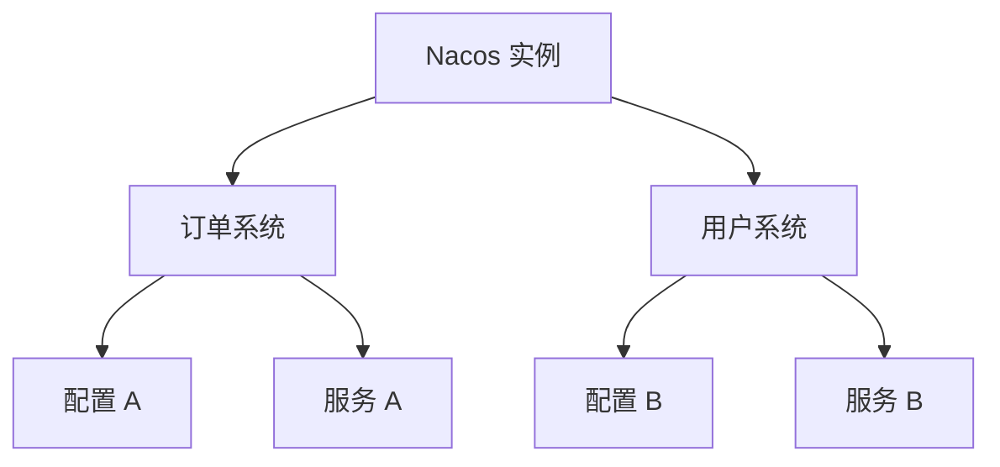

# Nacos 命名空间

## 介绍

在微服务架构中，配置管理和服务发现是两个非常重要的组件。Nacos 作为一个动态服务发现、配置和服务管理平台，提供了强大的功能来支持这些需求。其中，**命名空间（Namespace）**是 Nacos 中用于隔离配置和服务的一个重要概念。

命名空间可以帮助我们在同一个 Nacos 实例中，将不同的环境（如开发、测试、生产）或不同的业务模块（如订单系统、用户系统）进行隔离。通过命名空间，我们可以避免配置和服务之间的冲突，确保每个环境或模块的独立性。

## 命名空间的基本概念

在 Nacos 中，命名空间是一个逻辑上的隔离单元。每个命名空间都有自己的配置和服务，不同命名空间之间的配置和服务是相互隔离的。命名空间的主要作用包括：

1. **环境隔离**：将开发、测试、生产等环境的配置和服务分开管理。
2. **业务隔离**：将不同业务模块的配置和服务分开管理。
3. **权限控制**：通过命名空间可以实现更细粒度的权限控制。

## 创建和管理命名空间

在 Nacos 中，命名空间可以通过控制台或 API 进行创建和管理。每个命名空间都有一个唯一的 ID 和名称。

### 通过控制台创建命名空间

1. 登录 Nacos 控制台。
2. 在左侧导航栏中选择“命名空间”。
3. 点击“新建命名空间”按钮。
4. 输入命名空间的 ID 和名称，然后点击“确定”。

:::note
命名空间的 ID 是唯一的，通常使用 UUID 或自定义的字符串来标识。
:::

### 通过 API 创建命名空间

你也可以通过 Nacos 提供的 API 来创建命名空间。以下是一个使用 `curl` 命令创建命名空间的示例：

```bash
curl -X POST 'http://localhost:8848/nacos/v1/console/namespaces' \
-H 'Content-Type: application/x-www-form-urlencoded' \
-d 'customNamespaceId=dev&namespaceName=Development&namespaceDesc=Development Environment'
```

在这个示例中，我们创建了一个 ID 为 `dev`，名称为 `Development` 的命名空间，并为其添加了描述。

## 使用命名空间

在 Nacos 中，配置和服务都可以与命名空间关联。以下是如何在配置和服务中使用命名空间的示例。

### 配置管理中的命名空间

在 Nacos 中，配置项可以通过命名空间进行隔离。以下是一个在 Java 中使用 Nacos 配置管理的示例：

```java
import com.alibaba.nacos.api.config.ConfigService;
import com.alibaba.nacos.api.exception.NacosException;

public class NacosConfigExample {
    public static void main(String[] args) {
        try {
            String serverAddr = "localhost:8848";
            String namespace = "dev"; // 使用 dev 命名空间
            String dataId = "example-config";
            String group = "DEFAULT_GROUP";

            ConfigService configService = NacosFactory.createConfigService(serverAddr);
            String content = configService.getConfig(dataId, group, 5000);
            System.out.println("配置内容: " + content);
        } catch (NacosException e) {
            e.printStackTrace();
        }
    }
}
```

在这个示例中，我们通过指定 `namespace` 参数来获取 `dev` 命名空间下的配置。

### 服务发现中的命名空间

在服务发现中，命名空间同样可以用于隔离服务。以下是一个在 Spring Cloud Alibaba 中使用 Nacos 服务发现的示例：

```yaml
spring:
  application:
    name: example-service
  cloud:
    nacos:
      discovery:
        server-addr: localhost:8848
        namespace: dev # 使用 dev 命名空间
```

在这个示例中，我们将服务注册到 `dev` 命名空间中。

## 实际应用场景

### 多环境管理

在一个典型的开发流程中，我们通常会有多个环境，如开发环境、测试环境和生产环境。通过使用命名空间，我们可以将不同环境的配置和服务进行隔离，避免环境之间的冲突。



### 多业务模块管理

在一个大型系统中，可能会有多个业务模块，如订单系统、用户系统等。通过使用命名空间，我们可以将不同业务模块的配置和服务进行隔离，确保每个模块的独立性。



## 总结

Nacos 的命名空间功能为我们提供了一种简单而强大的方式来隔离和管理不同环境或业务模块的配置和服务。通过合理使用命名空间，我们可以避免配置和服务之间的冲突，确保系统的稳定性和可维护性。

## 附加资源

- [Nacos 官方文档](https://nacos.io/zh-cn/docs/what-is-nacos.html)
- [Spring Cloud Alibaba Nacos 文档](https://spring-cloud-alibaba-group.github.io/github-pages/hoxton/en-us/index.html#_spring_cloud_alibaba_nacos_discovery)

## 练习

1. 在 Nacos 控制台中创建一个新的命名空间，并为其添加一些配置项。
2. 使用 Nacos 的 API 创建一个命名空间，并尝试通过 API 获取该命名空间下的配置。
3. 在 Spring Cloud Alibaba 项目中，尝试将服务注册到不同的命名空间中，并观察服务发现的行为。