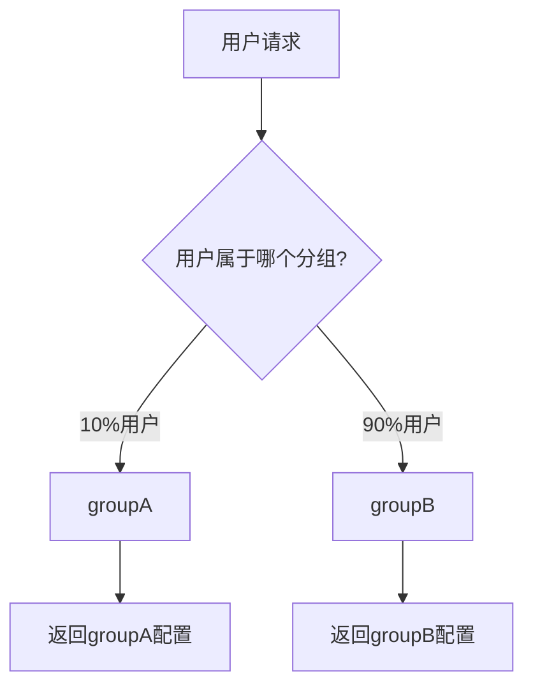

# Nacos 灰度发布配置

## 介绍

灰度发布（Gray Release）是一种逐步向用户发布新功能或配置的策略。通过灰度发布，您可以将新配置或功能逐步推送给一小部分用户，观察其效果，再决定是否全面发布。这种方式可以有效降低发布风险，确保系统的稳定性。

在Nacos配置中心中，灰度发布配置是通过**配置分组**和**配置标签**来实现的。通过为不同的用户群体分配不同的配置，您可以轻松实现灰度发布。

## 灰度发布的基本概念

### 什么是灰度发布？

灰度发布是一种逐步发布新功能或配置的策略。它允许您将新功能或配置逐步推送给一小部分用户，而不是一次性推送给所有用户。通过这种方式，您可以在发布过程中监控系统的表现，及时发现并修复问题。

### 为什么需要灰度发布？

- **降低风险**：通过逐步发布，您可以降低新功能或配置对系统的影响。
- **快速回滚**：如果发现问题，您可以快速回滚到旧版本。
- **用户反馈**：通过观察小部分用户的使用情况，您可以收集反馈并进行优化。

## 在Nacos中实现灰度发布

### 1. 创建配置分组

在Nacos中，您可以通过创建不同的配置分组来实现灰度发布。每个分组可以包含不同的配置内容。

```yaml
# 配置分组示例
group: groupA
dataId: example-config
content: |
  feature.enabled=true
  feature.version=1.0
```

### 2. 使用配置标签

Nacos支持为配置添加标签（Tag），您可以通过标签来区分不同的用户群体。

```yaml
# 配置标签示例
group: groupA
dataId: example-config
tag: beta
content: |
  feature.enabled=true
  feature.version=1.1
```

### 3. 配置推送策略

通过Nacos的配置推送策略，您可以将不同的配置推送给不同的用户群体。例如，您可以将`groupA`的配置推送给10%的用户，而将`groupB`的配置推送给90%的用户。



### 4. 监控与反馈

在灰度发布过程中，您需要密切监控系统的表现，收集用户反馈。如果发现问题，您可以快速回滚到旧版本。

## 实际案例

假设您正在开发一个电商网站，并希望逐步发布一个新的推荐算法。您可以通过Nacos实现灰度发布：

1. **创建配置分组**：为不同的用户群体创建不同的配置分组，例如`groupA`和`groupB`。
2. **添加配置标签**：为`groupA`添加`beta`标签，表示该分组使用新的推荐算法。
3. **配置推送策略**：将`groupA`的配置推送给10%的用户，`groupB`的配置推送给90%的用户。
4. **监控与反馈**：观察`groupA`用户的使用情况，收集反馈。如果新算法表现良好，您可以逐步扩大发布范围。

## 总结

灰度发布是一种有效的发布策略，可以帮助您降低发布风险，确保系统的稳定性。通过Nacos配置中心，您可以轻松实现灰度发布配置。通过创建配置分组、使用配置标签以及配置推送策略，您可以逐步向用户发布新功能或配置。

## 附加资源

- [Nacos官方文档](https://nacos.io/zh-cn/docs/what-is-nacos.html)
- [灰度发布策略详解](https://en.wikipedia.org/wiki/Feature_toggle)

## 练习

1. 在Nacos中创建一个配置分组，并为其添加不同的配置标签。
2. 尝试将不同的配置推送给不同的用户群体，并观察系统的表现。
3. 思考在实际项目中，如何利用灰度发布策略来降低发布风险。