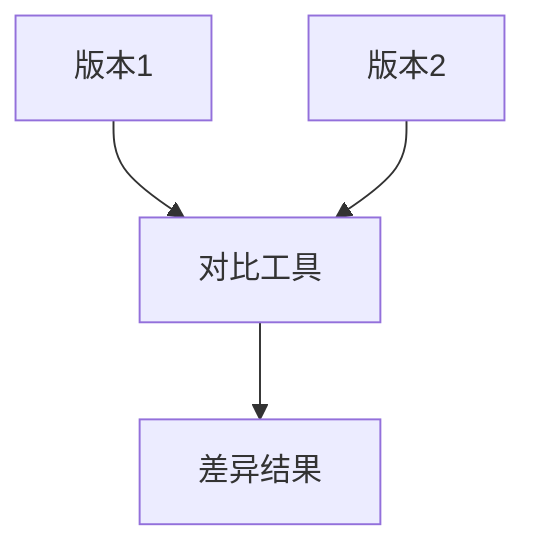

# Nacos 配置版本管理

在微服务架构中，配置管理是一个至关重要的环节。Nacos作为一个动态服务发现、配置管理和服务管理平台，提供了强大的配置管理功能。其中，**配置版本管理**是Nacos配置中心的核心功能之一，它允许开发者对配置的历史版本进行管理，支持配置回滚和版本对比，从而确保配置的稳定性和可追溯性。

本文将详细介绍Nacos配置版本管理的概念、使用方法以及实际应用场景，帮助你更好地理解和运用这一功能。

## 什么是配置版本管理？

在Nacos中，每次对配置进行修改时，系统都会自动生成一个新的版本。这些版本记录了配置的变更历史，开发者可以随时查看、对比或回滚到某个历史版本。配置版本管理的主要作用包括：

1. **版本追溯**：查看配置的变更历史，了解每次修改的内容。
2. **配置回滚**：当新配置出现问题或不符合预期时，可以快速回滚到之前的稳定版本。
3. **版本对比**：对比不同版本之间的差异，帮助开发者更好地理解配置的变更。

## 配置版本管理的基本操作

### 1. 查看配置历史版本

在Nacos控制台中，你可以轻松查看某个配置的历史版本。以下是具体步骤：

1. 登录Nacos控制台。
2. 进入“配置管理”页面，找到目标配置。
3. 点击配置名称，进入配置详情页。
4. 在详情页中，点击“历史版本”选项卡，即可查看该配置的所有历史版本。

### 2. 回滚到历史版本

如果发现当前配置存在问题，可以通过以下步骤回滚到某个历史版本：

1. 在“历史版本”选项卡中，找到需要回滚的版本。
2. 点击“回滚”按钮，系统会提示确认操作。
3. 确认后，当前配置将被替换为所选的历史版本。

:::tip
回滚操作是不可逆的，请确保在回滚前备份当前配置。
:::

### 3. 版本对比

Nacos提供了版本对比功能，帮助开发者快速识别配置的变更。以下是操作步骤：

1. 在“历史版本”选项卡中，选择两个需要对比的版本。
2. 点击“对比”按钮，系统会显示两个版本之间的差异。

## 实际应用场景

### 场景1：配置回滚

假设你在生产环境中发布了一个新的配置，但发现该配置导致了服务异常。此时，你可以通过Nacos的配置版本管理功能，快速回滚到之前的稳定版本，避免服务长时间不可用。

### 场景2：版本对比

在团队协作开发中，多个开发者可能会同时修改同一个配置。通过Nacos的版本对比功能，可以清晰地看到每次修改的内容，避免配置冲突。

### 场景3：配置审计

在需要审计配置变更的场景中，Nacos的配置版本管理功能可以帮助你追踪每次配置的修改记录，确保配置变更的可追溯性。

## 总结

Nacos的配置版本管理功能为微服务架构中的配置管理提供了强大的支持。通过版本追溯、配置回滚和版本对比，开发者可以更好地管理配置的变更历史，确保系统的稳定性和可维护性。

:::note
如果你对Nacos的配置管理功能感兴趣，可以尝试以下练习：
1. 在Nacos中创建一个配置，并多次修改它，观察历史版本的变化。
2. 尝试回滚到某个历史版本，并验证配置是否生效。
3. 使用版本对比功能，分析两个版本之间的差异。
:::

## 附加资源

- [Nacos官方文档](https://nacos.io/zh-cn/docs/what-is-nacos.html)
- [Nacos配置管理指南](https://nacos.io/zh-cn/docs/quick-start.html)

希望本文能帮助你更好地理解和使用Nacos的配置版本管理功能。如果你有任何问题或建议，欢迎在评论区留言！