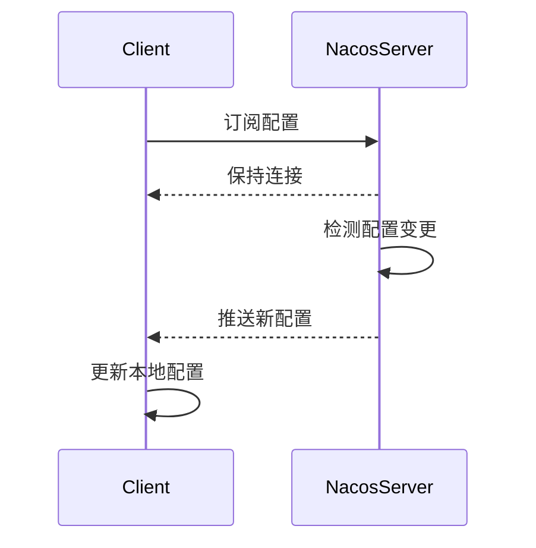

# Nacos 配置推送原理

Nacos是一个动态服务发现、配置管理和服务管理平台。在微服务架构中，Nacos配置中心扮演着至关重要的角色，它能够帮助开发者集中管理配置，并实现配置的动态推送。本文将详细介绍Nacos配置推送的原理，帮助初学者理解其工作机制。

## 什么是Nacos配置推送？

Nacos配置推送是指当配置中心的配置发生变化时，Nacos能够将这些变化实时推送到所有订阅了该配置的客户端。这种机制确保了微服务应用能够在不重启的情况下，动态更新配置，从而实现更高的灵活性和可维护性。

## Nacos 配置推送的工作原理

Nacos配置推送的核心原理基于长轮询（Long Polling）机制。以下是其工作流程的详细步骤：

1. **客户端订阅配置**：当客户端启动时，它会向Nacos服务器订阅所需的配置。订阅请求中包含了配置的`dataId`和`group`等信息。

2. **长轮询请求**：客户端向Nacos服务器发送一个长轮询请求，等待配置更新。Nacos服务器会保持这个连接，直到配置发生变化或超时。

3. **配置变更**：当Nacos服务器检测到配置发生变化时，它会立即将新的配置推送给所有订阅了该配置的客户端。

4. **客户端更新配置**：客户端接收到新的配置后，会立即更新本地配置，并重新加载应用。

### 长轮询机制

长轮询是一种改进的轮询机制，它减少了不必要的网络请求。与传统的短轮询相比，长轮询在服务器端保持连接，直到有数据更新或超时。这种方式能够显著减少网络开销，并提高实时性。



## 实际应用场景

假设我们有一个微服务应用，它需要根据不同的环境（如开发、测试、生产）加载不同的数据库连接配置。通过Nacos配置中心，我们可以将这些配置集中管理，并在配置发生变化时，实时推送到所有相关的微服务实例。

### 代码示例

以下是一个简单的Java代码示例，展示了如何使用Nacos客户端订阅配置并处理配置更新：

```java
import com.alibaba.nacos.api.config.ConfigService;
import com.alibaba.nacos.api.config.listener.Listener;
import com.alibaba.nacos.api.exception.NacosException;

public class NacosConfigExample {
    public static void main(String[] args) throws NacosException {
        String serverAddr = "localhost:8848";
        String dataId = "example-dataId";
        String group = "DEFAULT_GROUP";

        ConfigService configService = NacosFactory.createConfigService(serverAddr);

        // 获取初始配置
        String content = configService.getConfig(dataId, group, 5000);
        System.out.println("Initial config: " + content);

        // 添加配置监听器
        configService.addListener(dataId, group, new Listener() {
            @Override
            public void receiveConfigInfo(String configInfo) {
                System.out.println("Config updated: " + configInfo);
            }

            @Override
            public Executor getExecutor() {
                return null;
            }
        });

        // 保持主线程运行，以便监听配置更新
        while (true) {
            try {
                Thread.sleep(1000);
            } catch (InterruptedException e) {
                e.printStackTrace();
            }
        }
    }
}
```

:::note
在上述代码中，`ConfigService`用于与Nacos服务器交互，`addListener`方法用于添加配置监听器，当配置发生变化时，`receiveConfigInfo`方法会被调用。
:::

## 总结

Nacos配置推送机制通过长轮询实现了配置的动态更新，确保了微服务应用能够在运行时动态调整配置，而无需重启。这种机制在微服务架构中具有重要的应用价值，能够显著提高系统的灵活性和可维护性。

## 附加资源

- [Nacos官方文档](https://nacos.io/zh-cn/docs/what-is-nacos.html)
- [Nacos配置管理指南](https://nacos.io/zh-cn/docs/quick-start.html)

## 练习

1. 尝试在本地搭建一个Nacos服务器，并使用上述代码示例进行配置订阅和更新。
2. 修改配置中心的配置，观察客户端是否能够实时接收到更新。
3. 探索Nacos的其他功能，如服务发现和动态DNS。

通过以上内容，你应该对Nacos配置推送的原理有了初步的了解。继续深入学习Nacos的其他功能，将有助于你更好地掌握微服务架构中的配置管理。