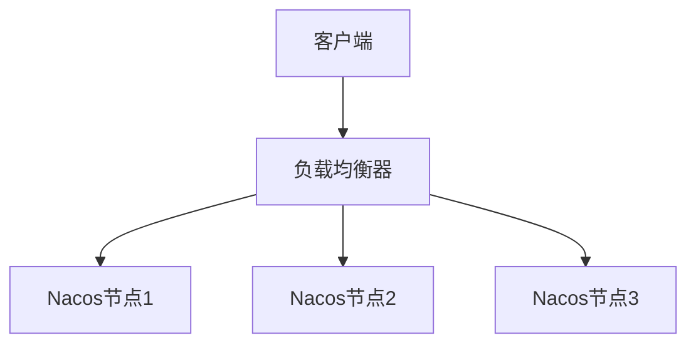

## 介绍

Nacos 是一个动态服务发现、配置管理和服务管理平台，广泛应用于微服务架构中。随着服务规模的扩大，Nacos 的性能优化变得尤为重要。本文将介绍 Nacos 性能优化的基本概念、常见的优化策略以及实际应用场景，帮助初学者理解如何提升 Nacos 的性能。

## Nacos 性能优化的基本概念

Nacos 性能优化主要涉及以下几个方面：

1. **服务发现性能优化**：提高服务注册和发现的效率，减少延迟。
2. **配置管理性能优化**：优化配置的读取和更新速度，降低配置中心的负载。
3. **集群性能优化**：通过集群部署和负载均衡，提高系统的整体性能。
4. **存储性能优化**：优化数据存储和查询性能，减少数据库的压力。

## 服务发现性能优化

服务发现是 Nacos 的核心功能之一。为了优化服务发现的性能，可以采取以下措施：

- **减少服务注册的频率**：通过合理设置心跳间隔和超时时间，减少不必要的服务注册和注销操作。
- **使用缓存**：在客户端缓存服务列表，减少对 Nacos 服务器的频繁查询。

```java
// 示例：设置心跳间隔和超时时间
NamingService namingService = NacosFactory.createNamingService(properties);
namingService.registerInstance("serviceName", "127.0.0.1", 8080);
namingService.setHeartbeatInterval(5000); // 设置心跳间隔为5秒
namingService.setHeartbeatTimeout(15000); // 设置超时时间为15秒
```

## 配置管理性能优化

配置管理是 Nacos 的另一个重要功能。为了优化配置管理的性能，可以采取以下措施：

- **批量读取配置**：减少配置读取的次数，通过批量读取配置来提高效率。
- **使用本地缓存**：在客户端缓存配置信息，减少对 Nacos 服务器的频繁请求。

```java
// 示例：批量读取配置
ConfigService configService = NacosFactory.createConfigService(properties);
String dataId = "exampleDataId";
String group = "exampleGroup";
String content = configService.getConfig(dataId, group, 5000); // 读取配置
```

## 集群性能优化

Nacos 支持集群部署，通过集群可以提高系统的可用性和性能。为了优化集群性能，可以采取以下措施：

- **负载均衡**：通过负载均衡器将请求分发到不同的 Nacos 节点，避免单点压力过大。
- **数据分片**：将数据分片存储在不同的节点上，提高数据查询的效率。



## 存储性能优化

Nacos 使用数据库来存储服务信息和配置数据。为了优化存储性能，可以采取以下措施：

- **数据库优化**：通过索引、分区等技术优化数据库的查询性能。
- **数据压缩**：对存储的数据进行压缩，减少存储空间和网络传输的开销。

```sql
-- 示例：创建索引
CREATE INDEX idx_service_name ON nacos_service (service_name);
```

## 实际案例

假设我们有一个微服务系统，包含多个服务实例。随着服务实例的增加，Nacos 的性能逐渐下降。通过以下优化措施，我们成功提升了系统的性能：

1. **减少服务注册频率**：将心跳间隔从1秒调整为5秒，减少了服务注册的频率。
2. **使用缓存**：在客户端缓存服务列表，减少了对 Nacos 服务器的频繁查询。
3. **集群部署**：通过负载均衡器将请求分发到多个 Nacos 节点，避免了单点压力过大。

## 总结

Nacos 性能优化是提升微服务系统整体性能的重要环节。通过合理设置服务注册频率、使用缓存、集群部署和数据库优化等措施，可以显著提升 Nacos 的性能。希望本文能帮助初学者理解 Nacos 性能优化的基本概念和策略。

## 附加资源

- [Nacos 官方文档](https://nacos.io/zh-cn/docs/what-is-nacos.html)
- [微服务架构设计与实践](https://example.com/microservices-design)
- [数据库优化指南](https://example.com/database-optimization)

## 练习

1. 尝试在本地部署一个 Nacos 集群，并测试其性能。
2. 修改 Nacos 客户端的心跳间隔和超时时间，观察对性能的影响。
3. 使用缓存技术优化服务发现和配置管理的性能。
