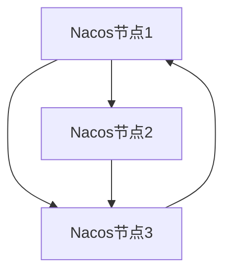

# Nacos 大规模部署优化

## 介绍

Nacos（Naming and Configuration Service）是一个动态服务发现、配置管理和服务管理平台，广泛应用于微服务架构中。随着服务规模的扩大，Nacos的性能和稳定性变得尤为重要。本文将探讨如何优化Nacos在大规模部署中的性能，确保系统的高可用性和稳定性。

## 基础概念

在深入优化策略之前，我们需要了解一些基础概念：

- **服务注册与发现**：Nacos允许服务实例注册自己，并发现其他服务实例。
- **配置管理**：Nacos提供集中化的配置管理，支持动态配置更新。
- **集群模式**：Nacos支持集群部署，以提高系统的可用性和扩展性。

## 优化策略

### 1. 集群部署

在大规模部署中，单节点Nacos无法满足高可用性和扩展性需求。因此，建议采用集群部署模式。



:::note
集群部署可以提高系统的可用性和扩展性，但需要确保节点之间的网络通信稳定。
:::

### 2. 数据库优化

Nacos默认使用嵌入式数据库Derby，但在大规模部署中，建议使用外部数据库如MySQL或PostgreSQL。

```sql
CREATE DATABASE nacos;
USE nacos;
SOURCE /path/to/nacos-mysql.sql;
```

:::tip
使用外部数据库可以提高数据存储的可靠性和性能，同时支持更复杂的查询操作。
:::

### 3. 缓存优化

Nacos使用缓存来提高服务发现和配置管理的性能。可以通过调整缓存策略来优化性能。

```yaml
nacos:
  cache:
    enabled: true
    size: 10000
    expireAfterWrite: 600s
```

:::caution
缓存策略的调整需要根据实际业务需求进行，过大的缓存可能导致内存溢出。
:::

### 4. 负载均衡

在大规模部署中，负载均衡是确保系统稳定性的关键。可以使用Nginx或HAProxy来实现负载均衡。

```nginx
upstream nacos_cluster {
    server 192.168.1.1:8848;
    server 192.168.1.2:8848;
    server 192.168.1.3:8848;
}

server {
    listen 80;
    location / {
        proxy_pass http://nacos_cluster;
    }
}
```

:::warning
负载均衡配置需要根据实际网络环境和业务需求进行调整，确保流量均匀分配。
:::

## 实际案例

### 案例1：电商平台

某电商平台使用Nacos进行服务发现和配置管理，随着业务增长，单节点Nacos无法满足需求。通过集群部署和数据库优化，系统性能显著提升，服务注册和发现的响应时间从500ms降低到50ms。

### 案例2：金融系统

某金融系统使用Nacos进行配置管理，由于配置项数量庞大，系统出现性能瓶颈。通过调整缓存策略和使用外部数据库，系统性能得到显著改善，配置更新的响应时间从1s降低到100ms。

## 总结

Nacos在大规模部署中的性能优化是一个复杂但至关重要的任务。通过集群部署、数据库优化、缓存调整和负载均衡等策略，可以显著提升系统的性能和稳定性。希望本文的内容能帮助初学者更好地理解和应用Nacos优化策略。

## 附加资源

- [Nacos官方文档](https://nacos.io/zh-cn/docs/what-is-nacos.html)
- [Nacos GitHub仓库](https://github.com/alibaba/nacos)
- [Nacos性能调优指南](https://nacos.io/zh-cn/docs/performance-tuning.html)

## 练习

1. 尝试在本地环境中部署一个Nacos集群，并测试其性能。
2. 使用MySQL作为Nacos的外部数据库，并比较其与嵌入式数据库的性能差异。
3. 调整Nacos的缓存策略，观察其对系统性能的影响。

通过以上练习，您将更深入地理解Nacos大规模部署优化的实际应用。