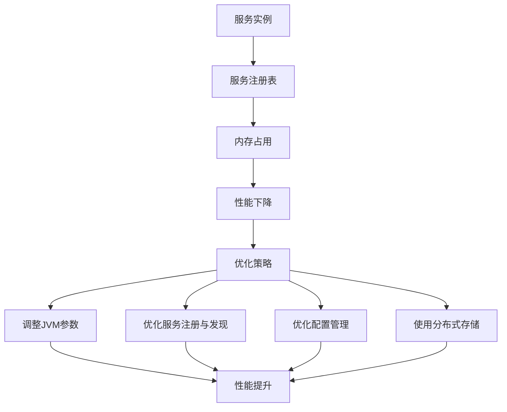

# Nacos 内存管理优化

Nacos 是一个动态服务发现、配置和服务管理平台，广泛应用于微服务架构中。随着服务规模的扩大，Nacos 的内存管理变得尤为重要。本文将详细介绍如何通过优化 Nacos 的内存管理来提升其性能。

## 介绍

Nacos 的内存管理主要涉及到服务注册、配置管理、元数据存储等方面。随着服务实例和配置项的增加，Nacos 的内存使用量也会显著增加。如果不加以优化，可能会导致内存溢出、性能下降等问题。因此，合理的内存管理是确保 Nacos 高效运行的关键。

## 内存管理优化策略

### 1. 调整 JVM 参数

JVM 参数的调整是优化 Nacos 内存管理的基础。通过合理设置 JVM 的堆内存大小、垃圾回收器等参数，可以有效提升 Nacos 的性能。

```bash
# 示例 JVM 参数设置
-Xms2g -Xmx2g -XX:+UseG1GC -XX:MaxGCPauseMillis=200
```

- `-Xms2g` 和 `-Xmx2g`：设置 JVM 的初始堆内存和最大堆内存为 2GB。
- `-XX:+UseG1GC`：使用 G1 垃圾回收器，适合大内存应用。
- `-XX:MaxGCPauseMillis=200`：设置最大垃圾回收停顿时间为 200 毫秒。

### 2. 优化服务注册与发现

Nacos 的服务注册与发现功能是其核心功能之一。随着服务实例的增加，服务注册表会占用大量内存。可以通过以下方式优化：

- **定期清理无效服务实例**：通过配置 `nacos.naming.clean.interval` 参数，定期清理无效的服务实例，释放内存。

```yaml
# 示例配置
nacos:
  naming:
    clean:
      interval: 60000  # 60秒清理一次
```

- **限制服务实例数量**：通过配置 `nacos.naming.instance.limit` 参数，限制每个服务的最大实例数量，防止内存过度占用。

```yaml
# 示例配置
nacos:
  naming:
    instance:
      limit: 1000  # 每个服务最多1000个实例
```

### 3. 优化配置管理

Nacos 的配置管理功能也会占用大量内存，尤其是在配置项较多的情况下。可以通过以下方式优化：

- **配置项压缩**：Nacos 支持对配置项进行压缩存储，减少内存占用。

```yaml
# 示例配置
nacos:
  config:
    compress:
      enabled: true  # 启用配置项压缩
```

- **配置项缓存**：通过配置 `nacos.config.cache.enabled` 参数，启用配置项缓存，减少重复加载配置项的内存开销。

```yaml
# 示例配置
nacos:
  config:
    cache:
      enabled: true  # 启用配置项缓存
```

### 4. 使用分布式存储

对于大规模的服务集群，单机内存可能无法满足需求。可以考虑使用分布式存储来分担内存压力。

- **使用 MySQL 作为存储后端**：Nacos 支持将数据存储在 MySQL 中，减少内存占用。

```yaml
# 示例配置
spring:
  datasource:
    url: jdbc:mysql://localhost:3306/nacos
    username: root
    password: root
```

## 实际案例

假设我们有一个包含 1000 个服务实例的微服务集群，每个服务实例有 10 个配置项。如果不进行优化，Nacos 的内存使用量可能会迅速增加，导致性能下降。

通过调整 JVM 参数、优化服务注册与发现、配置管理以及使用分布式存储，我们可以显著减少内存使用量，提升 Nacos 的性能。



## 总结

通过合理调整 JVM 参数、优化服务注册与发现、配置管理以及使用分布式存储，我们可以有效优化 Nacos 的内存管理，提升其性能。希望本文的内容能够帮助初学者更好地理解和应用 Nacos 的内存管理优化策略。

## 附加资源

- [Nacos 官方文档](https://nacos.io/zh-cn/docs/what-is-nacos.html)
- [JVM 参数调优指南](https://docs.oracle.com/javase/8/docs/technotes/guides/vm/gctuning/)
- [微服务架构中的服务发现与配置管理](https://microservices.io/patterns/service-registry.html)

## 练习

1. 尝试在你的 Nacos 环境中调整 JVM 参数，观察性能变化。
2. 配置 Nacos 的定期清理无效服务实例功能，查看内存使用情况。
3. 研究如何将 Nacos 的存储后端切换为 MySQL，并测试其性能表现。
