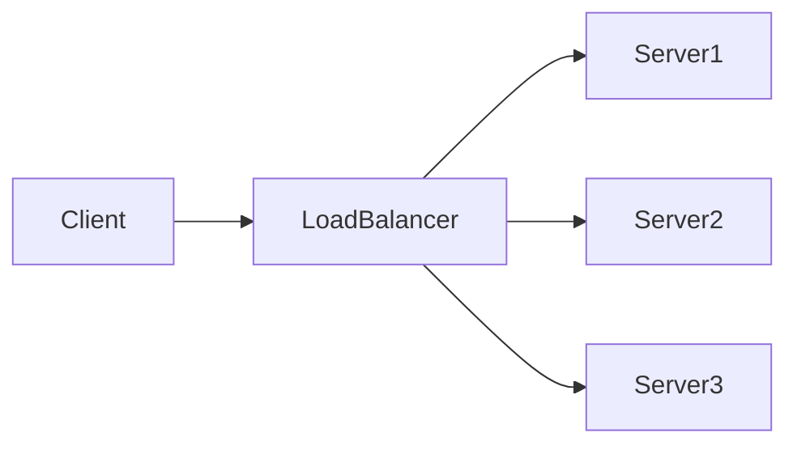

## 介绍

Nacos（Naming and Configuration Service）是一个动态服务发现、配置管理和服务管理平台。在高并发场景下，Nacos的网络通信性能可能成为系统的瓶颈。因此，优化Nacos的网络通信对于提升系统整体性能至关重要。

本文将介绍Nacos网络通信优化的基本概念、常见问题以及优化策略，帮助初学者理解并应用这些技术。

## 网络通信基础

在Nacos中，网络通信主要涉及以下几个方面：

1. **服务注册与发现**：客户端与服务端之间的通信。
2. **配置管理**：客户端从服务端获取配置信息。
3. **心跳机制**：客户端定期向服务端发送心跳包以维持连接。

这些通信过程可能受到网络延迟、带宽限制、连接数过多等因素的影响，导致性能下降。

## 优化策略

### 1. 使用长连接

Nacos默认使用HTTP短连接进行通信，每次请求都需要建立和断开连接，这会增加网络开销。使用长连接可以减少连接建立和断开的次数，从而提升性能。

```java
// 示例：使用长连接
NacosFactory.createConfigService(properties).getConfig("dataId", "group", 5000);
```

### 2. 压缩数据传输

在传输大量数据时，压缩数据可以减少网络带宽的占用，从而提升传输效率。Nacos支持Gzip压缩，可以在客户端和服务端配置启用。

```yaml
# 示例：启用Gzip压缩
nacos:
  client:
    compression:
      enabled: true
```

### 3. 负载均衡

在高并发场景下，单个Nacos服务端可能无法承受所有请求。通过负载均衡将请求分发到多个服务端，可以有效分担压力。



### 4. 调整心跳间隔

心跳机制用于维持客户端与服务端的连接，但过于频繁的心跳会增加网络负担。适当调整心跳间隔可以在保证连接稳定的同时减少网络开销。

```java
// 示例：调整心跳间隔
properties.put(PropertyKeyConst.HEART_BEAT_INTERVAL, "5000"); // 5秒
```

## 实际案例

### 案例1：电商平台的服务发现优化

某电商平台在促销活动期间，服务注册和发现的请求量激增，导致Nacos服务端响应变慢。通过以下优化措施，问题得到解决：

1. **启用长连接**：减少连接建立和断开的开销。
2. **启用Gzip压缩**：减少数据传输量。
3. **调整心跳间隔**：从1秒调整为5秒，减少网络负担。

### 案例2：微服务架构的配置管理优化

某微服务架构的系统在启动时，所有服务同时从Nacos获取配置信息，导致服务端压力过大。通过以下优化措施，问题得到缓解：

1. **负载均衡**：将请求分发到多个Nacos服务端。
2. **缓存配置**：在客户端缓存配置信息，减少对服务端的请求。

## 总结

Nacos网络通信优化是提升系统性能的重要手段。通过使用长连接、压缩数据传输、负载均衡和调整心跳间隔等策略，可以有效减少网络开销，提升系统稳定性和响应速度。

## 附加资源

- [Nacos官方文档](https://nacos.io/zh-cn/docs/what-is-nacos.html)
- [Nacos性能调优指南](https://nacos.io/zh-cn/docs/performance-tuning.html)

## 练习

1. 在你的Nacos项目中启用Gzip压缩，并观察网络传输量的变化。
2. 调整Nacos客户端的心跳间隔，测试其对系统性能的影响。
3. 尝试在Nacos集群中配置负载均衡，观察请求分发的效果。
