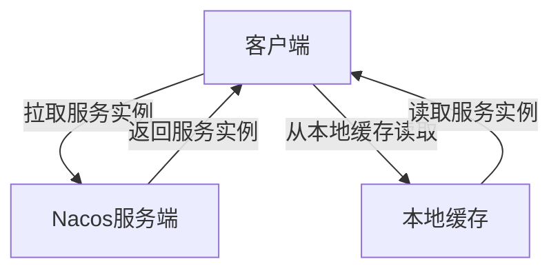

# Nacos 缓存策略优化

Nacos 是一个动态服务发现、配置和服务管理平台，广泛应用于微服务架构中。在高并发场景下，Nacos 的性能优化尤为重要，而缓存策略的优化是其中的关键环节之一。本文将详细介绍 Nacos 的缓存机制，并提供优化建议和实际案例。

## 什么是Nacos缓存策略？

Nacos 的缓存策略是指 Nacos 在服务发现和配置管理中使用的缓存机制。通过缓存，Nacos 可以减少对数据库的直接访问，从而提升系统的响应速度和吞吐量。缓存策略的优化可以帮助系统在高并发场景下保持稳定性和高效性。

## Nacos 缓存机制

Nacos 的缓存机制主要包括以下几个方面：

1. **服务发现缓存**：Nacos 会将服务实例的信息缓存在内存中，以减少对注册中心的频繁查询。
2. **配置管理缓存**：Nacos 会将配置信息缓存在客户端和服务端，以减少对配置中心的频繁访问。

### 服务发现缓存

在服务发现中，Nacos 客户端会定期从服务端拉取最新的服务实例信息，并将其缓存在本地。当客户端需要调用某个服务时，它会直接从本地缓存中获取服务实例列表，而不需要每次都向服务端发起请求。

### 配置管理缓存

在配置管理中，Nacos 客户端会定期从服务端拉取最新的配置信息，并将其缓存在本地。当应用程序需要获取配置时，它会直接从本地缓存中读取，而不需要每次都向服务端发起请求。

## 缓存策略优化

为了进一步提升 Nacos 的性能，我们可以从以下几个方面优化缓存策略：

### 1. 调整缓存刷新频率

Nacos 客户端默认会每隔一定时间（如 10 秒）从服务端拉取最新的服务实例或配置信息。在高并发场景下，频繁的拉取操作可能会导致服务端压力过大。我们可以通过调整缓存刷新频率来减少对服务端的压力。

```java
// 示例：调整Nacos客户端的缓存刷新频率
NacosDiscoveryProperties properties = new NacosDiscoveryProperties();
properties.setCacheRefreshInterval(30 * 1000); // 将缓存刷新频率调整为30秒
```

### 2. 使用本地缓存

在某些场景下，我们可以将 Nacos 的缓存信息持久化到本地文件系统中，以减少对服务端的依赖。当服务端不可用时，客户端可以从本地缓存中读取服务实例或配置信息，从而保证系统的可用性。

```java
// 示例：启用Nacos客户端的本地缓存
NacosDiscoveryProperties properties = new NacosDiscoveryProperties();
properties.setLocalCacheEnabled(true); // 启用本地缓存
```

### 3. 优化缓存大小

Nacos 客户端默认会缓存一定数量的服务实例或配置信息。如果缓存过大，可能会导致内存占用过高；如果缓存过小，可能会导致缓存命中率降低。我们可以根据实际需求调整缓存大小。

```java
// 示例：调整Nacos客户端的缓存大小
NacosDiscoveryProperties properties = new NacosDiscoveryProperties();
properties.setCacheSize(1000); // 将缓存大小调整为1000
```

## 实际案例

假设我们有一个微服务系统，其中包含多个服务实例。在高并发场景下，Nacos 服务端的压力较大，导致服务发现的响应时间变长。通过调整缓存刷新频率和启用本地缓存，我们可以显著减少对服务端的请求次数，从而提升系统的性能。



在上图中，客户端首先尝试从本地缓存中读取服务实例信息。如果本地缓存中没有所需信息，客户端才会向 Nacos 服务端发起请求。

## 总结

通过优化 Nacos 的缓存策略，我们可以显著提升系统的性能和稳定性。在实际应用中，我们可以根据具体需求调整缓存刷新频率、启用本地缓存以及优化缓存大小。这些优化措施可以帮助我们在高并发场景下保持系统的高效运行。

## 附加资源

- [Nacos官方文档](https://nacos.io/zh-cn/docs/what-is-nacos.html)
- [微服务架构中的缓存策略](https://microservices.io/patterns/caching.html)

## 练习

1. 尝试在你的 Nacos 客户端中调整缓存刷新频率，并观察系统的性能变化。
2. 启用本地缓存，并在服务端不可用时测试系统的可用性。
3. 根据你的系统需求，调整 Nacos 客户端的缓存大小，并评估其对内存占用的影响。
