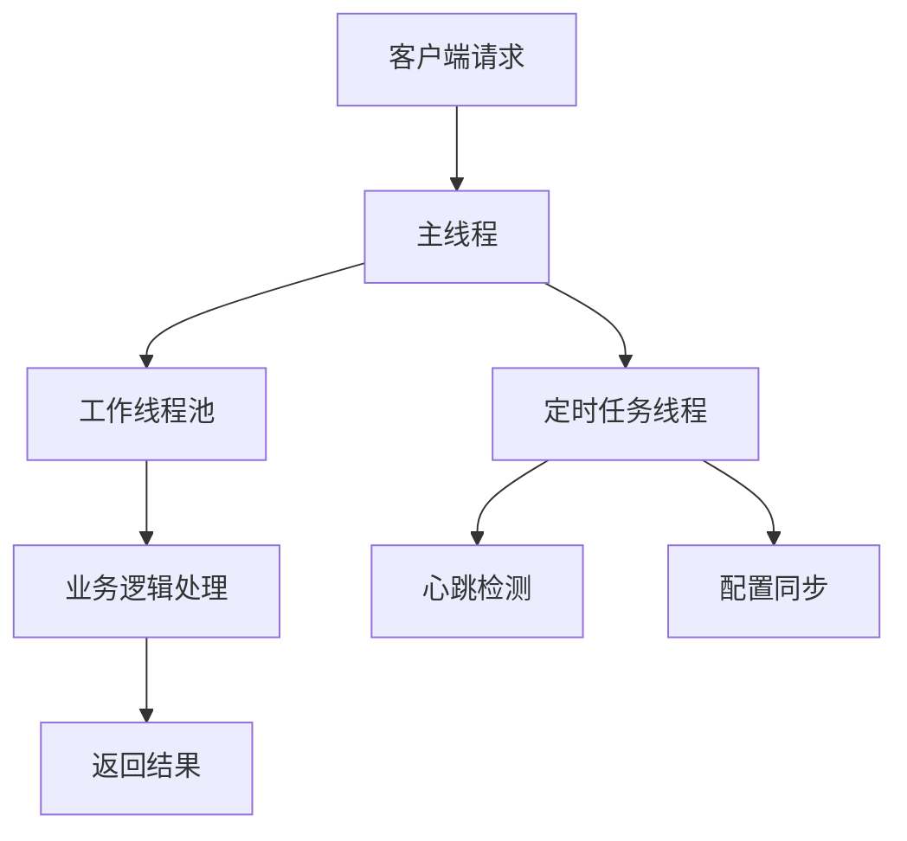

## 介绍

Nacos是一个动态服务发现、配置管理和服务管理平台，广泛应用于微服务架构中。在高并发场景下，Nacos的性能表现尤为重要。线程模型是影响Nacos性能的关键因素之一。本文将详细介绍Nacos的线程模型，并探讨如何通过调优来提升其性能。

## Nacos 线程模型概述

Nacos的线程模型主要分为以下几部分：

1. **主线程**：负责接收客户端请求。
2. **工作线程**：处理具体的业务逻辑。
3. **定时任务线程**：执行定时任务，如心跳检测、配置同步等。

### 主线程

主线程负责监听客户端请求，并将请求分发给工作线程。主线程的性能直接影响Nacos的响应速度。

### 工作线程

工作线程负责处理具体的业务逻辑，如服务注册、配置更新等。工作线程的数量和性能直接影响Nacos的并发处理能力。

### 定时任务线程

定时任务线程负责执行定时任务，如心跳检测、配置同步等。定时任务线程的性能和调度策略会影响Nacos的稳定性和实时性。

## 线程模型调优

### 1. 调整线程池大小

Nacos使用线程池来管理工作线程。通过调整线程池的大小，可以优化Nacos的并发处理能力。

```java
// 示例：调整Nacos线程池大小
ExecutorService executorService = Executors.newFixedThreadPool(100);
```

:::tip
线程池大小的设置应根据实际业务需求和服务器性能进行调整。过小的线程池会导致请求堆积，过大的线程池会消耗过多资源。
:::

### 2. 优化线程调度策略

Nacos的定时任务线程需要高效的调度策略。可以通过调整定时任务的执行频率和优先级来优化线程调度。

```java
// 示例：调整定时任务执行频率
ScheduledExecutorService scheduledExecutorService = Executors.newScheduledThreadPool(10);
scheduledExecutorService.scheduleAtFixedRate(() -> {
    // 定时任务逻辑
}, 0, 1, TimeUnit.SECONDS);
```

:::caution
定时任务的执行频率应根据业务需求进行调整。过高的频率会增加系统负载，过低的频率会影响实时性。
:::

### 3. 使用异步处理

对于耗时较长的操作，可以使用异步处理来避免阻塞主线程。

```java
// 示例：使用异步处理
CompletableFuture.runAsync(() -> {
    // 耗时操作
}, executorService);
```

:::note
异步处理可以提高系统的响应速度，但需要注意线程安全和资源管理。
:::

## 实际案例

### 案例：高并发场景下的Nacos性能优化

在一个高并发的微服务系统中，Nacos作为服务发现和配置管理中心，面临着大量的请求。通过调整线程池大小和优化线程调度策略，系统的响应时间和稳定性得到了显著提升。



:::warning
在实际应用中，调优需要结合具体的业务场景和系统性能进行，避免盲目调整。
:::

## 总结

通过调整线程池大小、优化线程调度策略和使用异步处理，可以显著提升Nacos的性能。在实际应用中，应根据具体业务需求和系统性能进行调优。

## 附加资源

- [Nacos官方文档](https://nacos.io/zh-cn/docs/what-is-nacos.html)
- [Java线程池详解](https://docs.oracle.com/javase/8/docs/api/java/util/concurrent/ExecutorService.html)
- [微服务架构中的性能优化](https://microservices.io/patterns/performance/)

## 练习

1. 尝试在你的Nacos环境中调整线程池大小，观察性能变化。
2. 编写一个定时任务，并使用不同的调度策略进行测试。
3. 使用异步处理优化一个耗时操作，并比较优化前后的性能差异。

通过以上学习和实践，你将能够更好地理解和应用Nacos线程模型调优，提升系统的性能和稳定性。