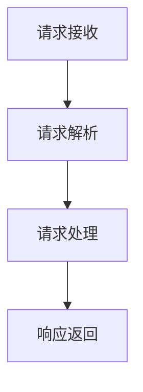
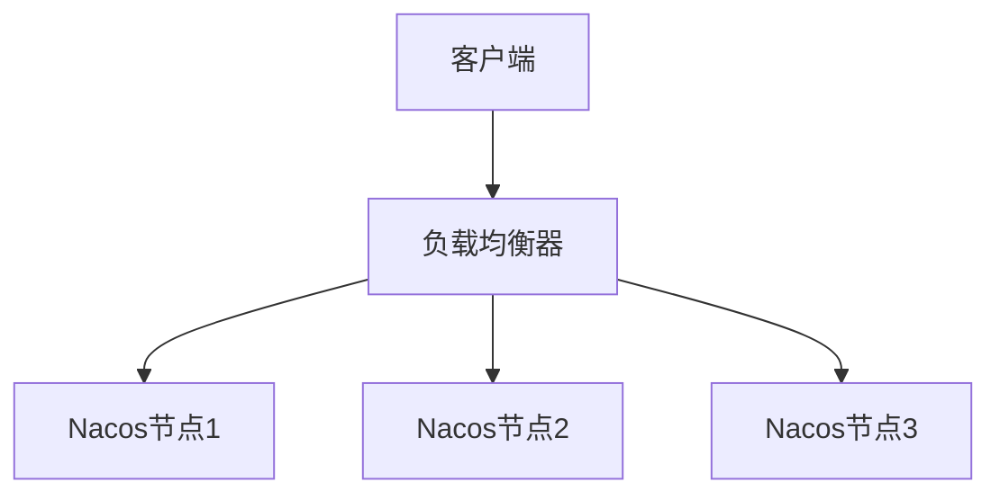

## 介绍

Nacos 是一个动态服务发现、配置管理和服务管理平台，广泛应用于微服务架构中。随着服务规模的扩大，Nacos 的请求处理能力可能成为系统性能的瓶颈。因此，优化 Nacos 的请求处理性能对于提升整体系统的响应速度和稳定性至关重要。

本文将介绍如何通过优化 Nacos 的请求处理流程，提升其性能。我们将从基础概念入手，逐步讲解优化策略，并提供实际案例和代码示例。

## 请求处理流程

在深入优化之前，我们需要了解 Nacos 的请求处理流程。Nacos 的请求处理流程可以分为以下几个步骤：

1. **请求接收**：Nacos 接收到来自客户端的请求。
2. **请求解析**：Nacos 解析请求，提取出必要的信息。
3. **请求处理**：Nacos 根据请求类型，执行相应的操作（如服务注册、配置更新等）。
4. **响应返回**：Nacos 将处理结果返回给客户端。



## 优化策略

### 1. 请求缓存

在 Nacos 中，许多请求是重复的，例如频繁查询服务列表或配置信息。通过引入缓存机制，可以减少对后端存储的直接访问，从而提升响应速度。

:::tip
缓存适用于读多写少的场景。对于频繁更新的数据，需要谨慎使用缓存，以避免数据不一致的问题。
:::

#### 代码示例

```java
// 使用缓存优化服务列表查询
public List<ServiceInfo> getServiceList(String serviceName) {
    List<ServiceInfo> cachedServiceList = cache.get(serviceName);
    if (cachedServiceList != null) {
        return cachedServiceList;
    }
    List<ServiceInfo> serviceList = queryServiceListFromStorage(serviceName);
    cache.put(serviceName, serviceList);
    return serviceList;
}
```

### 2. 请求合并

在某些场景下，多个相似的请求可以合并为一个请求进行处理。例如，多个客户端同时请求相同的配置信息时，可以将这些请求合并为一个请求，减少对后端存储的压力。

#### 代码示例

```java
// 请求合并示例
public void handleConfigRequest(String dataId, String group) {
    if (isRequestMerged(dataId, group)) {
        return; // 请求已合并，直接返回
    }
    mergeRequest(dataId, group);
    ConfigInfo configInfo = fetchConfigFromStorage(dataId, group);
    notifyAllListeners(dataId, group, configInfo);
}
```

### 3. 异步处理

对于一些耗时的操作，可以采用异步处理的方式，避免阻塞主线程。例如，服务注册和配置更新等操作可以通过异步任务来处理，提升系统的并发处理能力。

#### 代码示例

```java
// 异步处理示例
public void registerServiceAsync(ServiceInfo serviceInfo) {
    CompletableFuture.runAsync(() -> {
        registerService(serviceInfo);
    }, executorService);
}
```

### 4. 负载均衡

在高并发场景下，Nacos 的请求处理可能会集中在某些节点上，导致性能瓶颈。通过引入负载均衡机制，可以将请求均匀地分配到多个节点上，提升系统的整体处理能力。



## 实际案例

### 案例：配置中心性能优化

某电商平台的配置中心使用了 Nacos 作为配置管理工具。随着业务的发展，配置中心的请求量急剧增加，导致系统响应变慢。通过引入请求缓存和异步处理机制，配置中心的性能得到了显著提升。

#### 优化前

- 平均响应时间：500ms
- 最大并发请求数：1000

#### 优化后

- 平均响应时间：200ms
- 最大并发请求数：5000

## 总结

通过本文的介绍，我们了解了如何优化 Nacos 的请求处理性能。通过引入缓存、请求合并、异步处理和负载均衡等策略，可以显著提升 Nacos 的响应速度和稳定性。在实际应用中，需要根据具体的业务场景选择合适的优化策略。

## 附加资源

- [Nacos 官方文档](https://nacos.io/zh-cn/docs/what-is-nacos.html)
- [微服务架构中的性能优化](https://www.example.com/microservices-performance-optimization)

## 练习

1. 尝试在本地搭建一个 Nacos 环境，并模拟高并发场景，观察系统的性能表现。
2. 实现一个简单的缓存机制，优化 Nacos 的服务列表查询功能。
3. 研究 Nacos 的源码，了解其请求处理流程，并尝试提出进一步的优化建议。
