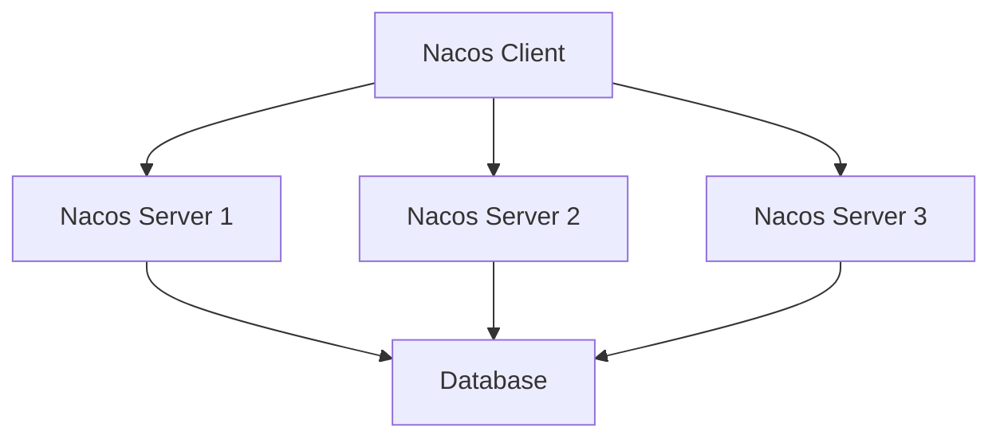

# Nacos 服务发现性能优化

在现代微服务架构中，服务发现是一个至关重要的组件。Nacos作为一款流行的服务发现和配置管理工具，其性能直接影响到整个系统的响应速度和稳定性。本文将深入探讨如何优化Nacos服务发现的性能，帮助初学者理解并应用这些优化策略。

## 什么是Nacos服务发现？

Nacos（Naming and Configuration Service）是一个动态服务发现、配置和服务管理平台。它支持多种服务发现模式，包括基于DNS和基于HTTP的服务发现。Nacos的核心功能之一是服务注册与发现，它允许服务实例在启动时注册自己，并在需要时发现其他服务实例。

## 为什么需要优化Nacos服务发现性能？

随着微服务数量的增加，服务发现的负载也会显著增加。如果Nacos的性能没有得到优化，可能会导致服务发现的延迟增加，进而影响整个系统的响应速度。因此，优化Nacos服务发现的性能是确保系统高效运行的关键。

## Nacos 服务发现性能优化策略

### 1. 减少服务注册的频率

服务实例在启动时会向Nacos注册自己，频繁的注册操作会增加Nacos的负载。可以通过以下方式减少注册频率：

- **延长心跳间隔**：默认情况下，Nacos客户端会每隔5秒发送一次心跳。可以通过调整心跳间隔来减少注册频率。例如，将心跳间隔设置为10秒：

  ```java
  NacosDiscoveryProperties properties = new NacosDiscoveryProperties();
  properties.setHeartBeatInterval(10000); // 10秒
  ```

- **使用长连接**：确保Nacos客户端与服务器之间的连接是长连接，避免频繁建立和断开连接。

### 2. 优化服务发现的查询频率

服务发现的核心是查询服务实例列表。频繁的查询操作会增加Nacos的负载。可以通过以下方式优化查询频率：

- **缓存服务实例列表**：在客户端缓存服务实例列表，减少对Nacos服务器的查询次数。例如，使用Spring Cloud的`@LoadBalanced`注解时，可以通过配置缓存时间来实现：

  ```yaml
  ribbon:
    ServerListRefreshInterval: 30000 # 30秒
  ```

- **使用本地缓存**：在客户端使用本地缓存存储服务实例列表，减少对Nacos服务器的依赖。

### 3. 调整Nacos服务器的配置

Nacos服务器的配置也会影响服务发现的性能。可以通过以下方式调整配置：

- **增加Nacos服务器的资源**：确保Nacos服务器有足够的CPU和内存资源来处理大量的服务注册和发现请求。

- **优化数据库性能**：Nacos使用数据库来存储服务注册信息。可以通过优化数据库性能来提升Nacos的整体性能。例如，使用高性能的数据库（如MySQL或PostgreSQL），并确保数据库连接池的配置合理。

### 4. 使用Nacos集群

单点Nacos服务器可能会成为性能瓶颈。可以通过部署Nacos集群来提升服务发现的性能和可靠性。Nacos集群通过Raft协议实现数据一致性，确保多个节点之间的数据同步。



### 5. 监控和调优

持续监控Nacos的性能指标，并根据监控结果进行调优。可以使用Nacos自带的监控工具，或者集成第三方监控工具（如Prometheus）来监控Nacos的性能。

## 实际案例

假设我们有一个电商系统，包含多个微服务（如订单服务、库存服务、支付服务等）。随着业务量的增加，服务发现的延迟逐渐增加，影响了用户的购物体验。通过以下优化措施，我们成功提升了Nacos服务发现的性能：

1. **延长心跳间隔**：将心跳间隔从5秒调整为10秒，减少了Nacos服务器的负载。
2. **缓存服务实例列表**：在客户端缓存服务实例列表，减少了查询Nacos服务器的频率。
3. **部署Nacos集群**：通过部署Nacos集群，提升了服务发现的性能和可靠性。

经过这些优化措施，服务发现的延迟显著降低，用户的购物体验得到了明显改善。

## 总结

优化Nacos服务发现的性能是确保微服务架构高效运行的关键。通过减少服务注册的频率、优化服务发现的查询频率、调整Nacos服务器的配置、使用Nacos集群以及持续监控和调优，可以显著提升Nacos服务发现的性能。

## 附加资源

- [Nacos官方文档](https://nacos.io/zh-cn/docs/what-is-nacos.html)
- [Spring Cloud Nacos集成指南](https://spring.io/projects/spring-cloud-alibaba)
- [微服务架构设计模式](https://microservices.io/)

## 练习

1. 尝试在你的本地环境中部署一个Nacos集群，并观察其性能表现。
2. 修改Nacos客户端的心跳间隔，观察其对服务发现性能的影响。
3. 使用Prometheus监控Nacos的性能指标，并根据监控结果进行调优。
