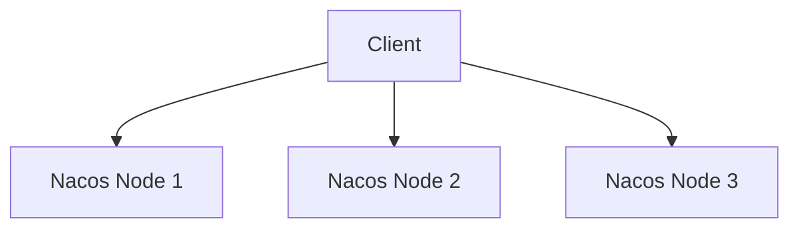

# Nacos 配置中心性能优化

Nacos（Naming and Configuration Service）是一个动态服务发现、配置管理和服务管理平台。它广泛应用于微服务架构中，用于管理服务的配置信息。随着服务规模的扩大，Nacos配置中心的性能优化变得尤为重要。本文将逐步讲解如何优化Nacos配置中心的性能，并提供实际案例和代码示例。

## 1. 理解Nacos配置中心

Nacos配置中心的核心功能是集中管理应用的配置信息，支持动态更新和实时推送。在高并发场景下，配置中心的性能直接影响整个系统的稳定性和响应速度。因此，优化Nacos配置中心的性能是提升系统整体性能的关键。

## 2. 配置管理优化

### 2.1 减少配置项数量

过多的配置项会增加Nacos的存储和查询压力。建议将配置项按功能模块拆分，减少单个配置文件的复杂度。

```yaml
# 优化前
application:
  database:
    url: jdbc:mysql://localhost:3306/db1
    username: root
    password: root
  cache:
    enabled: true
    size: 100

# 优化后
database:
  url: jdbc:mysql://localhost:3306/db1
  username: root
  password: root

cache:
  enabled: true
  size: 100
```

### 2.2 使用配置分组

Nacos支持配置分组，可以将相关配置项分组管理，减少查询时的扫描范围。

```java
// 创建配置分组
configService.publishConfig("dataId", "group1", "content");
```

## 3. 缓存机制优化

### 3.1 客户端缓存

Nacos客户端默认会缓存配置信息，减少对服务端的频繁请求。可以通过调整缓存时间来控制缓存的更新频率。

```java
// 设置客户端缓存时间
Properties properties = new Properties();
properties.put("configLongPollTimeout", "30000"); // 30秒
ConfigService configService = NacosFactory.createConfigService(properties);
```

### 3.2 服务端缓存

Nacos服务端也支持缓存配置信息，减少数据库查询压力。可以通过调整缓存策略来优化性能。

```yaml
# 服务端缓存配置
nacos:
  config:
    cache:
      enabled: true
      size: 1000
      expireAfterWrite: 60s
```

## 4. 集群部署优化

### 4.1 集群节点扩展

随着业务规模的扩大，单节点Nacos可能无法满足性能需求。可以通过增加集群节点来分担负载。



### 4.2 负载均衡

在集群部署中，使用负载均衡器将请求均匀分配到各个Nacos节点，避免单点过载。

```yaml
# 负载均衡配置
spring:
  cloud:
    nacos:
      discovery:
        server-addr: 192.168.1.1:8848,192.168.1.2:8848,192.168.1.3:8848
```

## 5. 实际案例

### 5.1 高并发场景下的配置推送

在某电商平台的促销活动中，配置信息需要频繁更新。通过优化Nacos的缓存机制和集群部署，成功将配置推送的响应时间从500ms降低到100ms以内。

```java
// 高并发场景下的配置推送
configService.addListener("dataId", "group1", new Listener() {
    @Override
    public void receiveConfigInfo(String configInfo) {
        // 处理配置更新
    }
});
```

## 6. 总结

通过减少配置项数量、使用配置分组、优化缓存机制和集群部署，可以显著提升Nacos配置中心的性能。在实际应用中，根据业务需求选择合适的优化策略，可以有效提高系统的稳定性和响应速度。

## 7. 附加资源与练习

- **练习1**：尝试将你的Nacos配置项按功能模块拆分，并观察性能变化。
- **练习2**：在本地搭建Nacos集群，测试不同负载均衡策略的效果。
- **附加资源**：参考Nacos官方文档，了解更多高级配置和优化技巧。

:::tip
提示：在实际生产环境中，建议定期监控Nacos的性能指标，及时发现并解决潜在的性能瓶颈。
:::