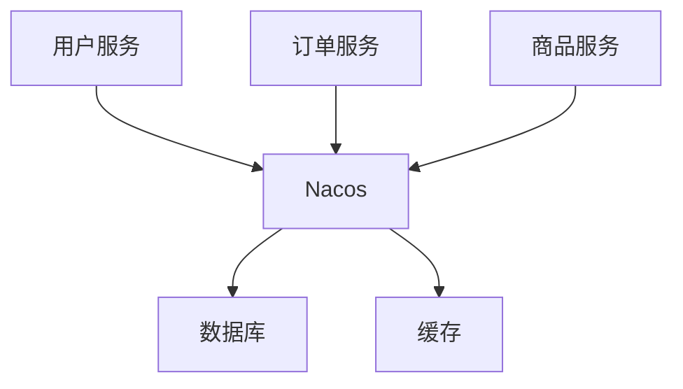

## 介绍

Nacos（Naming and Configuration Service）是一个开源的动态服务发现、配置管理和服务管理平台。它专为云原生架构设计，帮助开发者轻松构建和管理微服务应用。在云原生架构中，Nacos 扮演着至关重要的角色，尤其是在服务发现、配置管理和动态服务治理方面。

云原生架构的核心目标是实现应用的弹性、可扩展性和高可用性。Nacos 通过提供统一的服务注册与发现、动态配置管理和服务健康监测等功能，帮助开发者实现这些目标。

## Nacos 的核心功能

### 1. 服务发现

在微服务架构中，服务发现是至关重要的。Nacos 允许服务实例在启动时自动注册到服务注册中心，并在需要时动态发现其他服务实例。以下是一个简单的服务注册与发现的示例：

```java
// 服务注册
NacosDiscoveryProperties discoveryProperties = new NacosDiscoveryProperties();
discoveryProperties.setServiceName("my-service");
discoveryProperties.setServerAddr("127.0.0.1:8848");
NacosServiceRegistry registry = new NacosServiceRegistry(discoveryProperties);
registry.register(new Registration("my-service", "127.0.0.1", 8080));

// 服务发现
NacosDiscoveryProperties discoveryProperties = new NacosDiscoveryProperties();
discoveryProperties.setServerAddr("127.0.0.1:8848");
NacosServiceDiscovery discovery = new NacosServiceDiscovery(discoveryProperties);
List<ServiceInstance> instances = discovery.getInstances("my-service");
```

### 2. 配置管理

Nacos 提供了动态配置管理功能，允许开发者在运行时动态更新配置，而无需重启服务。以下是一个配置管理的示例：

```java
// 获取配置
ConfigService configService = NacosFactory.createConfigService("127.0.0.1:8848");
String content = configService.getConfig("my-config", "DEFAULT_GROUP", 5000);

// 监听配置变化
configService.addListener("my-config", "DEFAULT_GROUP", new Listener() {
    @Override
    public void receiveConfigInfo(String configInfo) {
        System.out.println("配置已更新: " + configInfo);
    }

    @Override
    public Executor getExecutor() {
        return null;
    }
});
```

### 3. 动态服务治理

Nacos 还支持动态服务治理，包括流量管理、负载均衡和服务熔断等功能。通过 Nacos，开发者可以轻松实现服务的动态路由和流量控制。

## 实际案例

假设我们正在开发一个电商平台，该平台由多个微服务组成，包括用户服务、订单服务和商品服务。我们可以使用 Nacos 来实现以下功能：

1. **服务发现**：每个服务在启动时自动注册到 Nacos，其他服务可以通过 Nacos 发现并调用这些服务。
2. **配置管理**：我们可以将每个服务的配置存储在 Nacos 中，并在运行时动态更新配置，例如调整数据库连接池大小或修改缓存策略。
3. **动态服务治理**：通过 Nacos，我们可以实现服务的动态路由和流量控制，例如在促销活动期间将更多的流量导向商品服务。

以下是一个简单的电商平台架构图：



## 总结

Nacos 是云原生架构中不可或缺的一部分，它通过提供强大的服务发现、配置管理和动态服务治理功能，帮助开发者构建高可用、可扩展的微服务应用。通过本文的学习，你应该对 Nacos 的核心功能有了初步的了解，并能够在实际项目中应用这些功能。

## 附加资源与练习

- **官方文档**：访问 [Nacos 官方文档](https://nacos.io/zh-cn/docs/what-is-nacos.html) 以获取更多详细信息。
- **练习**：尝试在自己的项目中集成 Nacos，并实现服务发现和配置管理功能。

:::tip
如果你在集成过程中遇到问题，可以参考 Nacos 的官方示例代码，或者加入 Nacos 社区寻求帮助。
:::