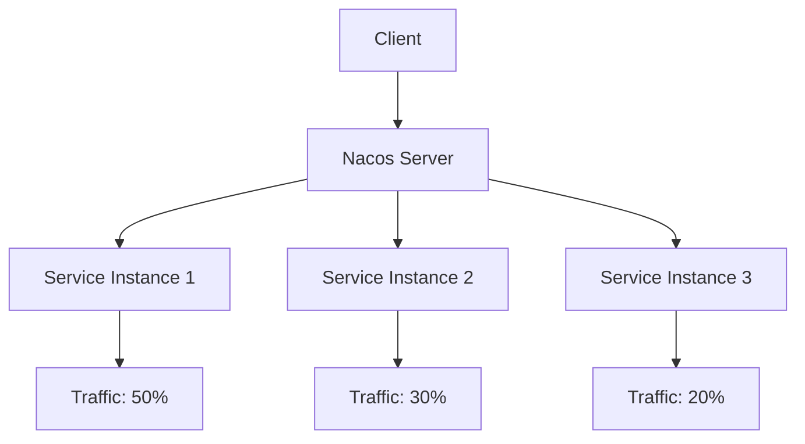

# Nacos 与微服务治理

## 介绍

在现代微服务架构中，服务治理是一个至关重要的环节。随着服务数量的增加，如何有效地管理服务的注册、发现、配置以及动态调整成为了一个挑战。Nacos（Naming and Configuration Service）是一个开源的动态服务发现、配置管理和服务管理平台，它帮助开发者轻松构建云原生应用。

Nacos的核心功能包括：
- **服务发现**：自动注册和发现服务实例。
- **配置管理**：集中管理应用的配置，支持动态更新。
- **服务治理**：提供健康检查、流量管理等功能。

## Nacos 的核心概念

### 服务注册与发现

在微服务架构中，服务实例需要注册到服务注册中心，以便其他服务能够发现并调用它们。Nacos作为服务注册中心，提供了简单易用的API来实现服务的注册与发现。

#### 服务注册

以下是一个简单的Java代码示例，展示如何将服务注册到Nacos：

```java
import com.alibaba.nacos.api.naming.NamingFactory;
import com.alibaba.nacos.api.naming.NamingService;
import com.alibaba.nacos.api.naming.pojo.Instance;

public class ServiceRegistration {
    public static void main(String[] args) throws Exception {
        // 创建NamingService实例
        NamingService namingService = NamingFactory.createNamingService("127.0.0.1:8848");

        // 创建服务实例
        Instance instance = new Instance();
        instance.setIp("192.168.1.100");
        instance.setPort(8080);
        instance.setServiceName("example-service");

        // 注册服务
        namingService.registerInstance("example-service", instance);
        System.out.println("Service registered successfully!");
    }
}
```

#### 服务发现

服务发现是客户端从Nacos获取服务实例的过程。以下是一个简单的Java代码示例，展示如何从Nacos发现服务：

```java
import com.alibaba.nacos.api.naming.NamingFactory;
import com.alibaba.nacos.api.naming.NamingService;
import com.alibaba.nacos.api.naming.pojo.Instance;

public class ServiceDiscovery {
    public static void main(String[] args) throws Exception {
        // 创建NamingService实例
        NamingService namingService = NamingFactory.createNamingService("127.0.0.1:8848");

        // 获取服务实例
        List<Instance> instances = namingService.getAllInstances("example-service");
        for (Instance instance : instances) {
            System.out.println("Service instance: " + instance.getIp() + ":" + instance.getPort());
        }
    }
}
```

### 配置管理

Nacos不仅支持服务注册与发现，还提供了强大的配置管理功能。开发者可以将应用的配置集中存储在Nacos中，并在运行时动态更新配置。

#### 配置发布

以下是一个简单的Java代码示例，展示如何在Nacos中发布配置：

```java
import com.alibaba.nacos.api.config.ConfigService;
import com.alibaba.nacos.api.config.ConfigFactory;

public class ConfigPublisher {
    public static void main(String[] args) throws Exception {
        // 创建ConfigService实例
        ConfigService configService = ConfigFactory.createConfigService("127.0.0.1:8848");

        // 发布配置
        String dataId = "example-config";
        String group = "DEFAULT_GROUP";
        String content = "example.config.value=123";
        configService.publishConfig(dataId, group, content);
        System.out.println("Config published successfully!");
    }
}
```

#### 配置获取

以下是一个简单的Java代码示例，展示如何从Nacos获取配置：

```java
import com.alibaba.nacos.api.config.ConfigService;
import com.alibaba.nacos.api.config.ConfigFactory;

public class ConfigConsumer {
    public static void main(String[] args) throws Exception {
        // 创建ConfigService实例
        ConfigService configService = ConfigFactory.createConfigService("127.0.0.1:8848");

        // 获取配置
        String dataId = "example-config";
        String group = "DEFAULT_GROUP";
        String content = configService.getConfig(dataId, group, 5000);
        System.out.println("Config content: " + content);
    }
}
```

### 服务治理

Nacos还提供了服务治理的功能，包括健康检查、流量管理等。通过这些功能，开发者可以更好地管理微服务的运行状态和流量分配。

#### 健康检查

Nacos会自动对注册的服务实例进行健康检查，确保只有健康的实例才会被其他服务发现和调用。

#### 流量管理

Nacos支持基于权重的流量管理，开发者可以根据需要调整不同服务实例的流量分配比例。



## 实际案例

假设我们有一个电商系统，包含用户服务、订单服务和商品服务。我们可以使用Nacos来管理这些服务的注册、发现和配置。

1. **服务注册**：用户服务、订单服务和商品服务分别注册到Nacos。
2. **服务发现**：订单服务需要调用用户服务时，通过Nacos发现用户服务的实例。
3. **配置管理**：商品服务的配置存储在Nacos中，可以在运行时动态更新。
4. **服务治理**：通过Nacos的健康检查功能，确保只有健康的服务实例被调用。

## 总结

Nacos作为一个强大的服务发现和配置管理平台，为微服务架构提供了全面的支持。通过Nacos，开发者可以轻松实现服务的注册与发现、配置管理以及服务治理，从而构建高效、可靠的微服务系统。

## 附加资源与练习

- **官方文档**：访问[Nacos官方文档](https://nacos.io/zh-cn/docs/what-is-nacos.html)了解更多详细信息。
- **练习**：尝试在自己的项目中集成Nacos，实现服务的注册、发现和配置管理。

:::tip
如果你在集成Nacos时遇到问题，可以参考官方文档或社区论坛，获取更多帮助。
:::