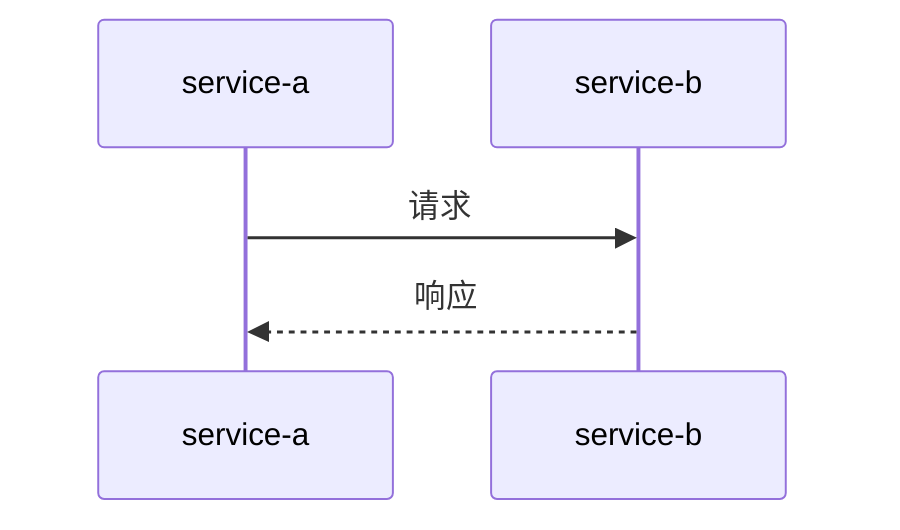

# Nacos 与分布式追踪系统

在现代微服务架构中，服务之间的调用关系变得越来越复杂。为了确保系统的稳定性和性能，开发者需要一种有效的方式来监控和调试这些分布式调用。分布式追踪系统（Distributed Tracing System）正是为了解决这一问题而诞生的。本文将介绍Nacos如何与分布式追踪系统集成，帮助初学者理解其工作原理和实际应用。

## 什么是分布式追踪系统？

分布式追踪系统是一种用于监控和记录微服务架构中请求链路的技术。它通过在请求的每个阶段插入唯一的追踪ID（Trace ID），并将这些信息发送到中央存储系统，从而帮助开发者可视化请求的完整路径。常见的分布式追踪系统包括Zipkin、Jaeger和SkyWalking等。

## Nacos 与分布式追踪系统的集成

Nacos是一个动态服务发现、配置管理和服务管理平台，广泛应用于微服务架构中。虽然Nacos本身并不直接提供分布式追踪功能，但它可以与现有的分布式追踪系统无缝集成，帮助开发者更好地管理和监控微服务。

### 1. 配置Nacos与分布式追踪系统

首先，我们需要在Nacos中配置分布式追踪系统的相关信息。假设我们使用的是Zipkin作为分布式追踪系统，以下是一个示例配置：

```yaml
spring:
  zipkin:
    base-url: http://localhost:9411
    enabled: true
  sleuth:
    sampler:
      probability: 1.0
```

在这个配置中，`spring.zipkin.base-url`指定了Zipkin服务器的地址，`spring.sleuth.sampler.probability`设置了采样率（1.0表示100%采样）。

### 2. 在微服务中启用分布式追踪

接下来，我们需要在每个微服务中启用分布式追踪功能。以Spring Boot应用为例，可以通过添加以下依赖来启用Spring Cloud Sleuth和Zipkin支持：

```xml
<dependency>
    <groupId>org.springframework.cloud</groupId>
    <artifactId>spring-cloud-starter-sleuth</artifactId>
</dependency>
<dependency>
    <groupId>org.springframework.cloud</groupId>
    <artifactId>spring-cloud-starter-zipkin</artifactId>
</dependency>
```

### 3. 查看追踪信息

启用分布式追踪后，每次请求都会生成一个唯一的Trace ID，并在请求的每个阶段记录相关信息。这些信息会被发送到Zipkin服务器，开发者可以通过Zipkin的UI界面查看请求的完整链路。

例如，假设我们有两个微服务：`service-a`和`service-b`。当`service-a`调用`service-b`时，Zipkin会记录以下信息：



在Zipkin的UI界面中，开发者可以看到`service-a`和`service-b`之间的调用关系，以及每个阶段的耗时和状态。

## 实际应用场景

### 场景1：性能优化

假设我们在一个电商系统中发现某个订单查询接口的响应时间较长。通过分布式追踪系统，我们可以快速定位到是哪个微服务或数据库查询导致了性能瓶颈，从而有针对性地进行优化。

### 场景2：故障排查

当系统出现故障时，分布式追踪系统可以帮助开发者快速定位问题所在。例如，如果某个请求在调用`service-b`时失败，开发者可以通过追踪信息查看`service-b`的日志，找出具体的错误原因。

## 总结

Nacos与分布式追踪系统的集成为微服务架构提供了强大的监控和调试能力。通过配置Nacos和启用分布式追踪，开发者可以更好地理解服务之间的调用关系，快速定位性能瓶颈和故障原因。

## 附加资源

- [Spring Cloud Sleuth 官方文档](https://spring.io/projects/spring-cloud-sleuth)
- [Zipkin 官方文档](https://zipkin.io/)
- [Nacos 官方文档](https://nacos.io/)

## 练习

1. 在你的本地环境中配置Nacos和Zipkin，并启用分布式追踪功能。
2. 创建一个简单的微服务应用，模拟服务之间的调用，并在Zipkin中查看追踪信息。
3. 尝试调整采样率，观察Zipkin中追踪信息的变化。

通过以上练习，你将更深入地理解Nacos与分布式追踪系统的集成及其在微服务架构中的应用。