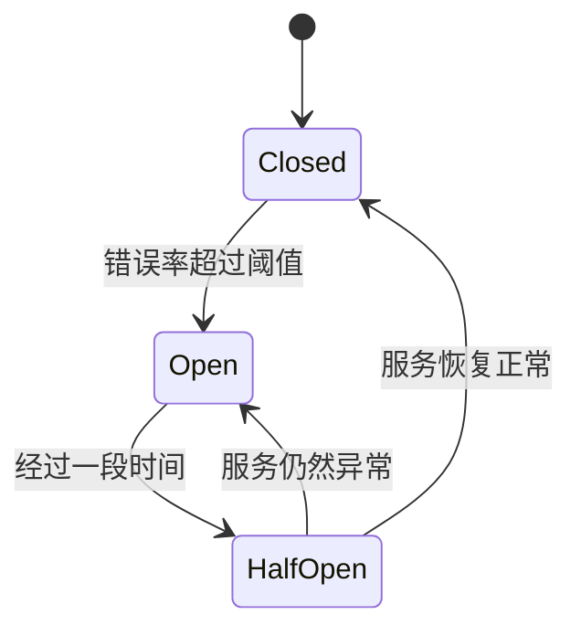

## 介绍

在微服务架构中，服务之间的依赖关系复杂，一个服务的故障可能会引发连锁反应，导致整个系统的崩溃。为了避免这种情况，熔断降级机制应运而生。熔断降级是一种保护机制，当某个服务出现故障或响应过慢时，系统会自动切断对该服务的调用，并返回一个预设的降级响应，从而避免故障扩散。

Nacos 是一个动态服务发现、配置和服务管理平台，支持微服务架构中的服务注册与发现、配置管理等功能。结合 Nacos，我们可以轻松实现熔断降级机制，确保系统的高可用性。

## 熔断降级的基本概念

熔断降级的核心思想是“快速失败”和“优雅降级”。当某个服务的错误率超过阈值时，熔断器会打开，停止对该服务的调用，并直接返回降级结果。经过一段时间后，熔断器会尝试半开状态，允许部分请求通过，以检测服务是否恢复正常。

### 熔断器的三种状态

1. **Closed（关闭状态）**：熔断器关闭，所有请求正常调用服务。
2. **Open（打开状态）**：熔断器打开，所有请求直接返回降级结果，不再调用服务。
3. **Half-Open（半开状态）**：熔断器尝试恢复，允许部分请求通过，检测服务是否恢复正常。



## 使用 Nacos 实现熔断降级

Nacos 本身并不直接提供熔断降级功能，但可以与 Spring Cloud Alibaba 的 Sentinel 结合使用，实现熔断降级。Sentinel 是阿里巴巴开源的流量控制组件，支持熔断降级、流量控制等功能。

### 1. 引入依赖

首先，在 `pom.xml` 中引入 Nacos 和 Sentinel 的依赖：

```xml
<dependency>
    <groupId>com.alibaba.cloud</groupId>
    <artifactId>spring-cloud-starter-alibaba-nacos-discovery</artifactId>
</dependency>
<dependency>
    <groupId>com.alibaba.cloud</groupId>
    <artifactId>spring-cloud-starter-alibaba-sentinel</artifactId>
</dependency>
```

### 2. 配置 Nacos 和 Sentinel

在 `application.yml` 中配置 Nacos 和 Sentinel：

```yaml
spring:
  application:
    name: user-service
  cloud:
    nacos:
      discovery:
        server-addr: localhost:8848
    sentinel:
      transport:
        dashboard: localhost:8080
```

### 3. 定义熔断降级规则

在 Sentinel 中定义熔断降级规则。例如，当 `user-service` 的某个接口的错误率超过 50% 时，触发熔断：

```java
@RestController
public class UserController {

    @GetMapping("/user/{id}")
    @SentinelResource(value = "getUserById", fallback = "fallbackMethod")
    public User getUserById(@PathVariable Long id) {
        // 模拟服务调用
        if (id == 1) {
            throw new RuntimeException("Service Error");
        }
        return new User(id, "User" + id);
    }

    public User fallbackMethod(Long id) {
        return new User(id, "Fallback User");
    }
}
```

### 4. 监控与调整

通过 Sentinel Dashboard，你可以实时监控服务的流量、错误率等信息，并根据实际情况调整熔断降级规则。

## 实际案例

假设我们有一个电商系统，其中 `order-service` 依赖于 `user-service` 来获取用户信息。当 `user-service` 出现故障时，`order-service` 可以通过熔断降级机制返回一个默认的用户信息，而不是一直等待 `user-service` 的响应。

```java
@RestController
public class OrderController {

    @Autowired
    private UserServiceClient userServiceClient;

    @GetMapping("/order/{userId}")
    public Order getOrder(@PathVariable Long userId) {
        User user = userServiceClient.getUserById(userId);
        return new Order(user, "Order123");
    }
}
```

在 `UserServiceClient` 中，我们使用 `@FeignClient` 调用 `user-service`，并配置熔断降级：

```java
@FeignClient(name = "user-service", fallback = UserServiceFallback.class)
public interface UserServiceClient {

    @GetMapping("/user/{id}")
    User getUserById(@PathVariable Long id);
}

@Component
public class UserServiceFallback implements UserServiceClient {

    @Override
    public User getUserById(Long id) {
        return new User(id, "Fallback User");
    }
}
```

## 总结

熔断降级是微服务架构中确保系统稳定性的重要机制。通过 Nacos 和 Sentinel 的结合，我们可以轻松实现熔断降级，避免因单个服务的故障导致整个系统的崩溃。在实际应用中，合理配置熔断降级规则，并结合监控工具进行调整，是保证系统高可用性的关键。

## 附加资源与练习

- **练习**：尝试在你的微服务项目中实现熔断降级机制，并通过 Sentinel Dashboard 监控服务的状态。
- **资源**：
  - [Nacos 官方文档](https://nacos.io/zh-cn/docs/what-is-nacos.html)
  - [Sentinel 官方文档](https://sentinelguard.io/zh-cn/docs/introduction.html)
