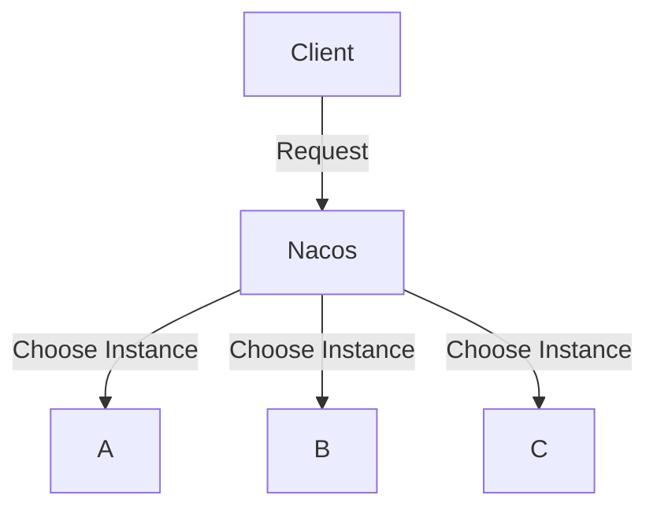

## 引言

在分布式系统中，负载均衡是一个至关重要的概念。它确保请求能够均匀地分配到多个服务实例上，从而提高系统的可用性和性能。Nacos 作为一个动态服务发现和配置管理平台，内置了强大的负载均衡功能。本文将深入分析 Nacos 负载均衡的源码实现，帮助初学者理解其工作原理。

## 什么是负载均衡？

负载均衡（Load Balancing）是一种将工作负载分配到多个计算资源（如服务器、网络链接、CPU等）的技术。在微服务架构中，负载均衡通常用于将客户端请求分发到多个服务实例上，以避免单个实例过载。

## Nacos 负载均衡机制

Nacos 提供了多种负载均衡策略，包括随机、轮询、权重等。这些策略通过 `LoadBalancer` 接口实现，开发者可以根据需求选择合适的策略。

### 核心接口：LoadBalancer

Nacos 的负载均衡机制主要通过 `LoadBalancer` 接口实现。该接口定义了一个方法 `choose`，用于从服务实例列表中选择一个实例。

```java
public interface LoadBalancer {
    Instance choose(List<Instance> instances);
}
```

### 负载均衡策略

Nacos 提供了多种负载均衡策略，以下是几种常见的策略：

1. **随机策略（RandomLoadBalancer）**：随机选择一个服务实例。
2. **轮询策略（RoundRobinLoadBalancer）**：按顺序依次选择服务实例。
3. **权重策略（WeightedLoadBalancer）**：根据实例的权重进行选择，权重越高的实例被选中的概率越大。

### 代码示例

以下是一个使用随机策略的代码示例：

```java
List<Instance> instances = nacosNamingService.getAllInstances("example-service");
LoadBalancer loadBalancer = new RandomLoadBalancer();
Instance instance = loadBalancer.choose(instances);
System.out.println("Selected instance: " + instance.getIp() + ":" + instance.getPort());
```

### 实际案例

假设我们有一个微服务架构，其中包含三个服务实例 `A`、`B` 和 `C`。我们希望使用 Nacos 的负载均衡功能将请求均匀地分配到这三个实例上。



在这个案例中，Nacos 会根据配置的负载均衡策略（如随机、轮询或权重）选择一个实例来处理请求。

## 源码分析

### 随机策略源码分析

随机策略的实现非常简单，它通过 `Random` 类生成一个随机数，然后根据该随机数选择一个实例。

```java
public class RandomLoadBalancer implements LoadBalancer {
    private final Random random = new Random();

    @Override
    public Instance choose(List<Instance> instances) {
        if (instances.isEmpty()) {
            return null;
        }
        int index = random.nextInt(instances.size());
        return instances.get(index);
    }
}
```

### 轮询策略源码分析

轮询策略通过维护一个计数器来实现，每次选择实例时，计数器加一，然后根据计数器的值选择实例。

```java
public class RoundRobinLoadBalancer implements LoadBalancer {
    private final AtomicInteger counter = new AtomicInteger(0);

    @Override
    public Instance choose(List<Instance> instances) {
        if (instances.isEmpty()) {
            return null;
        }
        int index = counter.getAndIncrement() % instances.size();
        return instances.get(index);
    }
}
```

### 权重策略源码分析

权重策略的实现稍微复杂一些，它需要根据实例的权重计算每个实例被选中的概率。

```java
public class WeightedLoadBalancer implements LoadBalancer {
    @Override
    public Instance choose(List<Instance> instances) {
        if (instances.isEmpty()) {
            return null;
        }
        int totalWeight = instances.stream().mapToInt(Instance::getWeight).sum();
        int randomWeight = new Random().nextInt(totalWeight);
        int currentWeight = 0;
        for (Instance instance : instances) {
            currentWeight += instance.getWeight();
            if (randomWeight < currentWeight) {
                return instance;
            }
        }
        return null;
    }
}
```

## 总结

Nacos 提供了多种负载均衡策略，开发者可以根据实际需求选择合适的策略。通过源码分析，我们了解到这些策略的实现原理，并通过实际案例展示了它们的应用场景。

## 附加资源

- [Nacos 官方文档](https://nacos.io/zh-cn/docs/what-is-nacos.html)
- [微服务架构中的负载均衡](https://microservices.io/patterns/client-side-discovery.html)
- [Nacos 源码仓库](https://github.com/alibaba/nacos)

## 练习

1. 尝试实现一个自定义的负载均衡策略，并在 Nacos 中使用它。
2. 使用 Nacos 的负载均衡功能，构建一个简单的微服务架构，并测试不同负载均衡策略的效果。
