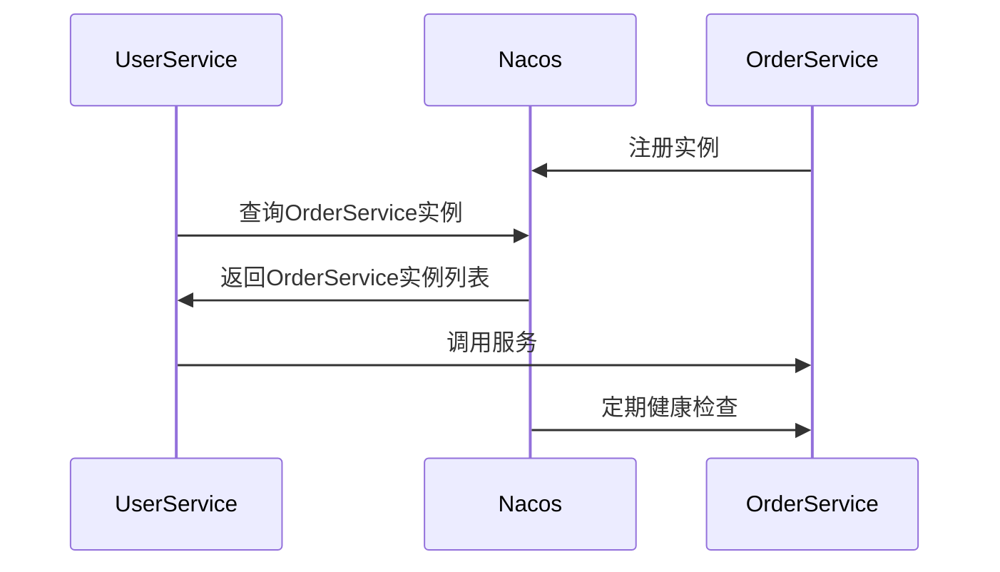

# Nacos 服务发现源码分析

## 介绍

Nacos（Naming and Configuration Service）是一个动态服务发现、配置管理和服务管理平台。服务发现是Nacos的核心功能之一，它允许服务实例在启动时注册自己，并在需要时发现其他服务实例。本文将深入分析Nacos服务发现的源码实现，帮助初学者理解其核心机制和实现细节。

## 服务发现的基本概念

在微服务架构中，服务发现是一个关键组件，它允许服务实例动态地注册和发现其他服务实例。Nacos通过其服务发现模块实现了这一功能，主要包括以下几个步骤：

1. **服务注册**：服务实例启动时，向Nacos注册自己的信息。
2. **服务发现**：客户端通过Nacos查询可用的服务实例。
3. **健康检查**：Nacos定期检查服务实例的健康状态，并更新服务实例的状态。

## 源码分析

### 服务注册

服务注册的核心逻辑位于`com.alibaba.nacos.naming.core.ServiceManager`类中。当一个服务实例启动时，它会调用`registerInstance`方法向Nacos注册自己。

```java
public void registerInstance(String serviceName, String groupName, Instance instance) throws NacosException {
    // 省略部分代码
    Service service = getService(serviceName, groupName);
    if (service == null) {
        service = new Service(serviceName, groupName);
        putService(service);
    }
    service.addInstance(instance);
    // 省略部分代码
}
```

在这个方法中，`ServiceManager`首先检查服务是否已经存在，如果不存在则创建一个新的`Service`对象，并将服务实例添加到该服务中。

### 服务发现

服务发现的核心逻辑位于`com.alibaba.nacos.naming.core.ServiceManager`类的`getAllInstances`方法中。客户端可以通过调用该方法获取指定服务的所有实例。

```java
public List<Instance> getAllInstances(String serviceName, String groupName) throws NacosException {
    Service service = getService(serviceName, groupName);
    if (service == null) {
        return Collections.emptyList();
    }
    return service.allIPs();
}
```

在这个方法中，`ServiceManager`首先获取指定服务的`Service`对象，然后返回该服务的所有实例。

### 健康检查

Nacos通过定期发送心跳包来检查服务实例的健康状态。健康检查的核心逻辑位于`com.alibaba.nacos.naming.healthcheck`包中。Nacos支持多种健康检查方式，包括TCP、HTTP和MySQL等。

```java
public void check() {
    // 省略部分代码
    if (instance.isHealthy()) {
        // 更新实例状态
    } else {
        // 标记实例为不健康
    }
    // 省略部分代码
}
```

在这个方法中，Nacos会定期检查服务实例的健康状态，并根据检查结果更新实例的状态。

## 实际案例

假设我们有一个微服务架构，其中包含两个服务：`UserService`和`OrderService`。`UserService`需要调用`OrderService`来完成某些操作。我们可以使用Nacos来实现服务发现。

1. **服务注册**：`OrderService`启动时，向Nacos注册自己。
2. **服务发现**：`UserService`通过Nacos查询`OrderService`的实例，并选择一个实例进行调用。
3. **健康检查**：Nacos定期检查`OrderService`的健康状态，并更新其状态。



## 总结

本文详细分析了Nacos服务发现的源码实现，包括服务注册、服务发现和健康检查的核心逻辑。通过实际案例，我们展示了Nacos在微服务架构中的应用场景。希望本文能帮助初学者更好地理解Nacos服务发现的实现机制。

## 附加资源

- [Nacos官方文档](https://nacos.io/zh-cn/docs/what-is-nacos.html)
- [Nacos GitHub仓库](https://github.com/alibaba/nacos)

## 练习

1. 尝试在本地启动Nacos，并注册一个服务实例。
2. 编写一个简单的客户端程序，通过Nacos发现并调用服务实例。
3. 修改Nacos的健康检查配置，观察服务实例状态的变化。

:::tip
在学习和实践过程中，如果遇到问题，可以参考Nacos的官方文档或在GitHub上提交Issue。
:::