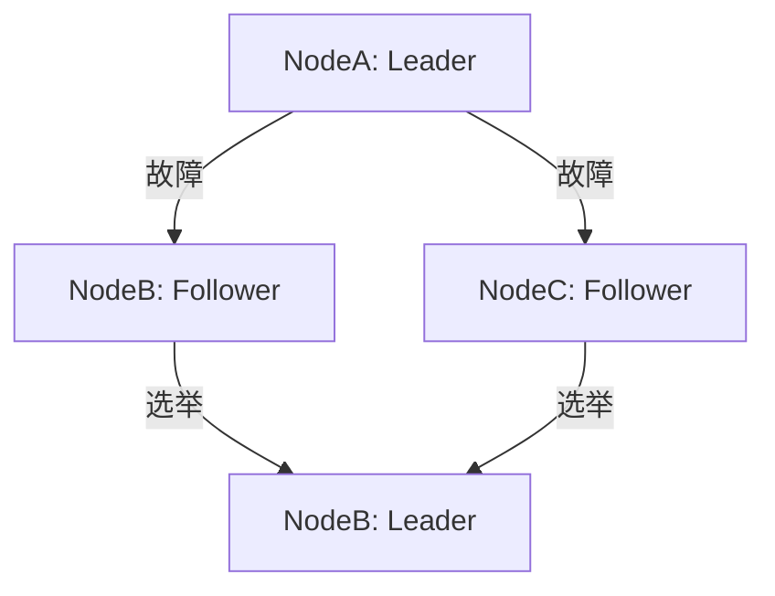

# Nacos 集群管理源码分析

## 介绍

Nacos（Naming and Configuration Service）是一个动态服务发现、配置管理和服务管理平台。它支持多种部署模式，包括单机模式和集群模式。在集群模式下，Nacos通过集群管理机制实现高可用性和数据一致性。本文将深入分析Nacos集群管理的源码实现，帮助初学者理解其工作原理。

## 集群管理的基本概念

在Nacos中，集群管理主要涉及以下几个方面：

1. **节点发现**：集群中的节点需要相互发现，以便进行通信和数据同步。
2. **数据一致性**：集群中的节点需要保持数据一致性，确保每个节点的数据都是最新的。
3. **故障恢复**：当集群中的某个节点发生故障时，其他节点需要能够检测到并进行故障恢复。

## 源码分析

### 节点发现

Nacos使用Raft协议来实现节点发现和数据一致性。Raft是一种分布式一致性算法，它将集群中的节点分为Leader、Follower和Candidate三种角色。

```java
public class RaftCore {
    private volatile RaftPeer leader;
    private List<RaftPeer> peers;

    public void init() {
        // 初始化节点
        peers = discoverPeers();
        leader = electLeader(peers);
    }

    private List<RaftPeer> discoverPeers() {
        // 发现集群中的其他节点
        return peerDiscoveryService.discover();
    }

    private RaftPeer electLeader(List<RaftPeer> peers) {
        // 选举Leader
        return raftElector.elect(peers);
    }
}
```

### 数据一致性

Nacos通过Raft协议实现数据一致性。Leader节点负责接收客户端的写请求，并将数据同步到Follower节点。

```java
public class RaftCore {
    public void onReceiveWriteRequest(Request request) {
        if (isLeader()) {
            // 如果是Leader，处理写请求并同步到Follower
            handleWriteRequest(request);
            replicateToFollowers(request);
        } else {
            // 如果不是Leader，将请求转发给Leader
            forwardToLeader(request);
        }
    }

    private void replicateToFollowers(Request request) {
        for (RaftPeer peer : peers) {
            if (!peer.isLeader()) {
                peer.send(request);
            }
        }
    }
}
```

### 故障恢复

当集群中的某个节点发生故障时，Nacos会通过Raft协议进行故障恢复。具体来说，Follower节点会检测Leader节点是否存活，如果Leader节点失效，Follower节点会发起新的选举。

```java
public class RaftCore {
    public void checkLeaderAlive() {
        if (!leader.isAlive()) {
            // 如果Leader失效，发起新的选举
            leader = electLeader(peers);
        }
    }
}
```

## 实际案例

假设我们有一个由三个节点组成的Nacos集群，分别是NodeA、NodeB和NodeC。初始时，NodeA被选为Leader。当NodeA发生故障时，NodeB和NodeC会检测到NodeA失效，并发起新的选举。最终，NodeB被选为新的Leader，集群继续正常运行。



## 总结

Nacos通过Raft协议实现了集群管理，确保了高可用性和数据一致性。本文分析了Nacos集群管理的源码实现，包括节点发现、数据一致性和故障恢复。希望通过本文的学习，初学者能够更好地理解Nacos的集群管理机制。

## 附加资源

- [Raft协议论文](https://raft.github.io/raft.pdf)
- [Nacos官方文档](https://nacos.io/zh-cn/docs/what-is-nacos.html)

## 练习

1. 尝试在本地搭建一个Nacos集群，并模拟节点故障，观察集群的行为。
2. 阅读Nacos源码中关于Raft协议的部分，尝试理解其实现细节。
