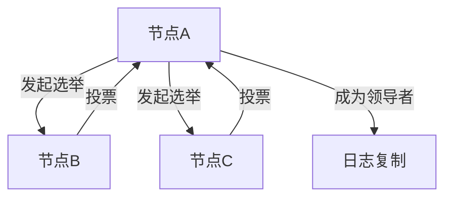

# Nacos 一致性协议实现

## 介绍

在分布式系统中，一致性协议是确保多个节点之间数据一致性的关键机制。Nacos作为一个动态服务发现、配置管理和服务管理平台，其核心功能依赖于一致性协议来保证数据的一致性和可靠性。本文将详细介绍Nacos中一致性协议的实现原理，并通过代码示例和实际案例帮助初学者深入理解。

## 一致性协议的基本概念

一致性协议是指在分布式系统中，多个节点之间通过某种机制达成数据一致性的协议。常见的一致性协议包括Paxos、Raft等。Nacos主要采用了Raft协议来实现数据一致性。

### Raft协议简介

Raft是一种易于理解的一致性算法，它将一致性问题分解为领导选举、日志复制和安全性三个子问题。Raft通过选举一个领导者来管理日志复制，确保所有节点的日志保持一致。

## Nacos 中的Raft实现

Nacos中的Raft实现主要包含以下几个部分：

1. **领导选举**：Raft协议通过选举一个领导者来管理日志复制。Nacos中的Raft实现也遵循这一原则，通过选举机制选出一个领导者节点。
2. **日志复制**：领导者节点负责将日志复制到其他节点，确保所有节点的日志一致。
3. **安全性**：Raft协议通过一系列安全性机制确保数据的一致性，如日志匹配、领导者限制等。

### 代码示例

以下是一个简单的Raft领导选举的代码示例：

```java
public class RaftNode {
    private String id;
    private RaftState state;

    public RaftNode(String id) {
        this.id = id;
        this.state = RaftState.FOLLOWER;
    }

    public void startElection() {
        if (this.state == RaftState.FOLLOWER) {
            this.state = RaftState.CANDIDATE;
            // 发起选举请求
            boolean elected = requestVotes();
            if (elected) {
                this.state = RaftState.LEADER;
                System.out.println("Node " + id + " is now the leader.");
            } else {
                this.state = RaftState.FOLLOWER;
            }
        }
    }

    private boolean requestVotes() {
        // 模拟选举请求
        return Math.random() > 0.5;
    }
}

enum RaftState {
    FOLLOWER, CANDIDATE, LEADER
}
```

**输入**：节点启动并开始选举。
**输出**：节点可能成为领导者或保持跟随者状态。

## 实际案例

假设我们有一个由三个Nacos节点组成的集群，节点A、节点B和节点C。初始状态下，所有节点都是跟随者。当节点A检测到当前没有领导者时，它会发起选举请求。如果节点A获得多数票（即至少两个节点的支持），它将成为领导者，并开始管理日志复制。



## 总结

Nacos通过实现Raft协议来确保分布式系统中的数据一致性。本文介绍了Raft协议的基本概念，并通过代码示例和实际案例展示了Nacos中Raft协议的实现过程。希望本文能帮助初学者更好地理解Nacos一致性协议的实现原理。

## 附加资源

- [Raft协议论文](https://raft.github.io/raft.pdf)
- [Nacos官方文档](https://nacos.io/zh-cn/docs/what-is-nacos.html)
- [分布式系统一致性协议](https://en.wikipedia.org/wiki/Consensus_(computer_science))

## 练习

1. 尝试在本地搭建一个Nacos集群，并观察领导选举的过程。
2. 修改上述代码示例，模拟多个节点同时发起选举的情况，并观察结果。
3. 阅读Raft协议论文，深入了解其安全性机制。

:::tip
在学习和实践过程中，建议使用调试工具来观察节点的状态变化，这将有助于更好地理解Raft协议的工作原理。
:::