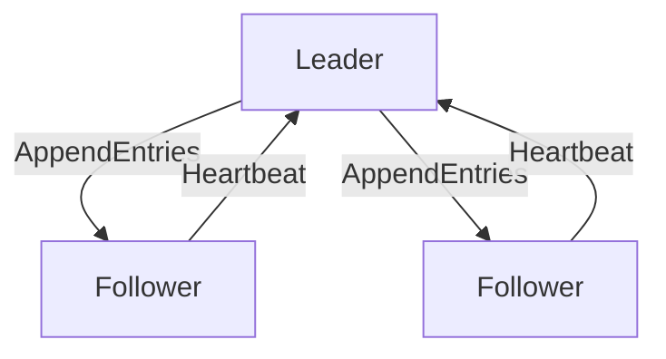

## 介绍

Nacos（Naming and Configuration Service）是一个动态服务发现、配置管理和服务管理平台。它的核心功能之一是服务注册与发现，而通信模型是实现这些功能的关键。本文将逐步分析Nacos的通信模型源码，帮助初学者理解其底层实现。

## Nacos 通信模型概述

Nacos的通信模型主要基于HTTP和gRPC协议。服务注册、发现和配置管理等功能都是通过这些通信协议实现的。Nacos的通信模型可以分为以下几个部分：

1. **客户端与服务端的通信**：客户端通过HTTP或gRPC与服务端进行通信，完成服务注册、发现和配置管理。
2. **服务端之间的通信**：在集群模式下，Nacos服务端之间通过Raft协议进行数据同步。

## 客户端与服务端的通信

### HTTP通信

Nacos客户端与服务端之间的通信主要通过HTTP协议实现。以下是一个简单的HTTP请求示例，用于服务注册：

```java
POST /nacos/v1/ns/instance HTTP/1.1
Host: localhost:8848
Content-Type: application/x-www-form-urlencoded

serviceName=exampleService&ip=192.168.1.1&port=8080
```

在这个请求中，客户端向Nacos服务端发送了一个服务注册请求，包含了服务名称、IP地址和端口号。

### gRPC通信

Nacos还支持gRPC协议，相比HTTP，gRPC具有更高的性能和更低的延迟。以下是一个gRPC请求的示例：

```java
Instance instance = Instance.newBuilder()
    .setServiceName("exampleService")
    .setIp("192.168.1.1")
    .setPort(8080)
    .build();

NamingServiceGrpc.NamingServiceBlockingStub stub = NamingServiceGrpc.newBlockingStub(channel);
stub.registerInstance(instance);
```

在这个示例中，客户端通过gRPC向Nacos服务端注册了一个服务实例。

## 服务端之间的通信

在集群模式下，Nacos服务端之间通过Raft协议进行数据同步。Raft是一种分布式一致性算法，用于在分布式系统中实现数据的一致性。



在这个图中，Leader节点负责向Follower节点发送日志条目（AppendEntries），Follower节点则通过心跳机制确认Leader的存在。

## 实际案例

假设我们有一个微服务架构，其中包含多个服务实例。每个服务实例在启动时都会向Nacos注册自己，其他服务可以通过Nacos发现这些实例。

```java
// 服务注册
NamingService namingService = NacosFactory.createNamingService("localhost:8848");
namingService.registerInstance("exampleService", "192.168.1.1", 8080);

// 服务发现
List<Instance> instances = namingService.getAllInstances("exampleService");
for (Instance instance : instances) {
    System.out.println("Service instance: " + instance.getIp() + ":" + instance.getPort());
}
```

在这个案例中，服务实例通过Nacos进行注册和发现，实现了服务之间的动态通信。

## 总结

Nacos的通信模型是其核心功能的基础，理解这一模型对于掌握Nacos的工作原理至关重要。本文通过分析HTTP和gRPC通信协议，以及Raft协议在集群模式下的应用，帮助初学者深入理解Nacos的通信机制。

## 附加资源

- [Nacos官方文档](https://nacos.io/zh-cn/docs/what-is-nacos.html)
- [Raft协议详解](https://raft.github.io/)
- [gRPC官方文档](https://grpc.io/docs/)

## 练习

1. 尝试使用Nacos的HTTP API注册一个服务实例，并通过API查询该实例。
2. 使用gRPC实现一个简单的服务注册和发现功能。
3. 研究Raft协议的工作原理，并尝试在本地环境中模拟一个简单的Raft集群。
