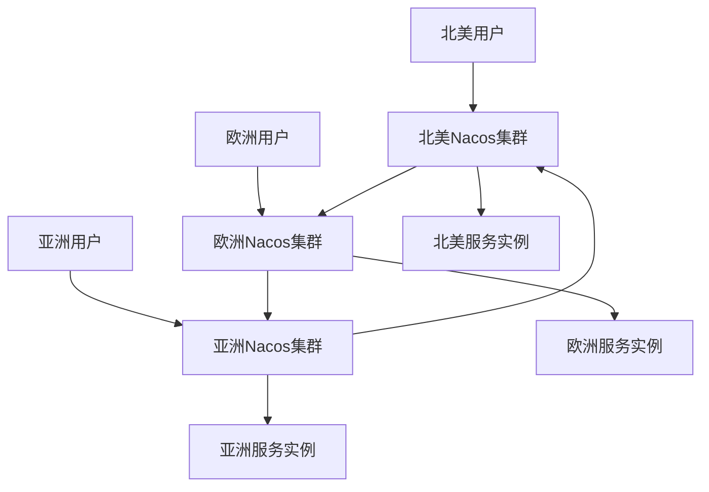

# Nacos 异地多活案例

## 介绍

在现代分布式系统中，**异地多活**（Multi-Region Active-Active）架构是一种常见的设计模式，旨在提高系统的可用性和容灾能力。Nacos 作为一款动态服务发现、配置管理和服务管理平台，支持异地多活架构，能够帮助开发者在多个地域部署服务并实现数据同步。

本文将逐步讲解 Nacos 在异地多活架构中的应用，并通过实际案例展示其真实应用场景。

## 什么是异地多活？

**异地多活**是指在多个地理位置（通常称为“地域”或“区域”）部署相同的服务实例，并且这些实例能够同时对外提供服务。这种架构的主要目的是：

1. **高可用性**：当一个地域的服务出现故障时，其他地域的服务可以继续提供服务。
2. **容灾能力**：在自然灾害或网络故障等情况下，系统仍然能够正常运行。
3. **低延迟**：用户可以从距离最近的地域获取服务，减少网络延迟。

## Nacos 在异地多活中的应用

Nacos 通过其**集群模式**和**数据同步机制**，支持异地多活架构。以下是 Nacos 实现异地多活的关键点：

1. **集群部署**：Nacos 可以在多个地域部署集群，每个集群独立运行。
2. **数据同步**：Nacos 通过 Raft 协议或 MySQL 等数据库实现跨地域的数据同步。
3. **服务发现**：Nacos 能够将服务实例注册到多个地域，并根据用户的地理位置返回最近的服务实例。

## 代码示例

以下是一个简单的 Nacos 服务注册和发现的代码示例，展示如何在多个地域部署服务。

### 服务注册

```java
import com.alibaba.nacos.api.naming.NamingFactory;
import com.alibaba.nacos.api.naming.NamingService;
import com.alibaba.nacos.api.naming.pojo.Instance;

public class NacosServiceRegistration {
    public static void main(String[] args) throws Exception {
        // 创建 NamingService 实例
        NamingService namingService = NamingFactory.createNamingService("127.0.0.1:8848");

        // 创建服务实例
        Instance instance = new Instance();
        instance.setIp("192.168.1.1");
        instance.setPort(8080);
        instance.setClusterName("RegionA");

        // 注册服务
        namingService.registerInstance("example-service", instance);
    }
}
```

### 服务发现

```java
import com.alibaba.nacos.api.naming.NamingFactory;
import com.alibaba.nacos.api.naming.NamingService;
import com.alibaba.nacos.api.naming.pojo.Instance;

import java.util.List;

public class NacosServiceDiscovery {
    public static void main(String[] args) throws Exception {
        // 创建 NamingService 实例
        NamingService namingService = NamingFactory.createNamingService("127.0.0.1:8848");

        // 获取服务实例列表
        List<Instance> instances = namingService.getAllInstances("example-service");

        // 打印服务实例信息
        for (Instance instance : instances) {
            System.out.println("Instance: " + instance.getIp() + ":" + instance.getPort() + " in " + instance.getClusterName());
        }
    }
}
```

### 输出示例

```
Instance: 192.168.1.1:8080 in RegionA
Instance: 192.168.2.1:8080 in RegionB
```

## 实际案例

假设我们有一个电商平台，用户分布在全球多个地区。为了提高系统的可用性和响应速度，我们在**北美**、**欧洲**和**亚洲**分别部署了 Nacos 集群和服务实例。

### 架构图



### 工作流程

1. **服务注册**：每个地域的服务实例向本地的 Nacos 集群注册。
2. **数据同步**：Nacos 集群之间通过 Raft 协议或 MySQL 数据库同步服务实例信息。
3. **服务发现**：用户请求服务时，Nacos 根据用户的地理位置返回最近的服务实例。

## 总结

Nacos 的异地多活架构能够显著提高系统的可用性和容灾能力，特别适合全球分布的大型应用。通过本文的介绍和示例，你应该已经掌握了 Nacos 在异地多活中的应用方法。

:::tip
在实际生产环境中，建议使用 Nacos 的集群模式和数据库同步功能，以确保数据的一致性和高可用性。
:::

## 附加资源

- [Nacos 官方文档](https://nacos.io/zh-cn/docs/what-is-nacos.html)
- [Nacos GitHub 仓库](https://github.com/alibaba/nacos)
- [分布式系统设计模式](https://en.wikipedia.org/wiki/Distributed_computing)

## 练习

1. 尝试在本地部署两个 Nacos 集群，并实现服务实例的跨集群注册和发现。
2. 修改服务发现代码，使其能够根据用户的地理位置返回最近的服务实例。

通过以上练习，你将更深入地理解 Nacos 在异地多活架构中的应用。