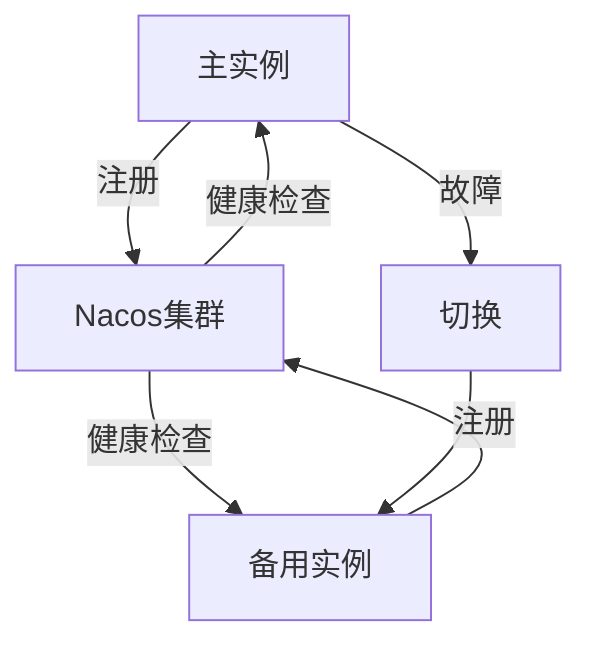

## 介绍

在现代分布式系统中，高可用性和容灾能力是至关重要的。Nacos（Naming and Configuration Service）作为一个动态服务发现、配置管理和服务管理平台，提供了强大的灾备支持。本文将带你了解Nacos在灾备系统中的应用，并通过一个实际案例展示如何利用Nacos实现高可用性和容灾能力。

## 什么是灾备系统？

灾备系统（Disaster Recovery System）是指在主系统发生故障时，能够快速切换到备用系统，确保业务连续性和数据安全性的系统。灾备系统通常包括数据备份、故障检测、自动切换和恢复等功能。

## Nacos 在灾备系统中的作用

Nacos通过以下机制支持灾备系统：

1. **服务发现与注册**：Nacos可以动态注册和发现服务，确保在主系统故障时，能够快速切换到备用系统。
2. **配置管理**：Nacos集中管理配置信息，支持动态更新和版本控制，确保配置的一致性。
3. **健康检查**：Nacos通过健康检查机制，实时监控服务的状态，及时发现故障并触发切换。
4. **集群部署**：Nacos支持集群部署，确保系统的高可用性和容灾能力。

## 实际案例：Nacos灾备系统

### 场景描述

假设我们有一个电商系统，包含订单服务、库存服务和支付服务。为了提高系统的可用性，我们需要为每个服务部署主备两个实例，并在主实例故障时，自动切换到备用实例。

### 实现步骤

1. **部署Nacos集群**：首先，我们需要部署一个Nacos集群，确保Nacos服务的高可用性。

2. **服务注册与发现**：在主备实例启动时，分别向Nacos注册服务。Nacos会维护服务的健康状态，并在主实例故障时，自动切换到备用实例。

   ```java
   // 主实例注册
   NacosServiceRegistry.register("order-service", "192.168.1.1", 8080);

   // 备用实例注册
   NacosServiceRegistry.register("order-service", "192.168.1.2", 8080);
   ```

3. **配置管理**：通过Nacos集中管理服务的配置信息，确保主备实例的配置一致性。

   ```java
   // 获取配置
   String config = NacosConfigService.getConfig("order-service", "DEFAULT_GROUP", 5000);
   ```

4. **健康检查**：Nacos会定期对服务进行健康检查，如果主实例不可用，Nacos会自动将流量切换到备用实例。

   ```java
   // 健康检查
   NacosHealthCheck.check("order-service");
   ```

5. **故障切换**：当主实例发生故障时，Nacos会自动将流量切换到备用实例，确保服务的连续性。

   ```java
   // 故障切换
   NacosFailover.switchToBackup("order-service");
   ```

### 流程图



## 总结

通过本文的介绍和案例，我们了解了Nacos在灾备系统中的应用。Nacos通过服务发现、配置管理、健康检查和集群部署等机制，确保了系统的高可用性和容灾能力。对于初学者来说，掌握Nacos的灾备功能是构建可靠分布式系统的重要一步。

## 附加资源

- [Nacos官方文档](https://nacos.io/zh-cn/docs/what-is-nacos.html)
- [Nacos GitHub仓库](https://github.com/alibaba/nacos)
- [分布式系统设计与实践](https://example.com/distributed-systems)

## 练习

1. 尝试在你的本地环境中部署一个Nacos集群，并注册两个服务实例。
2. 模拟主实例故障，观察Nacos如何自动切换到备用实例。
3. 修改Nacos的配置管理功能，动态更新服务的配置信息。

通过以上练习，你将更深入地理解Nacos在灾备系统中的应用。