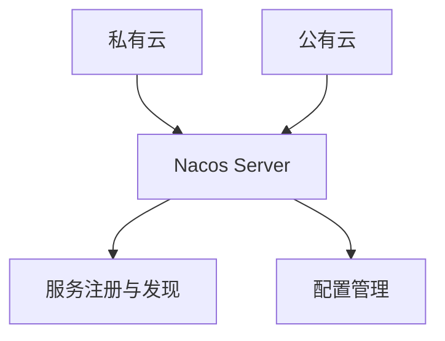

# Nacos 混合云部署案例

## 介绍

在现代云计算环境中，混合云（Hybrid Cloud）已经成为一种常见的架构模式。混合云结合了公有云和私有云的优势，允许企业在保持数据隐私和安全的同时，利用公有云的弹性和扩展性。Nacos作为一个动态服务发现、配置管理和服务管理平台，非常适合在混合云环境中使用。

本教程将逐步讲解如何在混合云环境中部署和使用Nacos，并通过一个实际案例展示其应用场景。

## 什么是Nacos？

Nacos（Naming and Configuration Service）是阿里巴巴开源的一个动态服务发现、配置管理和服务管理平台。它支持多种服务发现和配置管理的方式，能够帮助开发者轻松构建云原生应用。

## 混合云环境中的Nacos部署

在混合云环境中，Nacos可以部署在私有云和公有云中，通过统一的控制台进行管理。以下是一个典型的混合云部署架构：



### 步骤1：在私有云中部署Nacos

首先，我们需要在私有云中部署Nacos服务器。假设我们使用Docker进行部署，以下是部署命令：

```bash
docker run --name nacos-server -e MODE=standalone -p 8848:8848 -d nacos/nacos-server:latest
```

### 步骤2：在公有云中部署Nacos

接下来，我们在公有云中部署Nacos服务器。同样使用Docker进行部署：

```bash
docker run --name nacos-server -e MODE=standalone -p 8848:8848 -d nacos/nacos-server:latest
```

### 步骤3：配置Nacos集群

为了使私有云和公有云中的Nacos服务器能够协同工作，我们需要将它们配置为一个集群。编辑Nacos的配置文件 `cluster.conf`，添加私有云和公有云中Nacos服务器的IP地址：

```plaintext
192.168.1.100:8848
203.0.113.50:8848
```

### 步骤4：服务注册与发现

在混合云环境中，服务可以注册到任意一个Nacos服务器。以下是一个简单的Java服务注册示例：

```java
import com.alibaba.nacos.api.NacosFactory;
import com.alibaba.nacos.api.naming.NamingService;
import com.alibaba.nacos.api.naming.pojo.Instance;

public class ServiceRegistration {
    public static void main(String[] args) throws Exception {
        NamingService namingService = NacosFactory.createNamingService("192.168.1.100:8848");
        Instance instance = new Instance();
        instance.setIp("192.168.1.101");
        instance.setPort(8080);
        instance.setServiceName("example-service");
        namingService.registerInstance("example-service", instance);
    }
}
```

### 步骤5：配置管理

Nacos还支持配置管理。以下是一个从Nacos获取配置的示例：

```java
import com.alibaba.nacos.api.config.ConfigService;
import com.alibaba.nacos.api.exception.NacosException;

public class ConfigExample {
    public static void main(String[] args) throws NacosException {
        ConfigService configService = NacosFactory.createConfigService("192.168.1.100:8848");
        String dataId = "example-dataId";
        String group = "DEFAULT_GROUP";
        String content = configService.getConfig(dataId, group, 5000);
        System.out.println(content);
    }
}
```

## 实际案例

假设我们有一个电商平台，部分服务部署在私有云中，部分服务部署在公有云中。通过Nacos，我们可以实现以下功能：

1. **服务发现**：私有云中的订单服务可以调用公有云中的支付服务。
2. **配置管理**：统一管理私有云和公有云中的配置文件，确保配置一致性。

## 总结

通过本教程，我们学习了如何在混合云环境中部署和使用Nacos。Nacos的强大功能使得在复杂的混合云环境中进行服务发现和配置管理变得简单易行。

## 附加资源

- [Nacos官方文档](https://nacos.io/zh-cn/docs/what-is-nacos.html)
- [Nacos GitHub仓库](https://github.com/alibaba/nacos)

## 练习

1. 尝试在本地环境中部署Nacos，并注册一个简单的服务。
2. 修改Nacos的配置文件，使其支持更多的集群节点。
3. 编写一个Java程序，从Nacos获取配置并应用到你的应用中。

:::tip
如果你在部署过程中遇到问题，可以参考Nacos的官方文档或社区论坛，获取更多帮助。
:::