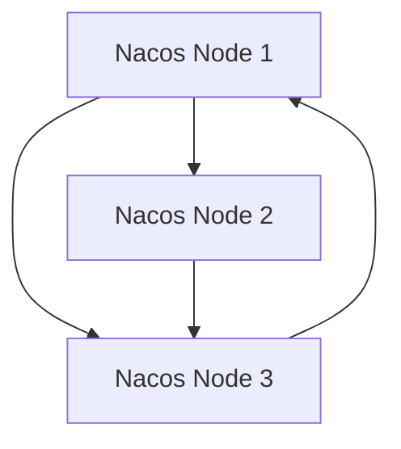

# Nacos 高并发系统应用案例

## 介绍

Nacos（Naming and Configuration Service）是一个动态服务发现、配置管理和服务管理平台，广泛应用于微服务架构中。在高并发系统中，Nacos的作用尤为重要，因为它能够帮助系统动态调整配置、快速发现服务实例，从而提升系统的稳定性和性能。

本文将逐步讲解如何在高并发系统中使用Nacos，并通过一个实际案例展示其应用场景。

## 高并发系统中的挑战

在高并发系统中，通常会面临以下挑战：

1. **配置管理**：系统需要根据流量动态调整配置，例如线程池大小、缓存策略等。
2. **服务发现**：在高并发场景下，服务实例的动态扩缩容是常态，系统需要快速发现新的服务实例。
3. **负载均衡**：如何在高并发下合理分配请求，避免单点过载。

Nacos通过其动态配置管理和服务发现功能，能够有效应对这些挑战。

## Nacos 在高并发系统中的应用

### 1. 动态配置管理

在高并发系统中，配置的动态调整是必不可少的。Nacos提供了动态配置管理功能，允许系统在不重启的情况下更新配置。

#### 示例：动态调整线程池大小

假设我们有一个高并发的Web服务，需要根据流量动态调整线程池大小。我们可以通过Nacos实现这一功能。

首先，在Nacos中创建一个配置项：

```yaml
threadPool:
  coreSize: 10
  maxSize: 50
```

然后，在代码中监听该配置项的变化：

```java
@NacosValue(value = "${threadPool.coreSize:10}", autoRefreshed = true)
private int coreSize;

@NacosValue(value = "${threadPool.maxSize:50}", autoRefreshed = true)
private int maxSize;

@PostConstruct
public void init() {
    // 初始化线程池
    ThreadPoolExecutor executor = new ThreadPoolExecutor(coreSize, maxSize, 60L, TimeUnit.SECONDS, new LinkedBlockingQueue<>());
}
```

当Nacos中的配置发生变化时，`coreSize`和`maxSize`会自动更新，线程池也会随之调整。

### 2. 服务发现与负载均衡

在高并发系统中，服务实例的动态扩缩容是常态。Nacos提供了服务发现功能，能够帮助系统快速发现新的服务实例，并结合负载均衡策略合理分配请求。

#### 示例：服务发现与负载均衡

假设我们有一个订单服务，部署了多个实例。我们可以通过Nacos实现服务发现和负载均衡。

首先，在Nacos中注册服务实例：

```java
NamingService namingService = NamingFactory.createNamingService("127.0.0.1:8848");
namingService.registerInstance("order-service", "192.168.1.1", 8080);
```

然后，在客户端通过Nacos发现服务实例并进行负载均衡：

```java
List<Instance> instances = namingService.getAllInstances("order-service");
Instance instance = loadBalancer.choose(instances); // 使用负载均衡策略选择实例
```

Nacos还支持多种负载均衡策略，例如轮询、随机、权重等，可以根据实际需求进行配置。

### 3. 高可用性与容错

在高并发系统中，Nacos本身也需要具备高可用性。Nacos支持集群部署，能够通过多节点保证服务的高可用性。

#### 示例：Nacos集群部署

Nacos集群通常由多个节点组成，每个节点都存储相同的配置和服务信息。当某个节点发生故障时，其他节点可以继续提供服务。



通过集群部署，Nacos能够有效应对单点故障，确保系统的高可用性。

## 实际案例：电商系统的高并发场景

假设我们有一个电商系统，在双十一大促期间面临高并发流量。我们可以通过Nacos实现以下功能：

1. **动态调整库存服务的线程池大小**：根据流量动态调整线程池大小，避免服务过载。
2. **订单服务的动态扩缩容**：在大促期间增加订单服务的实例数量，大促结束后缩减实例数量。
3. **负载均衡**：通过Nacos的负载均衡策略，合理分配请求，避免单点过载。

通过Nacos的动态配置管理和服务发现功能，电商系统能够在大促期间保持稳定运行。

## 总结

Nacos在高并发系统中扮演着重要角色，能够帮助系统动态调整配置、快速发现服务实例，并实现负载均衡。通过本文的讲解和实际案例，相信你已经对Nacos在高并发系统中的应用有了更深入的理解。

## 附加资源与练习

- **练习**：尝试在自己的项目中集成Nacos，并实现动态配置管理和服务发现功能。
- **资源**：
  - [Nacos官方文档](https://nacos.io/zh-cn/docs/what-is-nacos.html)
  - [Nacos GitHub仓库](https://github.com/alibaba/nacos)

:::tip
如果你在实践过程中遇到问题，可以参考Nacos官方文档或社区论坛，获取更多帮助。
:::