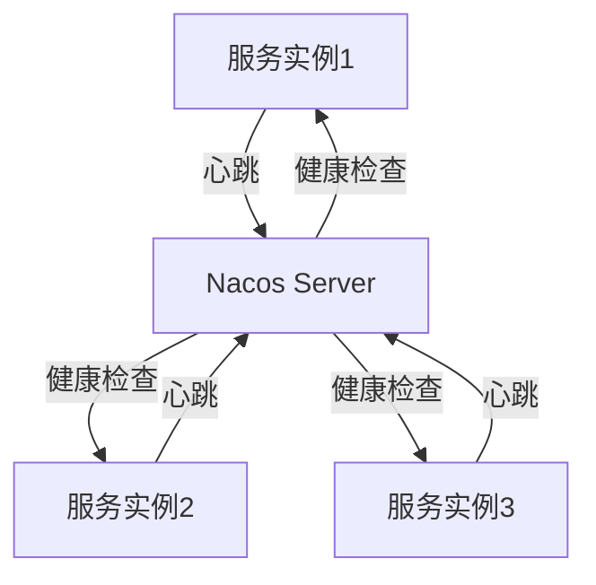

# Nacos 生态体系全景图

Nacos（Naming and Configuration Service）是一个动态服务发现、配置管理和服务管理平台。它帮助开发者构建云原生应用和微服务架构，提供了一种简单、高效的方式来管理服务的注册、发现和配置。Nacos生态体系涵盖了多个核心功能模块，并与众多主流技术栈无缝集成，形成了一个完整的微服务解决方案。

## Nacos 的核心功能

Nacos的核心功能主要包括以下三个方面：

1. **服务发现与注册**：Nacos支持服务的自动注册与发现，帮助微服务之间快速建立连接。
2. **动态配置管理**：Nacos提供动态配置管理功能，支持配置的实时更新和推送。
3. **服务健康监测**：Nacos能够实时监测服务的健康状态，确保服务的高可用性。

### 服务发现与注册

在微服务架构中，服务发现是至关重要的一环。Nacos通过服务注册中心，帮助服务实例自动注册和发现其他服务。以下是一个简单的服务注册示例：

```java
// 注册服务到Nacos
NamingService naming = NamingFactory.createNamingService("127.0.0.1:8848");
naming.registerInstance("my-service", "192.168.1.1", 8080);
```

:::tip
在实际开发中，服务注册通常由框架（如Spring Cloud Alibaba）自动完成，开发者无需手动编写注册代码。
:::

### 动态配置管理

Nacos的动态配置管理功能允许开发者在运行时动态修改配置，并实时推送到所有相关服务。以下是一个配置管理的示例：

```java
// 获取Nacos配置
ConfigService configService = NacosFactory.createConfigService("127.0.0.1:8848");
String content = configService.getConfig("my-config", "DEFAULT_GROUP", 5000);
System.out.println(content);
```

:::caution
动态配置更新时，请确保配置的格式和内容符合预期，避免因配置错误导致服务异常。
:::

### 服务健康监测

Nacos通过心跳机制实时监测服务的健康状态。如果某个服务实例不可用，Nacos会将其从服务列表中移除，确保请求不会被路由到不可用的实例。



## Nacos 生态集成

Nacos与众多主流技术栈无缝集成，形成了一个强大的微服务生态体系。以下是Nacos生态中的一些关键组件：

1. **Spring Cloud Alibaba**：Nacos作为Spring Cloud Alibaba的核心组件，提供了服务发现和配置管理的功能。
2. **Dubbo**：Nacos可以作为Dubbo的服务注册中心，帮助Dubbo实现服务的动态发现。
3. **Kubernetes**：Nacos与Kubernetes集成，支持在容器化环境中管理服务的配置和发现。
4. **Prometheus**：Nacos可以与Prometheus集成，实现服务监控和告警。

### 实际案例：Spring Cloud Alibaba集成Nacos

以下是一个Spring Cloud Alibaba集成Nacos的示例：

```yaml
# application.yml
spring:
  cloud:
    nacos:
      discovery:
        server-addr: 127.0.0.1:8848
      config:
        server-addr: 127.0.0.1:8848
        file-extension: yaml
```

:::note
通过Spring Cloud Alibaba集成Nacos，开发者可以轻松实现服务的自动注册、发现和配置管理。
:::

## 总结

Nacos生态体系为微服务架构提供了强大的支持，涵盖了服务发现、配置管理和健康监测等核心功能。通过与Spring Cloud Alibaba、Dubbo、Kubernetes等技术的集成，Nacos形成了一个完整的微服务解决方案，帮助开发者构建高效、可靠的云原生应用。

### 附加资源

- [Nacos官方文档](https://nacos.io/zh-cn/docs/what-is-nacos.html)
- [Spring Cloud Alibaba官方文档](https://spring.io/projects/spring-cloud-alibaba)
- [Dubbo官方文档](https://dubbo.apache.org/zh/docs/)

### 练习

1. 尝试在本地搭建一个Nacos服务器，并注册一个简单的服务。
2. 使用Spring Cloud Alibaba集成Nacos，实现服务的自动注册和配置管理。
3. 探索Nacos与Kubernetes的集成，了解如何在容器化环境中使用Nacos。

通过以上学习和实践，您将能够更好地理解Nacos生态体系，并在实际项目中应用这些知识。