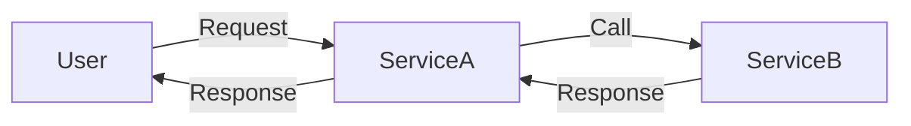

# Nacos 与Zipkin集成

在现代微服务架构中，服务发现和分布式追踪是两个至关重要的组件。Nacos 是一个动态服务发现、配置和服务管理平台，而 Zipkin 是一个分布式追踪系统，用于收集和查找微服务架构中的延迟问题。本文将详细介绍如何将 Nacos 与 Zipkin 集成，以便在微服务环境中实现服务发现和分布式追踪的无缝结合。

## 1. 什么是Nacos和Zipkin？

### Nacos
Nacos 是阿里巴巴开源的一个动态服务发现、配置和服务管理平台。它支持服务注册与发现、动态配置管理、服务元数据及流量管理等功能。Nacos 可以帮助开发者快速构建云原生应用和微服务架构。

### Zipkin
Zipkin 是一个开源的分布式追踪系统，用于收集和查找微服务架构中的延迟问题。它可以帮助开发者理解系统中的请求流，并识别性能瓶颈。

## 2. 为什么需要将Nacos与Zipkin集成？

在微服务架构中，服务之间的调用关系复杂，请求可能会经过多个服务节点。为了确保系统的可靠性和性能，我们需要：

1. **服务发现**：通过 Nacos 实现服务的自动注册与发现，确保服务之间的调用能够正确路由。
2. **分布式追踪**：通过 Zipkin 追踪请求在微服务之间的流转，识别潜在的性能瓶颈。

将 Nacos 与 Zipkin 集成，可以让我们在一个统一的平台上管理服务发现和分布式追踪，从而提高开发和运维效率。

## 3. 如何集成Nacos与Zipkin？

### 3.1 准备工作

在开始集成之前，确保你已经安装了以下组件：

- Nacos 服务器
- Zipkin 服务器
- Spring Boot 应用（作为微服务示例）

### 3.2 配置Nacos

首先，我们需要在 Spring Boot 应用中配置 Nacos 作为服务注册中心。

```yaml
# application.yml
spring:
  application:
    name: my-service
  cloud:
    nacos:
      discovery:
        server-addr: 127.0.0.1:8848
```

### 3.3 配置Zipkin

接下来，我们需要在 Spring Boot 应用中配置 Zipkin 作为分布式追踪系统。

```yaml
# application.yml
spring:
  zipkin:
    base-url: http://localhost:9411
  sleuth:
    sampler:
      probability: 1.0
```

### 3.4 启动服务

启动 Nacos 和 Zipkin 服务器，然后启动你的 Spring Boot 应用。应用启动后，会自动注册到 Nacos，并开始向 Zipkin 发送追踪数据。

### 3.5 查看追踪数据

打开 Zipkin 的 Web UI（通常位于 `http://localhost:9411`），你可以看到请求的追踪信息。通过这些信息，你可以分析请求在微服务之间的流转情况，并识别潜在的性能瓶颈。

## 4. 实际案例

假设我们有一个简单的微服务架构，包含以下服务：

1. **Service A**：提供用户信息查询服务。
2. **Service B**：提供订单信息查询服务。

用户请求首先到达 Service A，然后 Service A 调用 Service B 获取订单信息。通过 Nacos 和 Zipkin 的集成，我们可以实现以下功能：

1. **服务发现**：Service A 通过 Nacos 发现 Service B 的地址。
2. **分布式追踪**：Zipkin 追踪用户请求在 Service A 和 Service B 之间的流转。



## 5. 总结

通过将 Nacos 与 Zipkin 集成，我们可以在微服务架构中实现服务发现和分布式追踪的无缝结合。这不仅简化了服务的注册与发现过程，还提供了强大的追踪能力，帮助我们更好地理解和优化系统性能。

## 6. 附加资源与练习

- **Nacos 官方文档**：https://nacos.io/zh-cn/docs/what-is-nacos.html
- **Zipkin 官方文档**：https://zipkin.io/
- **练习**：尝试在你的 Spring Boot 应用中集成 Nacos 和 Zipkin，并分析一个简单的请求流。

:::tip
如果你在集成过程中遇到问题，可以参考官方文档或社区论坛，获取更多帮助。
:::