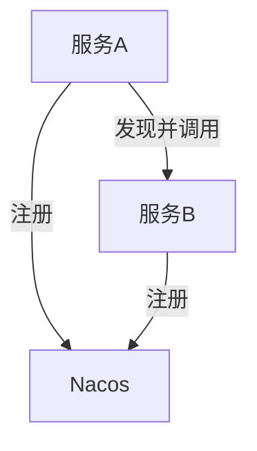
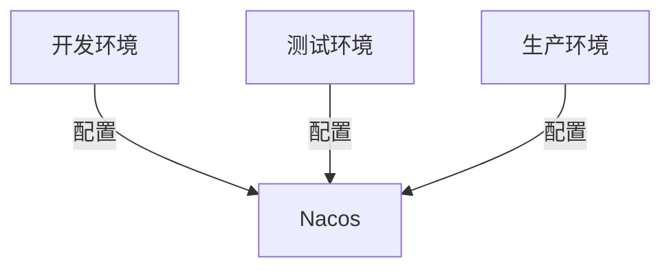

# Nacos 常见陷阱与解决方案

Nacos（Naming and Configuration Service）是一个动态服务发现、配置管理和服务管理平台，广泛应用于微服务架构中。尽管Nacos功能强大，但在实际使用中，开发者可能会遇到一些常见的陷阱。本文将详细介绍这些陷阱及其解决方案，帮助初学者更好地理解和应用Nacos。

## 1. 服务注册与发现的陷阱

### 1.1 服务注册失败

**问题描述**：在微服务架构中，服务注册是第一步。如果服务注册失败，后续的服务发现和调用将无法进行。

**解决方案**：
- **检查Nacos服务器状态**：确保Nacos服务器正在运行，并且网络连接正常。
- **检查服务配置**：确保服务的配置文件（如`application.yml`）中正确配置了Nacos服务器的地址和端口。
- **检查服务名称**：确保服务名称唯一且符合命名规范。

```yaml
spring:
  cloud:
    nacos:
      discovery:
        server-addr: 127.0.0.1:8848
```

### 1.2 服务发现失败

**问题描述**：服务注册成功后，可能会出现服务发现失败的情况，导致服务调用失败。

**解决方案**：
- **检查服务健康状态**：确保服务实例处于健康状态，Nacos会自动剔除不健康的实例。
- **检查服务订阅**：确保调用方正确订阅了目标服务。

```java
@RestController
public class ServiceController {

    @Autowired
    private DiscoveryClient discoveryClient;

    @GetMapping("/services")
    public List<String> getServices() {
        return discoveryClient.getServices();
    }
}
```

## 2. 配置管理的陷阱

### 2.1 配置更新不及时

**问题描述**：在Nacos中，配置更新后，客户端可能无法及时获取最新的配置。

**解决方案**：
- **启用配置监听**：通过`@RefreshScope`注解或`ConfigService`的`addListener`方法，监听配置变化并自动刷新。

```java
@RestController
@RefreshScope
public class ConfigController {

    @Value("${config.key}")
    private String configValue;

    @GetMapping("/config")
    public String getConfig() {
        return configValue;
    }
}
```

### 2.2 配置冲突

**问题描述**：在多个环境中，可能会出现配置冲突，导致应用行为异常。

**解决方案**：
- **使用命名空间**：通过命名空间隔离不同环境的配置，避免冲突。

```yaml
spring:
  cloud:
    nacos:
      config:
        server-addr: 127.0.0.1:8848
        namespace: dev
```

## 3. 实际案例

### 3.1 微服务架构中的服务注册与发现

在一个典型的微服务架构中，服务A需要调用服务B。服务A和服务B都需要注册到Nacos，服务A通过Nacos发现服务B的实例并进行调用。



### 3.2 配置管理的最佳实践

在一个多环境的应用中，通过Nacos的命名空间功能，隔离开发、测试和生产环境的配置，确保配置的一致性和安全性。



## 4. 总结

Nacos作为一个强大的服务发现和配置管理工具，在实际使用中可能会遇到一些陷阱。通过理解这些陷阱及其解决方案，开发者可以更好地利用Nacos构建稳定、高效的微服务架构。

:::tip 提示
在实际开发中，建议定期检查Nacos服务器的状态和日志，确保服务的健康状态和配置的及时更新。
:::

## 5. 附加资源

- [Nacos官方文档](https://nacos.io/zh-cn/docs/what-is-nacos.html)
- [Spring Cloud Alibaba Nacos](https://spring.io/projects/spring-cloud-alibaba)

## 6. 练习

1. 尝试在一个Spring Boot项目中集成Nacos，并实现服务的注册与发现。
2. 配置一个多环境的Spring Boot项目，使用Nacos的命名空间功能隔离不同环境的配置。
