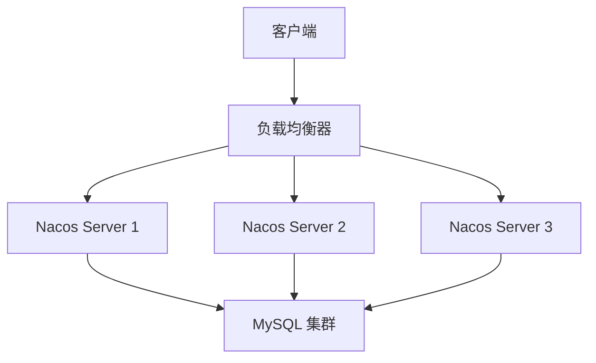

## 介绍

Nacos 是一个动态服务发现、配置管理和服务管理平台，广泛应用于微服务架构中。在生产环境中，确保 Nacos 的高可用性至关重要。高可用性（High Availability, HA）意味着系统能够在任何时间点正常运行，即使某些组件发生故障。本文将逐步讲解如何实现 Nacos 的高可用部署，并提供实际案例和最佳实践。

## Nacos 高可用架构设计

Nacos 的高可用性主要通过集群部署来实现。一个典型的 Nacos 集群由多个节点组成，这些节点分布在不同的物理服务器或虚拟机上。以下是 Nacos 高可用架构的核心组件：

1. **Nacos Server 集群**：多个 Nacos Server 实例组成一个集群，通过 Raft 协议实现数据一致性。
2. **数据库集群**：Nacos 支持 MySQL 作为持久化存储，数据库的高可用性也是确保 Nacos 高可用的关键。
3. **负载均衡器**：用于将客户端请求分发到不同的 Nacos Server 实例。



## 部署步骤

### 1. 部署 Nacos Server 集群

首先，需要在多台服务器上部署 Nacos Server。假设我们有三台服务器，IP 地址分别为 `192.168.1.101`、`192.168.1.102` 和 `192.168.1.103`。

在每台服务器上，下载并解压 Nacos Server：

```bash
wget https://github.com/alibaba/nacos/releases/download/2.0.3/nacos-server-2.0.3.tar.gz
tar -zxvf nacos-server-2.0.3.tar.gz
```

然后，修改 `conf/cluster.conf` 文件，配置集群节点：

```plaintext
192.168.1.101:8848
192.168.1.102:8848
192.168.1.103:8848
```

### 2. 配置 MySQL 集群

Nacos 支持 MySQL 作为持久化存储。首先，确保 MySQL 集群已经部署并配置好主从复制。然后，修改 Nacos 的 `conf/application.properties` 文件，配置数据库连接：

```properties
spring.datasource.platform=mysql
db.num=1
db.url.0=jdbc:mysql://192.168.1.104:3306/nacos?characterEncoding=utf8&connectTimeout=1000&socketTimeout=3000&autoReconnect=true
db.user=nacos
db.password=nacos
```

### 3. 配置负载均衡器

使用 Nginx 作为负载均衡器，配置如下：

```nginx
upstream nacos_cluster {
    server 192.168.1.101:8848;
    server 192.168.1.102:8848;
    server 192.168.1.103:8848;
}

server {
    listen 80;
    server_name nacos.example.com;

    location / {
        proxy_pass http://nacos_cluster;
    }
}
```

### 4. 启动 Nacos Server

在每台服务器上启动 Nacos Server：

```bash
sh bin/startup.sh -m cluster
```

## 实际案例

假设我们有一个微服务架构的电商系统，使用了 Nacos 作为服务发现和配置中心。为了确保系统的高可用性，我们按照上述步骤部署了一个 Nacos 集群。当某个 Nacos Server 实例发生故障时，其他实例仍然可以正常提供服务，确保系统的稳定运行。

## 总结

通过本文的学习，你应该已经掌握了 Nacos 高可用部署的基本步骤和最佳实践。高可用性是生产环境中不可或缺的一部分，合理的架构设计和配置优化可以显著提高系统的稳定性和可靠性。

## 附加资源

- [Nacos 官方文档](https://nacos.io/zh-cn/docs/what-is-nacos.html)
- [MySQL 主从复制配置指南](https://dev.mysql.com/doc/refman/8.0/en/replication.html)
- [Nginx 负载均衡配置指南](https://nginx.org/en/docs/http/load_balancing.html)

## 练习

1. 尝试在本地虚拟机环境中部署一个 Nacos 集群。
2. 配置 MySQL 主从复制，并将其作为 Nacos 的持久化存储。
3. 使用 Nginx 配置负载均衡，模拟客户端请求的分发过程。
