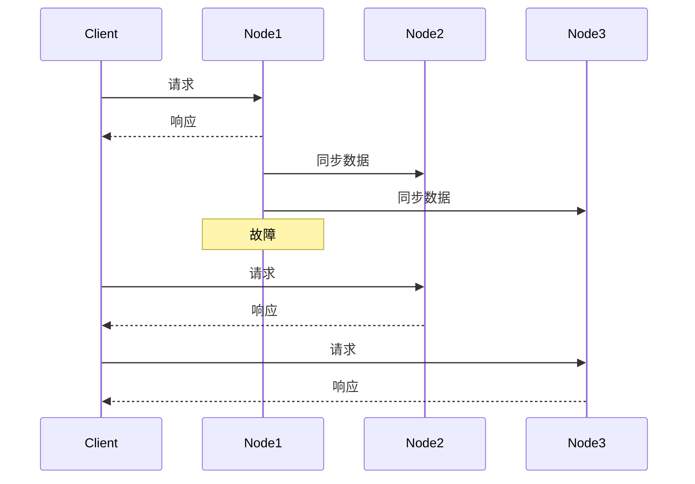

## 介绍

Nacos（Naming and Configuration Service）是一个动态服务发现、配置管理和服务管理平台。在生产环境中，确保Nacos服务的高可用性和数据安全至关重要。灾备策略是Nacos架构中不可或缺的一部分，它能够在系统故障或灾难发生时，确保服务的持续可用性和数据的完整性。

本文将逐步讲解Nacos的灾备策略规范，并通过实际案例展示其应用场景。

## 灾备策略概述

灾备策略是指在系统发生故障或灾难时，通过预先设计的方案和机制，确保系统能够快速恢复并继续提供服务。Nacos的灾备策略主要包括以下几个方面：

1. **数据备份与恢复**：定期备份Nacos的配置数据和服务注册信息，确保在数据丢失或损坏时能够快速恢复。
2. **多数据中心部署**：在不同地理位置部署多个Nacos集群，确保在一个数据中心发生故障时，其他数据中心能够继续提供服务。
3. **自动故障转移**：通过配置自动故障转移机制，确保在某个Nacos节点发生故障时，流量能够自动切换到其他可用节点。

## 数据备份与恢复

### 数据备份

Nacos的数据备份可以通过以下步骤实现：

1. **配置数据备份**：Nacos的配置数据存储在数据库中，可以通过数据库的备份工具（如MySQL的`mysqldump`）定期备份数据。
2. **服务注册信息备份**：Nacos的服务注册信息存储在内存中，可以通过Nacos提供的API导出服务注册信息并存储到文件系统中。

```bash
# 使用mysqldump备份Nacos配置数据
mysqldump -u root -p nacos_config > nacos_config_backup.sql
```

### 数据恢复

在数据丢失或损坏时，可以通过以下步骤恢复数据：

1. **恢复配置数据**：使用数据库的恢复工具（如MySQL的`mysql`命令）将备份的配置数据恢复到数据库中。
2. **恢复服务注册信息**：通过Nacos提供的API将备份的服务注册信息导入到Nacos中。

```bash
# 使用mysql命令恢复Nacos配置数据
mysql -u root -p nacos_config < nacos_config_backup.sql
```

## 多数据中心部署

### 部署架构

在多数据中心部署中，Nacos集群可以部署在多个地理位置的数据中心中。每个数据中心的Nacos集群都可以独立提供服务，并通过同步机制保持数据一致性。


### 配置同步

Nacos支持通过配置同步机制，确保不同数据中心的Nacos集群之间的数据一致性。可以通过以下步骤配置同步：

1. **配置同步策略**：在Nacos的配置文件中，配置同步策略，指定需要同步的数据中心和同步频率。
2. **启动同步服务**：启动Nacos集群时，同步服务会自动启动，并按照配置的策略进行数据同步。

```properties
# Nacos 配置文件示例
nacos.sync.strategy=auto
nacos.sync.frequency=60
```

## 自动故障转移

### 故障转移机制

Nacos支持通过配置自动故障转移机制，确保在某个Nacos节点发生故障时，流量能够自动切换到其他可用节点。可以通过以下步骤配置故障转移：

1. **配置健康检查**：在Nacos的配置文件中，配置健康检查机制，定期检查Nacos节点的健康状态。
2. **配置故障转移策略**：在Nacos的配置文件中，配置故障转移策略，指定在节点故障时如何切换流量。

```properties
# Nacos 配置文件示例
nacos.health.check.interval=10
nacos.failover.strategy=auto
```

### 故障转移示例

假设Nacos集群中有三个节点：`node1`、`node2`和`node3`。当`node1`发生故障时，Nacos会自动将流量切换到`node2`和`node3`，确保服务的持续可用性。



## 实际案例

### 案例背景

某电商平台使用Nacos作为服务发现和配置管理中心。为了确保服务的高可用性，该平台决定实施Nacos的灾备策略。

### 实施步骤

1. **数据备份**：每天凌晨2点，使用`mysqldump`备份Nacos的配置数据，并将备份文件存储到远程存储系统中。
2. **多数据中心部署**：在三个不同地理位置的数据中心部署Nacos集群，并配置同步策略，确保数据一致性。
3. **自动故障转移**：配置健康检查和故障转移策略，确保在某个Nacos节点发生故障时，流量能够自动切换到其他可用节点。

### 实施效果

通过实施Nacos的灾备策略，该电商平台成功确保了服务的高可用性和数据安全。在一次数据中心故障中，Nacos自动将流量切换到其他数据中心，确保了服务的持续可用性。

## 总结

Nacos的灾备策略是确保服务高可用性和数据安全的关键。通过数据备份与恢复、多数据中心部署和自动故障转移等策略，可以有效应对系统故障和灾难，确保服务的持续可用性。

## 附加资源

- [Nacos官方文档](https://nacos.io/zh-cn/docs/what-is-nacos.html)
- [MySQL备份与恢复指南](https://dev.mysql.com/doc/refman/8.0/en/backup-and-recovery.html)
- [分布式系统灾备策略](https://en.wikipedia.org/wiki/Disaster_recovery)

## 练习

1. 尝试在本地环境中部署一个Nacos集群，并配置数据备份与恢复策略。
2. 模拟Nacos节点故障，观察自动故障转移机制的效果。
3. 研究Nacos的多数据中心部署方案，并尝试在不同地理位置部署Nacos集群。
