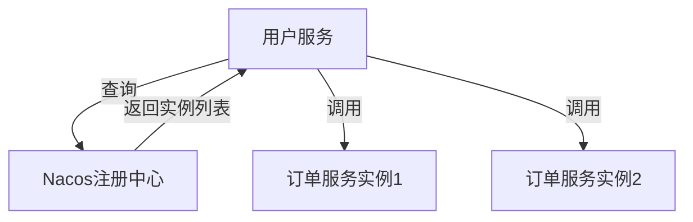

# Nacos 服务注册原理

在现代微服务架构中，服务注册与发现是至关重要的一环。Nacos（Naming and Configuration Service）是一个动态服务发现、配置管理和服务管理平台，广泛应用于微服务架构中。本文将详细介绍Nacos服务注册的原理，帮助初学者理解其工作机制。

## 什么是服务注册？

服务注册是指服务实例在启动时，将自己的信息（如IP地址、端口号、服务名称等）注册到服务注册中心的过程。服务注册中心负责维护这些服务实例的信息，并提供服务发现的功能，使得其他服务能够找到并调用这些服务实例。

## Nacos 服务注册的核心概念

在Nacos中，服务注册的核心概念包括：

- **服务（Service）**：一个服务代表一组功能相同的服务实例。
- **实例（Instance）**：服务实例是服务的具体实现，通常是一个运行中的进程。
- **注册中心（Registry）**：负责存储和管理服务实例的信息。

## Nacos 服务注册的工作流程

Nacos服务注册的工作流程可以分为以下几个步骤：

1. **服务实例启动**：服务实例在启动时，会向Nacos注册中心发送注册请求。
2. **注册请求处理**：Nacos注册中心接收到注册请求后，会将服务实例的信息存储到注册表中。
3. **心跳检测**：服务实例会定期向Nacos发送心跳，以表明自己仍然存活。如果Nacos在一定时间内没有收到心跳，会将该实例标记为不健康或下线。
4. **服务发现**：其他服务可以通过Nacos查询注册表，获取可用的服务实例列表。

### 代码示例

以下是一个简单的Java代码示例，展示了如何使用Nacos进行服务注册：

```java
import com.alibaba.nacos.api.NacosFactory;
import com.alibaba.nacos.api.exception.NacosException;
import com.alibaba.nacos.api.naming.NamingService;
import com.alibaba.nacos.api.naming.pojo.Instance;

public class NacosServiceRegistration {
    public static void main(String[] args) {
        try {
            // 创建NamingService实例
            NamingService namingService = NacosFactory.createNamingService("127.0.0.1:8848");

            // 创建服务实例
            Instance instance = new Instance();
            instance.setIp("192.168.1.100");
            instance.setPort(8080);
            instance.setServiceName("example-service");

            // 注册服务实例
            namingService.registerInstance("example-service", instance);

            System.out.println("服务实例注册成功！");
        } catch (NacosException e) {
            e.printStackTrace();
        }
    }
}
```

### 输出

```
服务实例注册成功！
```

## 实际应用场景

假设我们有一个电商系统，其中包含多个微服务，如用户服务、订单服务和商品服务。每个服务在启动时都会向Nacos注册中心注册自己的实例。当用户服务需要调用订单服务时，它可以通过Nacos查询到可用的订单服务实例列表，并选择一个实例进行调用。



## 总结

Nacos服务注册是微服务架构中不可或缺的一部分。通过服务注册，服务实例能够动态地将自己的信息注册到注册中心，其他服务则可以通过注册中心发现并调用这些实例。本文详细介绍了Nacos服务注册的原理、工作流程以及实际应用场景，并通过代码示例展示了如何使用Nacos进行服务注册。

## 附加资源

- [Nacos官方文档](https://nacos.io/zh-cn/docs/what-is-nacos.html)
- [Nacos GitHub仓库](https://github.com/alibaba/nacos)

## 练习

1. 尝试在本地搭建一个Nacos服务器，并使用Java代码注册一个服务实例。
2. 修改代码，使得服务实例能够定期发送心跳，并观察Nacos注册中心的变化。

:::tip
在微服务架构中，服务注册与发现是确保服务之间能够高效通信的关键。掌握Nacos服务注册的原理，将有助于你更好地理解和设计微服务系统。
:::