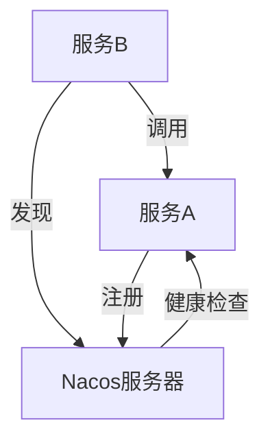

## 介绍

在微服务架构中，服务发现是一个关键组件，它允许服务动态地注册和发现其他服务的位置。Nacos（Naming and Configuration Service）是一个开源的动态服务发现、配置和服务管理平台，广泛应用于微服务架构中。本文将详细介绍Nacos的服务发现机制，并通过实际案例帮助初学者理解其工作原理。

## 什么是服务发现？

服务发现是微服务架构中的一个核心概念，它允许服务在运行时动态地发现和调用其他服务。在传统的单体应用中，服务之间的调用通常是硬编码的，但在微服务架构中，服务的数量和位置可能会频繁变化，因此需要一个动态的机制来管理这些服务。

Nacos通过提供一个中心化的服务注册表，使得服务可以在启动时注册自己，并在需要时发现其他服务的位置。这样，服务之间的调用就不再依赖于硬编码的地址，而是通过服务发现机制动态获取。

## Nacos 服务发现机制

### 服务注册

当一个服务启动时，它会向Nacos服务器注册自己的信息，包括服务名称、IP地址、端口号等。Nacos服务器会将这些信息存储在服务注册表中。

```java
// 示例：服务注册
NacosDiscoveryProperties properties = new NacosDiscoveryProperties();
properties.setServerAddr("127.0.0.1:8848");
properties.setServiceName("example-service");
properties.setIp("192.168.1.100");
properties.setPort(8080);

NamingService namingService = NacosFactory.createNamingService(properties.getServerAddr());
namingService.registerInstance(properties.getServiceName(), properties.getIp(), properties.getPort());
```

### 服务发现

当一个服务需要调用另一个服务时，它会向Nacos服务器查询目标服务的信息。Nacos服务器会返回目标服务的实例列表，调用方可以根据负载均衡策略选择一个实例进行调用。

```java
// 示例：服务发现
NamingService namingService = NacosFactory.createNamingService("127.0.0.1:8848");
List<Instance> instances = namingService.getAllInstances("example-service");

// 选择一个实例进行调用
Instance instance = instances.get(0);
String url = "http://" + instance.getIp() + ":" + instance.getPort() + "/api";
```

### 服务健康检查

Nacos会定期检查注册服务的健康状态，如果某个服务实例不可用，Nacos会将其从服务注册表中移除，确保调用方不会访问到不可用的服务。



## 实际案例

假设我们有一个简单的微服务架构，包含两个服务：`user-service` 和 `order-service`。`order-service` 需要调用 `user-service` 来获取用户信息。

1. **服务注册**：
   - `user-service` 启动时，向Nacos注册自己的信息。
   - `order-service` 启动时，向Nacos注册自己的信息。

2. **服务发现**：
   - `order-service` 需要调用 `user-service` 时，向Nacos查询 `user-service` 的实例列表。
   - Nacos返回 `user-service` 的实例列表，`order-service` 选择一个实例进行调用。

3. **健康检查**：
   - Nacos定期检查 `user-service` 和 `order-service` 的健康状态，确保只有健康的服务实例可以被发现和调用。

## 总结

Nacos的服务发现机制为微服务架构提供了动态的服务注册与发现能力，使得服务之间的调用更加灵活和可靠。通过本文的介绍和实际案例，初学者可以更好地理解Nacos的服务发现机制，并在实际项目中应用这一技术。

## 附加资源

- [Nacos官方文档](https://nacos.io/zh-cn/docs/what-is-nacos.html)
- [微服务架构设计模式](https://microservices.io/patterns/index.html)

## 练习

1. 尝试在本地搭建一个Nacos服务器，并注册一个简单的服务。
2. 编写一个服务发现客户端，查询并调用已注册的服务。
3. 模拟服务实例的故障，观察Nacos如何自动移除不可用的服务实例。
