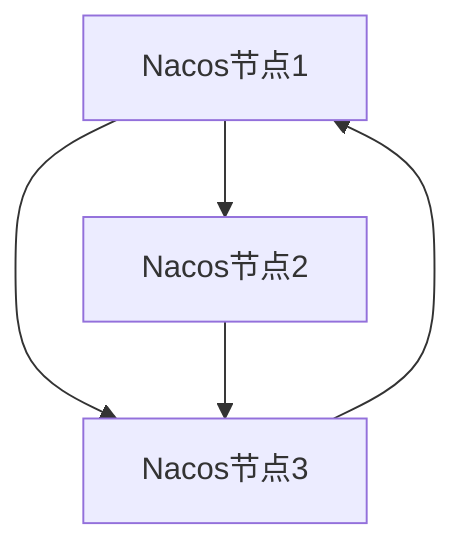
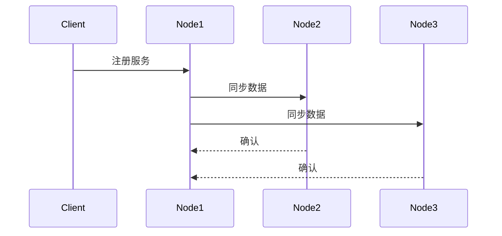

# Nacos 集群服务同步

在分布式系统中，服务注册与发现是核心功能之一。Nacos作为一个动态服务发现、配置和服务管理平台，支持集群部署以提高系统的可用性和容错能力。本文将详细介绍Nacos集群中的服务同步机制，帮助初学者理解其工作原理和实现方式。

## 什么是Nacos集群服务同步？

Nacos集群服务同步是指在Nacos集群中，各个节点之间如何共享和同步服务注册信息。当服务提供者注册到Nacos集群中的某个节点时，该节点的服务信息需要同步到其他节点，以确保整个集群的数据一致性。

## Nacos 集群架构

Nacos集群通常由多个节点组成，每个节点都可以独立处理服务注册与发现请求。为了实现高可用性，Nacos采用了Raft协议来保证集群中各个节点之间的数据一致性。



## 服务同步机制

### 1. 服务注册

当一个服务提供者向Nacos集群中的某个节点注册服务时，该节点会首先将服务信息存储到本地，然后通过Raft协议将服务信息同步到其他节点。

```java
// 示例：服务注册代码
NamingService naming = NacosFactory.createNamingService("127.0.0.1:8848");
naming.registerInstance("my-service", "127.0.0.1", 8080);
```

### 2. 数据同步

Nacos集群中的每个节点都会维护一个服务注册表。当一个节点接收到新的服务注册信息时，它会通过Raft协议将数据同步到其他节点。Raft协议确保了数据的一致性和顺序性。



### 3. 服务发现

当服务消费者需要发现某个服务时，它可以从Nacos集群中的任何一个节点获取服务信息。由于服务信息已经在集群中同步，因此无论请求发送到哪个节点，都能获取到一致的服务列表。

```java
// 示例：服务发现代码
List<Instance> instances = naming.getAllInstances("my-service");
for (Instance instance : instances) {
    System.out.println(instance.getIp() + ":" + instance.getPort());
}
```

## 实际应用场景

### 场景1：高可用性

在一个高可用的微服务架构中，Nacos集群可以确保即使某个节点发生故障，其他节点仍然可以继续提供服务注册与发现功能。例如，假设Nacos集群有三个节点，如果其中一个节点宕机，服务消费者仍然可以从其他两个节点获取服务信息。

### 场景2：数据一致性

在分布式系统中，数据一致性是一个重要的挑战。Nacos通过Raft协议确保集群中各个节点的服务信息保持一致。例如，当一个服务提供者在节点1上注册服务后，节点2和节点3也会同步该服务信息，从而保证整个集群的数据一致性。

## 总结

Nacos集群服务同步是确保分布式系统中服务注册与发现功能高可用性和数据一致性的关键机制。通过Raft协议，Nacos集群中的各个节点能够高效地同步服务信息，从而为微服务架构提供可靠的基础设施支持。

## 附加资源与练习

- **官方文档**: [Nacos官方文档](https://nacos.io/zh-cn/docs/what-is-nacos.html)
- **练习**: 尝试在本地搭建一个Nacos集群，并模拟服务注册与发现的过程，观察服务信息在不同节点之间的同步情况。

:::tip
提示：在搭建Nacos集群时，确保每个节点的配置文件正确配置了集群节点的地址列表。
:::