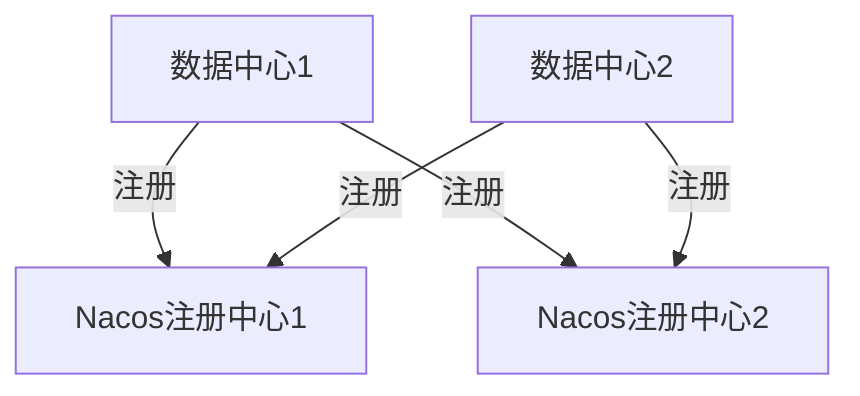

# Nacos 多注册中心

在现代微服务架构中，服务注册与发现是一个核心组件。Nacos作为一个动态服务发现、配置和服务管理平台，支持多注册中心的配置，使得服务可以在多个注册中心之间进行注册和发现，从而提高系统的可用性和灵活性。

## 什么是Nacos多注册中心？

Nacos多注册中心是指在一个微服务架构中，服务可以同时注册到多个Nacos注册中心。这种方式可以提高系统的容错能力，当其中一个注册中心出现故障时，服务仍然可以通过其他注册中心进行通信。

## 为什么需要多注册中心？

1. **高可用性**：通过多注册中心，可以避免单点故障，确保服务的持续可用。
2. **负载均衡**：多个注册中心可以分担服务注册和发现的负载，提高系统的性能。
3. **地理分布**：对于跨地域的微服务架构，多注册中心可以优化服务的访问延迟。

## 配置Nacos多注册中心

### 1. 配置多个Nacos服务器

首先，你需要在`application.properties`或`application.yml`中配置多个Nacos服务器的地址。

```yaml
spring:
  cloud:
    nacos:
      discovery:
        server-addr: 192.168.1.1:8848,192.168.1.2:8848
```

### 2. 服务注册

在服务启动时，Nacos客户端会自动将服务注册到配置的所有Nacos服务器上。

```java
@SpringBootApplication
@EnableDiscoveryClient
public class MyServiceApplication {
    public static void main(String[] args) {
        SpringApplication.run(MyServiceApplication.class, args);
    }
}
```

### 3. 服务发现

服务发现时，Nacos客户端会从所有配置的Nacos服务器中获取服务实例列表，并进行负载均衡。

```java
@RestController
public class MyController {

    @Autowired
    private LoadBalancerClient loadBalancer;

    @GetMapping("/call-service")
    public String callService() {
        ServiceInstance instance = loadBalancer.choose("my-service");
        return "Calling service at: " + instance.getUri();
    }
}
```

## 实际案例

假设你有一个电商平台，服务部署在两个不同的数据中心。为了提高系统的可用性，你可以在每个数据中心部署一个Nacos注册中心，并将服务注册到这两个注册中心。



在这种架构下，即使一个数据中心的Nacos注册中心出现故障，服务仍然可以通过另一个数据中心的注册中心进行通信。

## 总结

Nacos多注册中心配置是提高微服务架构高可用性和灵活性的重要手段。通过配置多个Nacos服务器，服务可以在多个注册中心之间进行注册和发现，从而避免单点故障，提高系统的整体稳定性。

## 附加资源

- [Nacos官方文档](https://nacos.io/zh-cn/docs/what-is-nacos.html)
- [Spring Cloud Alibaba Nacos Discovery](https://spring.io/projects/spring-cloud-alibaba)

## 练习

1. 尝试在你的本地环境中配置两个Nacos服务器，并将一个服务注册到这两个服务器上。
2. 模拟其中一个Nacos服务器宕机，观察服务是否仍然可以通过另一个服务器进行通信。

:::tip
在配置多注册中心时，确保所有Nacos服务器的配置一致，以避免服务注册和发现时出现不一致的情况。
:::