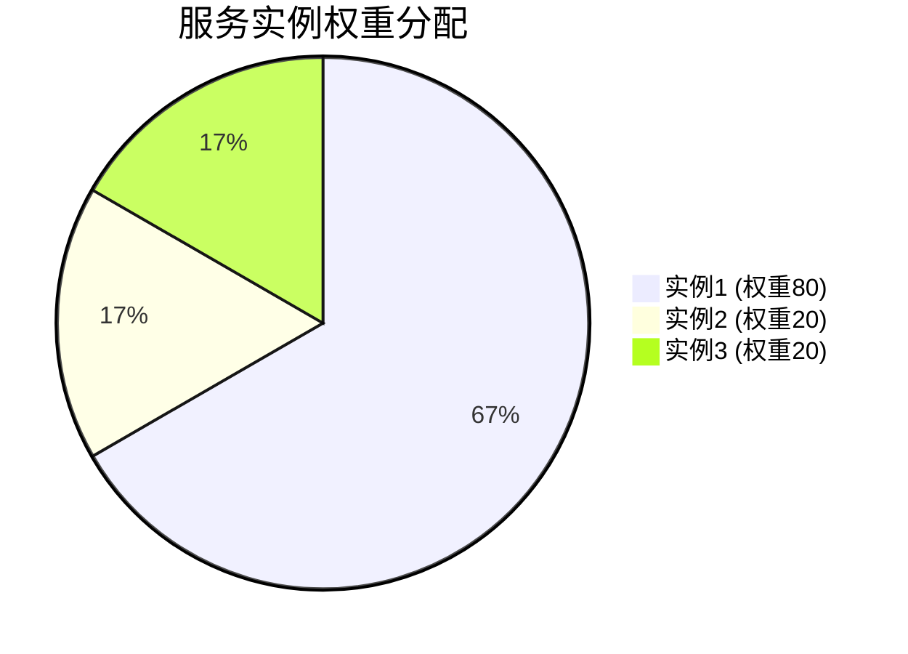
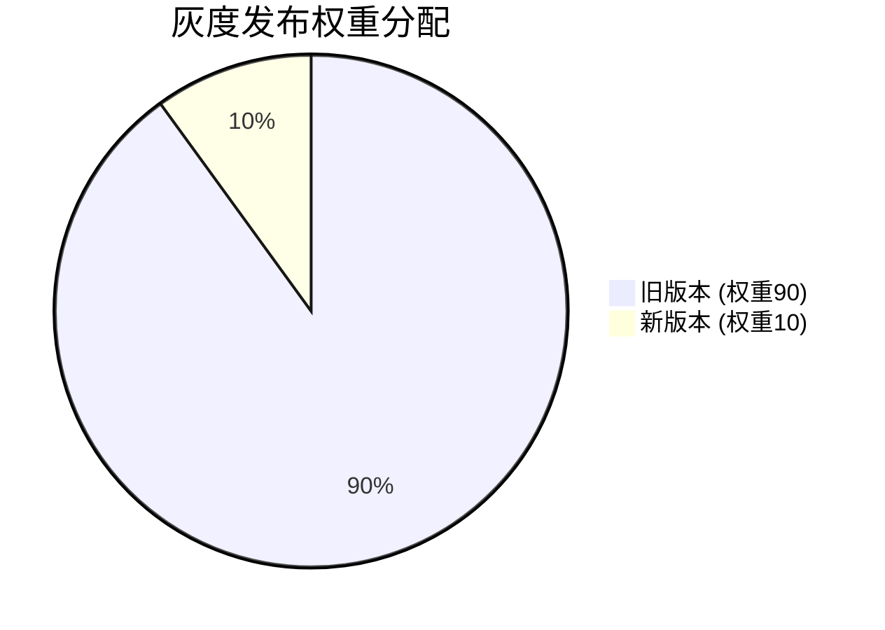

# Nacos 服务权重设置

在微服务架构中，服务注册与发现是一个核心组件，而Nacos作为一款流行的服务注册与发现工具，提供了丰富的功能来管理服务实例。其中，**服务权重设置**是一个重要的特性，它允许我们为不同的服务实例分配不同的权重，从而实现更灵活的负载均衡和流量控制。

## 什么是服务权重？

服务权重是指为服务实例分配的一个数值，用于表示该实例在处理请求时的相对能力或优先级。权重越高，该实例被选中的概率就越大。通过调整权重，我们可以实现以下目标：

- **负载均衡**：将更多的流量分配到性能更强的实例上。
- **灰度发布**：逐步将流量从旧版本服务切换到新版本服务。
- **故障隔离**：降低故障实例的权重，减少其对系统的影响。

## 如何在Nacos中设置服务权重？

在Nacos中，服务权重可以通过两种方式设置：

1. **通过Nacos控制台手动设置**。
2. **通过Nacos API动态设置**。

### 1. 通过Nacos控制台手动设置

在Nacos控制台中，你可以为每个服务实例手动设置权重。以下是具体步骤：

1. 登录Nacos控制台。
2. 进入“服务管理”页面，找到目标服务。
3. 点击服务名称，进入服务详情页面。
4. 在实例列表中，找到需要设置权重的实例，点击“编辑”按钮。
5. 在弹出的编辑窗口中，找到“权重”字段，输入所需的权重值（通常为0到100之间的整数）。
6. 点击“保存”按钮，完成权重设置。

:::note
权重值越高，该实例被选中的概率越大。权重为0的实例将不会被选中。
:::

### 2. 通过Nacos API动态设置

除了通过控制台手动设置权重外，你还可以通过Nacos提供的API动态调整服务权重。以下是一个使用Java SDK设置服务权重的示例：

```java
import com.alibaba.nacos.api.naming.NamingFactory;
import com.alibaba.nacos.api.naming.NamingService;
import com.alibaba.nacos.api.naming.pojo.Instance;

public class NacosWeightExample {
    public static void main(String[] args) throws Exception {
        // 创建NamingService实例
        NamingService namingService = NamingFactory.createNamingService("127.0.0.1:8848");

        // 注册服务实例
        Instance instance = new Instance();
        instance.setIp("192.168.1.100");
        instance.setPort(8080);
        instance.setWeight(50); // 设置权重为50
        namingService.registerInstance("my-service", instance);

        // 更新服务实例权重
        instance.setWeight(80); // 更新权重为80
        namingService.registerInstance("my-service", instance);
    }
}
```

在这个示例中，我们首先创建了一个`NamingService`实例，然后注册了一个服务实例并设置了初始权重为50。接着，我们通过再次调用`registerInstance`方法，将权重更新为80。

:::tip
通过API动态设置权重时，Nacos会自动将新的权重值同步到所有客户端，无需重启服务。
:::

## 实际应用场景

### 场景1：负载均衡

假设你有三个服务实例，分别部署在不同的服务器上。其中一台服务器的性能较强，你希望将更多的流量分配到这台服务器上。此时，你可以为性能较强的实例设置较高的权重，例如80，而为其他实例设置较低的权重，例如20。这样，Nacos在进行负载均衡时，会优先选择权重较高的实例。



### 场景2：灰度发布

在进行灰度发布时，你可能希望逐步将流量从旧版本服务切换到新版本服务。此时，你可以为新版本服务实例设置较低的权重（例如10），而为旧版本服务实例设置较高的权重（例如90）。随着新版本服务的稳定性得到验证，你可以逐步增加新版本服务的权重，直到最终完全切换到新版本。



## 总结

通过Nacos的服务权重设置功能，你可以灵活地控制服务实例的流量分配，从而实现负载均衡、灰度发布等目标。无论是通过Nacos控制台手动设置，还是通过API动态调整，Nacos都提供了简单易用的方式来管理服务权重。

## 附加资源与练习

- **Nacos官方文档**：了解更多关于Nacos服务注册与发现的功能和配置。
- **练习**：尝试在你的本地环境中部署Nacos，并为一个服务设置不同的权重，观察流量的分配情况。

:::caution
在实际生产环境中，调整服务权重时需谨慎操作，避免因权重设置不当导致服务过载或流量不均。
:::