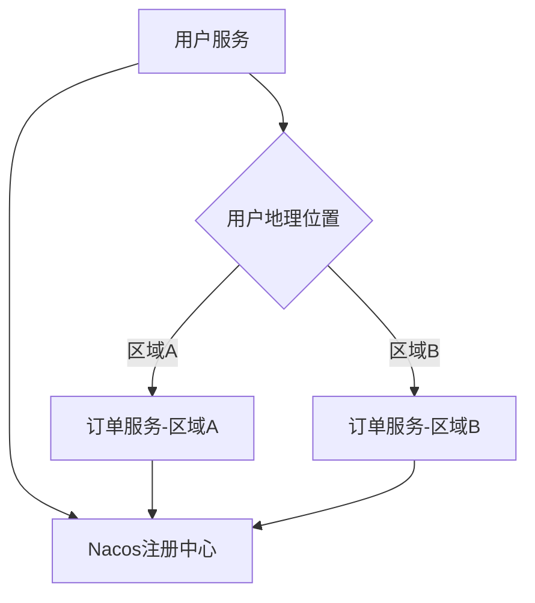

# Nacos 服务路由

## 介绍

在微服务架构中，服务路由是一个关键概念。它决定了客户端请求如何被路由到具体的服务实例。Nacos作为一个动态服务发现和配置管理平台，提供了强大的服务路由功能。通过Nacos，开发者可以轻松实现服务的动态路由、负载均衡和故障转移。

本文将详细介绍Nacos服务路由的基本概念、工作原理以及如何在实际项目中使用它。

## 什么是服务路由？

服务路由是指将客户端请求根据一定的规则（如权重、区域、版本等）分发到不同的服务实例上。Nacos通过内置的路由策略和配置管理功能，使得服务路由变得更加灵活和高效。

## Nacos 服务路由的工作原理

Nacos服务路由的核心思想是通过服务注册与发现机制，动态地获取服务实例列表，并根据配置的路由规则进行请求分发。以下是Nacos服务路由的基本工作流程：

1. **服务注册**：服务实例启动时，向Nacos注册中心注册自己的信息，包括IP地址、端口、权重等。
2. **服务发现**：客户端通过Nacos获取服务实例列表。
3. **路由规则配置**：在Nacos中配置路由规则，如权重、区域、版本等。
4. **请求分发**：客户端根据路由规则，将请求分发到合适的服务实例。

## 配置Nacos服务路由

### 1. 服务注册

首先，我们需要将服务实例注册到Nacos中。以下是一个简单的Spring Cloud服务注册示例：

```java
@SpringBootApplication
@EnableDiscoveryClient
public class ServiceApplication {
    public static void main(String[] args) {
        SpringApplication.run(ServiceApplication.class, args);
    }
}
```

### 2. 服务发现

客户端通过Nacos获取服务实例列表。以下是一个简单的Spring Cloud服务发现示例：

```java
@RestController
public class ServiceController {

    @Autowired
    private DiscoveryClient discoveryClient;

    @GetMapping("/instances")
    public List<ServiceInstance> getInstances() {
        return discoveryClient.getInstances("service-name");
    }
}
```

### 3. 路由规则配置

在Nacos控制台中，我们可以配置路由规则。以下是一个简单的权重路由配置示例：

```yaml
service-name:
  ribbon:
    NFLoadBalancerRuleClassName: com.netflix.loadbalancer.WeightedResponseTimeRule
```

### 4. 请求分发

客户端根据路由规则，将请求分发到合适的服务实例。以下是一个简单的Ribbon负载均衡示例：

```java
@RestController
public class ClientController {

    @Autowired
    private RestTemplate restTemplate;

    @GetMapping("/call")
    public String callService() {
        return restTemplate.getForObject("http://service-name/endpoint", String.class);
    }
}
```

## 实际案例

假设我们有一个电商系统，包含用户服务和订单服务。我们希望根据用户的地理位置，将请求路由到最近的订单服务实例。以下是实现步骤：

1. **服务注册**：用户服务和订单服务分别注册到Nacos中。
2. **路由规则配置**：在Nacos中配置基于区域的路由规则。
3. **请求分发**：客户端根据用户的地理位置，将请求分发到最近的订单服务实例。



## 总结

Nacos服务路由是微服务架构中不可或缺的一部分。通过Nacos，我们可以轻松实现服务的动态路由、负载均衡和故障转移。本文介绍了Nacos服务路由的基本概念、工作原理以及如何在实际项目中使用它。希望本文能帮助你更好地理解和使用Nacos服务路由。

## 附加资源

- [Nacos官方文档](https://nacos.io/zh-cn/docs/what-is-nacos.html)
- [Spring Cloud Alibaba Nacos](https://spring.io/projects/spring-cloud-alibaba)

## 练习

1. 尝试在本地环境中配置一个简单的Nacos服务路由示例。
2. 修改路由规则，观察请求分发的变化。
3. 探索Nacos的其他高级功能，如配置管理和服务治理。
