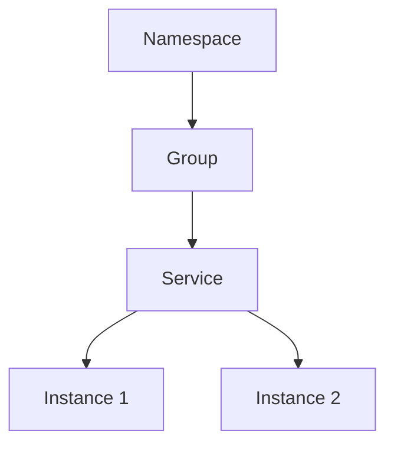

## 什么是Nacos服务分组？

在微服务架构中，服务注册与发现是一个核心组件，而Nacos作为一款流行的服务注册与发现工具，提供了强大的功能来管理服务实例。**服务分组**是Nacos中的一个重要概念，它允许你将服务实例按照逻辑分组进行管理。通过分组，你可以更好地组织和管理服务实例，尤其是在复杂的微服务环境中。

服务分组的主要作用包括：
- **逻辑隔离**：将服务实例按照业务逻辑或环境进行分组，避免不同业务或环境之间的干扰。
- **灵活管理**：通过分组可以更方便地对特定组的服务实例进行管理，例如灰度发布、流量控制等。
- **提高可维护性**：分组使得服务实例的管理更加清晰，便于团队协作和维护。

## 服务分组的基本概念

在Nacos中，每个服务实例都可以属于一个特定的分组。分组的名称是一个字符串，通常用于表示业务逻辑、环境（如开发、测试、生产）或其他自定义分类。默认情况下，Nacos使用`DEFAULT_GROUP`作为默认分组名称。

### 服务分组的结构

Nacos中的服务分组结构可以表示为以下层级：
- **Namespace（命名空间）**：用于隔离不同环境或租户的服务。
- **Group（分组）**：在命名空间下，服务实例可以进一步分组。
- **Service（服务）**：在分组下，具体的服务实例。



## 如何使用Nacos服务分组

### 1. 注册服务时指定分组

在注册服务实例时，可以通过指定`groupName`参数来将服务实例分配到特定的分组。以下是一个Java示例：

```java
import com.alibaba.nacos.api.naming.NamingFactory;
import com.alibaba.nacos.api.naming.NamingService;
import com.alibaba.nacos.api.naming.pojo.Instance;

public class NacosServiceRegistration {
    public static void main(String[] args) throws Exception {
        // 创建NamingService实例
        NamingService namingService = NamingFactory.createNamingService("127.0.0.1:8848");

        // 创建服务实例
        Instance instance = new Instance();
        instance.setIp("192.168.1.100");
        instance.setPort(8080);
        instance.setServiceName("my-service");
        instance.setClusterName("DEFAULT");
        instance.setGroupName("MY_GROUP"); // 指定分组名称

        // 注册服务实例
        namingService.registerInstance("my-service", instance);
    }
}
```

在这个示例中，服务实例被注册到名为`MY_GROUP`的分组中。

### 2. 查询特定分组的服务实例

在查询服务实例时，可以通过指定分组名称来获取特定分组的服务实例。以下是一个查询示例：

```java
import com.alibaba.nacos.api.naming.NamingFactory;
import com.alibaba.nacos.api.naming.NamingService;
import com.alibaba.nacos.api.naming.pojo.Instance;

import java.util.List;

public class NacosServiceDiscovery {
    public static void main(String[] args) throws Exception {
        // 创建NamingService实例
        NamingService namingService = NamingFactory.createNamingService("127.0.0.1:8848");

        // 查询特定分组的服务实例
        List<Instance> instances = namingService.getAllInstances("my-service", "MY_GROUP");

        // 输出服务实例信息
        for (Instance instance : instances) {
            System.out.println("Instance IP: " + instance.getIp() + ", Port: " + instance.getPort());
        }
    }
}
```

在这个示例中，我们查询了`MY_GROUP`分组下的所有服务实例，并输出了它们的IP和端口信息。

## 实际应用场景

### 场景1：多环境隔离

在开发过程中，通常会有多个环境（如开发、测试、生产）。通过使用Nacos的服务分组功能，可以将不同环境的服务实例分配到不同的分组中，从而实现环境的隔离。例如：

- `DEV_GROUP`：开发环境
- `TEST_GROUP`：测试环境
- `PROD_GROUP`：生产环境

这样，开发人员可以在开发环境中测试新功能，而不会影响到生产环境的服务。

### 场景2：灰度发布

在灰度发布过程中，可以将新版本的服务实例注册到一个特定的分组（如`GRAY_GROUP`），然后逐步将流量切换到该分组中的服务实例。通过这种方式，可以确保新版本的稳定性，避免全量发布带来的风险。

## 总结

Nacos的服务分组功能为微服务架构提供了更灵活的服务管理方式。通过分组，你可以更好地组织和管理服务实例，实现环境隔离、灰度发布等复杂场景。希望本文能帮助你理解并掌握Nacos服务分组的使用方法。

:::tip 提示
在实际项目中，建议根据业务需求合理设计分组名称，避免分组过多导致管理复杂。
:::

## 附加资源与练习

- **练习1**：尝试在Nacos中创建一个新的分组，并将多个服务实例注册到该分组中。
- **练习2**：编写代码查询特定分组下的服务实例，并输出它们的详细信息。
- **进一步阅读**：Nacos官方文档中的[服务发现与注册](https://nacos.io/zh-cn/docs/what-is-nacos.html)部分，了解更多高级功能。

通过以上练习和阅读，你将更深入地理解Nacos服务分组的应用场景和最佳实践。