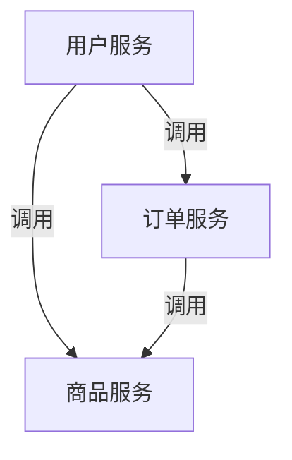

# Nacos 服务注册与Spring Cloud

在现代微服务架构中，服务注册与发现是一个核心组件。它允许服务动态地注册自己，并发现其他服务的位置，从而实现服务之间的通信。Nacos是一个易于使用的动态服务发现、配置和服务管理平台，而Spring Cloud是一个用于构建微服务的框架。本文将介绍如何将Nacos与Spring Cloud集成，实现服务注册与发现。

## 什么是Nacos？

Nacos（Naming and Configuration Service）是阿里巴巴开源的一个动态服务发现、配置和服务管理平台。它支持服务注册与发现、动态配置管理、服务健康检查等功能。Nacos可以帮助开发者轻松构建云原生应用和微服务架构。

## 为什么需要服务注册与发现？

在微服务架构中，服务实例的数量和位置可能会频繁变化。服务注册与发现机制允许服务实例在启动时向注册中心注册自己，并在需要时从注册中心获取其他服务实例的位置信息。这样，服务之间的通信不再依赖于硬编码的地址，而是动态地从注册中心获取。

## Nacos 与Spring Cloud集成

### 1. 添加依赖

首先，我们需要在Spring Cloud项目中添加Nacos的依赖。假设你使用的是Maven构建工具，可以在`pom.xml`中添加以下依赖：

```xml
<dependency>
    <groupId>com.alibaba.cloud</groupId>
    <artifactId>spring-cloud-starter-alibaba-nacos-discovery</artifactId>
    <version>2.2.5.RELEASE</version>
</dependency>
```

### 2. 配置Nacos服务器地址

接下来，我们需要在`application.yml`或`application.properties`中配置Nacos服务器的地址。以下是一个`application.yml`的示例配置：

```yaml
spring:
  application:
    name: my-service
  cloud:
    nacos:
      discovery:
        server-addr: 127.0.0.1:8848
```

在这个配置中，`spring.application.name`指定了服务的名称，`spring.cloud.nacos.discovery.server-addr`指定了Nacos服务器的地址。

### 3. 启用服务发现

在Spring Boot应用的启动类上添加`@EnableDiscoveryClient`注解，以启用服务发现功能：

```java
import org.springframework.boot.SpringApplication;
import org.springframework.boot.autoconfigure.SpringBootApplication;
import org.springframework.cloud.client.discovery.EnableDiscoveryClient;

@SpringBootApplication
@EnableDiscoveryClient
public class MyServiceApplication {
    public static void main(String[] args) {
        SpringApplication.run(MyServiceApplication.class, args);
    }
}
```

### 4. 注册服务

启动应用后，服务会自动向Nacos注册。你可以在Nacos的控制台中查看已注册的服务实例。

### 5. 服务发现

在需要调用其他服务的地方，可以使用`RestTemplate`或`FeignClient`来发现并调用其他服务。以下是一个使用`RestTemplate`的示例：

```java
import org.springframework.beans.factory.annotation.Autowired;
import org.springframework.cloud.client.ServiceInstance;
import org.springframework.cloud.client.discovery.DiscoveryClient;
import org.springframework.web.bind.annotation.GetMapping;
import org.springframework.web.bind.annotation.RestController;
import org.springframework.web.client.RestTemplate;

import java.util.List;

@RestController
public class MyController {

    @Autowired
    private DiscoveryClient discoveryClient;

    @Autowired
    private RestTemplate restTemplate;

    @GetMapping("/call-other-service")
    public String callOtherService() {
        List<ServiceInstance> instances = discoveryClient.getInstances("other-service");
        if (instances.isEmpty()) {
            return "No instances available";
        }
        String url = instances.get(0).getUri().toString() + "/endpoint";
        return restTemplate.getForObject(url, String.class);
    }
}
```

在这个示例中，`DiscoveryClient`用于获取`other-service`的实例列表，然后使用`RestTemplate`调用该服务的某个端点。

## 实际应用场景

假设我们有一个电商系统，包含用户服务、订单服务和商品服务。每个服务都可以独立部署和扩展。通过Nacos与Spring Cloud的集成，用户服务可以动态地发现订单服务和商品服务的位置，从而实现服务之间的通信。



在这个场景中，Nacos作为服务注册中心，管理着所有服务的实例信息。用户服务在需要调用订单服务或商品服务时，会从Nacos获取这些服务的实例地址，然后进行调用。

## 总结

通过本文，我们学习了如何将Nacos与Spring Cloud集成，实现服务注册与发现。Nacos作为一个强大的服务注册中心，可以帮助我们轻松管理微服务架构中的服务实例。Spring Cloud提供了简单易用的API，使得服务注册与发现变得非常容易。

## 附加资源与练习

- **Nacos官方文档**: [https://nacos.io/zh-cn/docs/what-is-nacos.html](https://nacos.io/zh-cn/docs/what-is-nacos.html)
- **Spring Cloud Alibaba文档**: [https://spring.io/projects/spring-cloud-alibaba](https://spring.io/projects/spring-cloud-alibaba)

**练习**: 尝试在你的Spring Cloud项目中集成Nacos，并实现两个服务之间的相互调用。观察Nacos控制台中的服务注册情况，并尝试动态扩展服务实例。